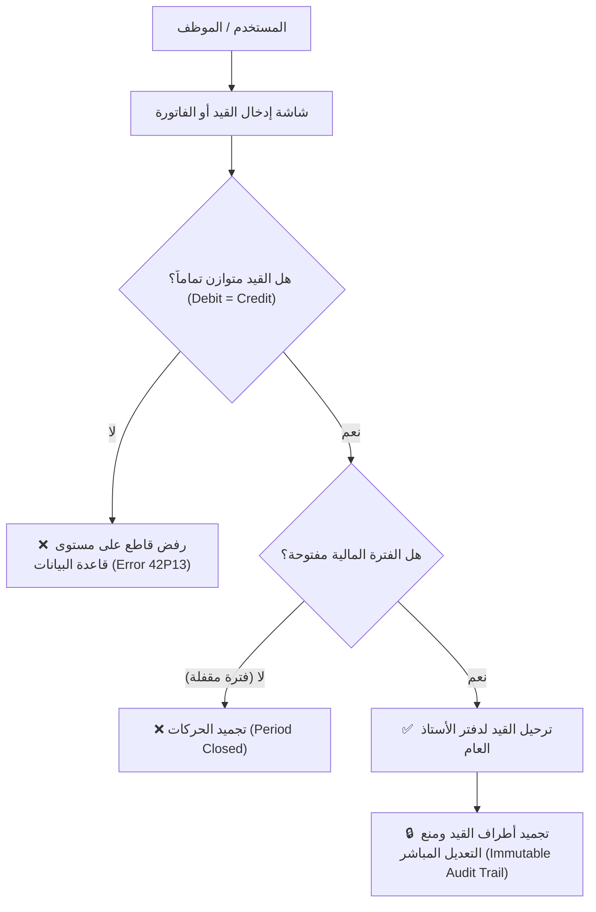

# المعايير المحاسبية والرقابية الصارمة لنظام TriPro ERP
### (Compliance with International & Local Accounting Standards — IFRS / EAS / SOCPA)

---

## 🧭 مقدمة موجهة للمديرين الماليين، المراجعين القانونيين، ومندوبي المبيعات

أحد أهم الأسئلة التي يطرحها المدير المالي (CFO)، أو رئيس الحسابات، أو المراجع القانوني الخارجي (External Auditor) عند تقييم أي برنامج محاسبي هو:
> **"هل البرنامج يلتزم بالمعايير المحاسبية المعتمدة ومبادئ الحوكمة المالية، أم أنه مجرد برنامج تسجيل حركات تجارية لا يراعي أسس المحاسبة القانونية؟"**

يقدم هذا الدليل إجابة قاطعة بالأدلة التقنية والمحاسبية التي تثبت أن نظام **TriPro ERP** صُمم وبُني من الصفر ليتوافق بدقة مطلقة مع:
- **المعايير الدولية لإعداد التقارير المالية (IFRS / IAS)**.
- **معايير المحاسبة المصرية (EAS)** المعتمدة من وزارة الاستثمار والهيئة العامة للرقابة المالية.
- **معايير المحاسبة السعودية** المعتمدة من الهيئة السعودية للمراجعين والمحاسبين (**SOCPA**).
- **قواعد الحوكمة وإمكانية التدقيق المالي الصارم (Auditability & Financial Governance)**.

---

# 1. 🏛️ المعايير المحاسبية الرئيسية المطبقة بالنظام

### 1. مبدأ الاستحقاق المحاسبي الكامل (Accrual Basis of Accounting)
- **المعيار:** (IAS 1 / معيار المحاسبة المصري رقم 1).
- **التطبيق في TriPro:**  
  يتم الاعتراف بالإيرادات عند تقديم الخدمة أو تسليم البضاعة (واقعة البيع) بغض النظر عن واقعة التحصيل النقدي. وتُثبت المصروفات عند استحقاقها وتحميلها على الفترة المالية التي تخصها، مع دعم كامل لقيود التسويات الجردية، المصروفات المدفوعة مقدماً، والمصروفات المستحقة.

---

### 2. نظام الجرد المستمر وتقييم المخزون (IAS 2 / EAS 2 - Inventories)
- **المعيار:** معيار المخزون وتحديد تكلفة البضاعة المباعة (COGS).
- **التطبيق في TriPro:**
  - يعمل النظام بـ **نظام الجرد المستمر (Perpetual Inventory System)**، حيث يُنشئ النظام قيداً محاسبياً آلياً لحظة خروج البضاعة من المخزن:
    * **من حساب:** تكلفة البضاعة المباعة (COGS).
    * **إلى حساب:** مخزون البضائع / المواد الخام (Inventory).
  - **طريقة التقييم المعتمدة:** **المتوسط المرجح المتحرك (Moving Weighted Average Cost - WAC)** المعترف به دولياً.
  - **محرك التصحيح الرجعي النادر (WAC Retro-Engine):** يعالج النظام تلقائياً أي انحرافات ناتجة عن إدخال فواتير شراء متأخرة أو البيع المؤقت بالسالب، ويعيد حساب تكلفة المخزون وتكلفة المبيعات بأثر رجعي لضبط الميزانية في ثوانٍ.

---

### 3. الاعتراف بالإيراد من العقود مع العملاء (IFRS 15 / EAS 48 - Revenue from Contracts)
- **المعيار:** الاعتراف بالإيراد وفق نسبة الإنجاز في المشاريع طويلة الأجل والمقاولات والتصنيع.
- **التطبيق في TriPro:**
  - في مديول المقاولات والتصنيع، يُطبق النظام بدقة **طريقة نسبة الإنجاز الفعلي (Percentage of Completion Method - POC)**.
  - لا يُثبت الإيراد بالتقدير العشوائي، بل يُربط بمستخلصات الإنجاز الميدانية المعتمدة من الاستشاري، مع الفصل التام بين:
    * إيرادات المشاريع المحققة.
    * محتجزات ضمان الأعمال (Retention Receivables) في حساب وسيط غير متداول حتى انتهاء فترة الصيانة.
    * استهلاك الدفعات المقدمة من العملاء كالتزام متناقص.

---

### 4. محاسبة الأصول الثابتة وإهلاكها (IAS 16 / EAS 10 - Property, Plant & Equipment)
- **المعيار:** رسملة الأصول، قياس مجمع الإهلاك، وإعادة التقييم.
- **التطبيق في TriPro:**
  - إثبات الأصول بتكلفتها التاريخية متضمنة كافة مصاريف الاقتناء والتركيب.
  - الفصل المحاسبي الصارم بين حساب الأصل الأصلي وحساب **مجمع الإهلاك (Accumulated Depreciation)** كحساب مقابل للأصول (Contra-Asset).
  - احتساب الإهلاك الدوري آلياً وتوليد قيود الإهلاك الشهرية والسنوية، مع حساب القيمة التخريدية (Salvage Value) والعمر الإنتاجي المقدر.
  - دعم معالجة فائض أو عجز إعادة تقييم الأصول (Asset Revaluation) وفق متطلبات المعيار.

---

### 5. المعيار الدولي للتقرير المالي رقم 18 في قائمة الدخل (IFRS 18 - Presentation & Disclosure in Financial Statements)
> 🌟 **ميزة تنافسية استثنائية ونادرة في TriPro ERP!**
- **المعيار:** أحدث معيار عالمي صادر عن مجلس معايير المحاسبة الدولية (IASB) ليحل محل المعيار القديم (IAS 1)، ويحدث ثورة هيكلية في **قائمة الدخل (Income Statement)** لتوحيد المقارنات والقضاء على التباين في تصنيف البنود.
- **التطبيق العملي في TriPro ERP (`IncomeStatement.tsx`):**
  نظام TriPro ERP هو من أوائل أنظمة الـ ERP في المنطقة التي تبنت هيكل **IFRS 18** بالكامل، حيث تقسم شاشة قائمة الدخل آلياً إلى **الفئات الثلاث المحددة رسمياً في المعيار**:
  1. **الفئة التشغيلية (Operating Category):**
     - إيرادات النشاط الرئيسي مطروحاً منها تكلفة المبيعات (COGS) لحساب **مجمل الربح (Gross Profit)**.
     - يضاف إليها الإيرادات التشغيلية الأخرى، وتطرح مصروفات البيع والتسويق والمصروفات الإدارية والعمومية.
  2. **الفئة الاستثمارية (Investing Category):**
     - فصل إيرادات وعوائد الاستثمارات في أوراق مالية أو شركات تابعة، والأرباح والخسائر الرأسمالية الناتجة عن بيع الأصول الثابتة.
  3. **الفئة التمويلية (Financing Category):**
     - فصل إيرادات التمويل (عائد الودائع والفوائد الدائنة) عن تكاليف التمويل (فوائد القروض، التسهيلات الائتمانية، والمرابحات).

- **المجاميع الفرعية الإلزامية التي يفرضها المعيار (Mandatory Subtotals):**
  * **المجموع الإلزامي الأول: الربح التشغيلي (Operating Profit):** يعكس كفاءة النشاط الأساسي للمنشأة بمعزل تام عن الأنشطة التمويلية والاستثمارية.
  * **المجموع الإلزامي الثاني: الربح قبل التمويل وضرائب الدخل (Profit Before Financing & Income Taxes):** يعطي صورة دقيقة للمستثمرين والبنوك عن ربحية الشركة التشغيلية والاستثمارية قبل خصم فوائد الديون والضرائب.
- **المقارنة التحليلية ومقاييس الأداء (Comparative Reporting):**
  * إمكانية المقارنة الفورية مع السنة السابقة بنقرة زر لاحتساب التغير المالي ونسبة التغير % لكل بند.
  * عرض نسب الهوامش المعيارية الثلاثة: **Gross Margin %**، **Operating Margin %**، و **Net Margin %**.
  * التصدير بضغطة زر لملفات Excel بتنسيق IFRS 18 الرسمي المعتمد لتقديمه لشركات التدقيق والمراجعين القانونيين.

---

### 6. المعالجة الضريبية والامتثال الحكومي (Tax Accounting Compliance)
- **ضريبة القيمة المضافة (VAT):** فصل ضريبة المخرجات (المبيعات) عن ضريبة المدخلات (المشتريات) واحتساب صافي الرد أو السداد الضريبي اللحظي.
- **ضريبة الخصم والتحصيل من المنبع (WHT):** استقطاع النسب المعتمدة (1% توريدات، 3% خدمات، 5% مهن حرة) وإصدار إشعارات الخصم الضريبي آلياً.
- **التوافق الضريبي التقني:** الربط المباشر مع مصلحة الضرائب المصرية (ETA E-Invoicing) والامتثال لمنظومة زاتكا السعودية المرحلة الثانية (ZATCA Phase 2).

---

# 2. 🛡️ الضوابط الرقابية الصارمة في قاعدة البيانات (PostgreSQL Database Constraints)

من أعظم نقاط القوة التي تبهر أي مدير مالي أن الرقابة المحاسبية في TriPro ليست مجرد واجهات في المتصفح يمكن اختراقها، بل هي **محددات إجبارية مكتوبة على مستوى كود قاعدة البيانات (Database Constraints & Triggers)**:

### 1. استحالة ترحيل أي قيد غير متوازن ($Debit = Credit$ Enforced):
- قاعدة بيانات PostgreSQL ترفض عبر دالة `fn_enforce_journal_entry_balance` تحويل أي قيد إلى حالة مرحل (`posted`) إلا إذا كان مجموع حركات المدين مساوياً للدائن بالسنتيمتر، وبحد أدنى طرفين محاسبيين.

### 2. تجميد القيود المرحّلة (Immutable Posted Entries):
- بمجرد ترحيل القيد، تمنع قاعدة البيانات عبر دالة `fn_protect_posted_journal_lines` تعديل أو حذف أي طرف من أطراف القيد، لحماية المنشأة من التلاعب بعد اعتماد الحسابات. وإذا وُجد خطأ، يُلزم النظام المحاسب بعمل **قيد تسوية عكسي** وفق الأصول المحاسبية.

### 3. إقفال الفترات المالية الشهرية والسنوية (Fiscal Closing):
- إمكانية قفل أي شهر مالي منتهٍ لمنع أي موظف من إضافة فاتورة بتاريخ قديم بعد تقديم الإقرار الضريبي.
- محرك إقفال السنة المالية الآلي (`FiscalYearClosing`) الذي يصفر حسابات الإيرادات والمصروفات ويرحل صافي النتيجة إلى **الأرباح المبقاة (Retained Earnings - كود 32)** مع توليد قيد الإقفال السنوي الرسمي.

### 4. حظر الحذف النهائي للحسابات ذات الحركات:
- ترفض قاعدة البيانات نهائياً حذف أي حساب من شجرة الحسابات أو أي عميل أو مورد إذا كان له سطر واحد في دفتر الأستاذ العام حفاظاً على سلامة السجلات التاريخية.

---

# 3. 🎯 نصائح بيعية لتقديم المعايير المحاسبية للعميل (Sales Script for CFOs)

> **المندوب:** *"يا فندم، أهم ما يميز TriPro ERP عن معظم البرامج في السوق هو أنه بُني بإشراف خبراء معايير محاسبية دولية ومراجعين قانونيين:
> 1. النظام يعمل بنظام **الجرد المستمر** وطريقة **المتوسط المرجح المتحرك WAC** المتوافقة مع معيار المخزون الدولي IAS 2.
> 2. قاعدة البيانات لدينا تمنع تقنياً أي عدم توازن في القيود ($Debit = Credit$).
> 3. مستخلصات المقاولات والتصنيع تطبق معيار **IFRS 15** بنسب الإنجاز وفصل محتجزات الضمان.
> 4. التقارير المالية (ميزان المراجعة، الأرباح والخسائر، والميزانية العمومية) تخرج مطابقة لمعايير المحاسبة المصرية والسعودية وجاهزة للاعتماد الفوري من مكتب المراجع القانوني الخاص بشركتكم دون أي تعديل يدوي."*

---

**TriPro ERP** ليس مجرد نظام إداري، بل هو **درعك المحاسبي والقانوني الرصين** أمام مكاتب المراجعة ومصالح الضرائب!
