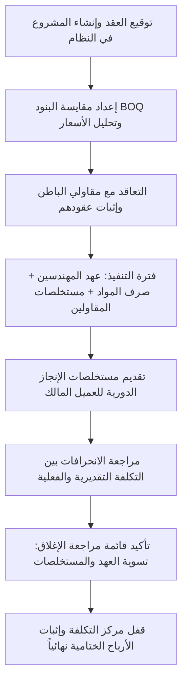

# دليل التعامل مع مديول المقاولات وإدارة المشاريع (TriPro ERP - Construction Module)

مرحباً بك يا صديقي. هذا الدليل مخصص لمساعدتك في شرح مديول المقاولات وعرضه لشركات المقاولات والإنشاءات بشكل يوضح القيمة العالية التي يقدمها، وكيف يحل أكبر مشاكل القطاع (التحكم بالتكاليف، مستخلصات العملاء ومقاولي الباطن، العهد الميدانية، والربحية الفعلية).

---

## 1. نظرة عامة والجمهور المستهدف (Overview & Target Audience)
يعتمد مديول المقاولات في نظام **TriPro ERP** على مفهوم **"مراكز التكلفة المفتوحة"** للمشاريع، حيث يربط جميع التحركات المالية والمخزنية والميدانية للمشروع بالحسابات العامة للمنشأة تلقائياً.

### الفئات المستفيدة داخل شركة المقاولات:
1. **مدير المشروع والمهندس الميداني (Project Manager / Site Engineer):** متابعة الإنجاز، طلب صرف المواد، وإدخال فواتير العهد النثرية.
2. **مهندس المكتب الفني (Technical Office Engineer):** إعداد مقايسات بنود المشروع (BOQ) وتحليل الأسعار وحساب الكميات.
3. **الحسابات والمراجعة (Accounting & Internal Audit):** مراجعة واعتماد مستخلصات مقاولي الباطن، وإصدار مستخلصات العميل، ومطابقة الصرف الفعلي بالميزانية المرصودة.
4. **المدير المالي والمالك (CFO & Owner):** مراقبة ربحية كل مشروع في الوقت الفعلي مقارنة بالمخطط له، ومنع تجاوز الميزانيات.

---

## 2. الميزات الرئيسية لبيع النظام (Key Selling Points)

عند التفاوض مع أصحاب شركات المقاولات، ركز على هذه الميزات السبعة الأساسية:

### 🌟 أولاً: إعداد المقايسات وتحليل سعر البنود (Bill of Quantities - BOQ)
* **الفكرة:** إدخال جدول كميات المشروع وتفكيك تكلفة كل بند للوصول لسعر البيع المناسب.
* **المميزات التشغيلية:**
  * تحديد البنود ووحداتها (م3، م2، طن، إلخ) والكمية التقديرية لكل بند.
  * **تحليل السعر (Cost Breakdown):** تفكيك تكلفة وحدة البند الواحد إلى: (تكلفة المواد + تكلفة العمالة + تكلفة المصاريف غير المباشرة/التشغيل).
  * **تحديد هامش الربح:** وضع نسبة هامش الربح المستهدفة للوصول إلى **"سعر البيع التقديري"** للعميل.
  * **الفائدة للعميل:** تسعير دقيق للمناقصات والمشاريع بناءً على تكاليف حقيقية بدلاً من التخمين العشوائي.

### 🌟 ثانياً: مستخلصات العميل الذكية (Client Progress Billings)
* **الفكرة:** إعداد المطالبات المالية للمالك (العميل) بناءً على ما تم إنجازه فعلياً في الموقع.
* **المميزات التشغيلية:**
  * إدخال نسب الإنجاز التقديرية للبنود أو الكميات المنفذة.
  * **الاستقطاعات التلقائية:** يحتسب النظام تلقائياً:
    * **محتجز ضمان الأعمال (Retention):** (عادة 5% أو 10%) ويتم ترحيلها لحساب وسيط.
    * **خصم استهلاك الدفعة المقدمة (Advance Payment Deduction).**
    * **الضرائب:** احتساب ضريبة القيمة المضافة (VAT) وضريبة خصم المنبع (WHT) آلياً.
  * **المرفقات الميدانية:** إمكانية إرفاق صور من الموقع، دفاتر حصر الكميات، أو تقارير الاستشاري الموقعة لإثبات الإنجاز داخل المستخلص.
  * **المحاسبة الآلية:** بمجرد اعتماد المستخلص عبر دالة `fn_approve_project_billing` يتم:
    1. قيد الإيراد المستحق على العميل (حساب المدينين).
    2. تسجيل قيمة محتجز الضمان في حساب الأصول المتداولة (محتجزات لدى العملاء).
    3. تسجيل الضرائب المستحقة.

### 🌟 ثالثاً: إدارة مقاولي الباطن بالكامل (Subcontractor Management)
* **الفكرة:** المقاولون هم الشريك التشغيلي الأهم، والنظام يضبط العلاقة المالية معهم بدقة.
* **المميزات التشغيلية:**
  * **عقود مقاولي الباطن:** تسجيل العقود مع كل مقاول، وقيمتها الإجمالية، ونسبة محتجز ضمان الأعمال المتفق عليها.
  * **مستخلصات مقاولي الباطن (Sub Billings):** إدخال مستخلص الأعمال المقدم من المقاول، ليقوم النظام آلياً بخصم محتجز الضمان الخاص به، واستهلاك دفعته المقدمة، واحتساب الضرائب.
  * **تقييم أداء المقاول:** عند اعتماد المستخلص، يطالب النظام المهندس بتقييم المقاول في (الجودة، والالتزام بالوقت) من 1 إلى 5 لإنشاء قاعدة بيانات موثوقة لأفضل المقاولين.
  * **الترحيل المالي:** اعتماد المستخلص يرحل التكاليف مباشرة كـ **"تكلفة مقاولي باطن"** على مركز تكلفة المشروع، ويثبت الدائنية للمقاول.

### 🌟 رابعاً: إدارة العهد النقدية للموقع ( петты cash / Site Custodies )
* **الفكرة:** المهندسون في الميدان يحتاجون سيولة نقدية لشراء مواد طارئة أو دفع أجور يومية، والنظام يراقب صرفها وتصفيتها.
* **المميزات التشغيلية:**
  * فتح حساب عهدة خاص بكل مهندس وربطه بملفه الشخصي.
  * **تغذية العهدة (Top-Up):** تحويل أموال من الصندوق العام أو البنك إلى حساب عهدة المهندس عبر النظام.
  * **تسجيل وتصنيف المصاريف:** يقوم المهندس بإدخال الفواتير والمصاريف التي دفعها من عهدته في الموقع مع تصنيفها (نثريات، حديد طارئ، وقود، إلخ).
  * **الاعتماد والتسوية المحاسبية:** يقوم المحاسب بمراجعة الفواتير المرفقة والضغط على **اعتماد (Approve)** ليقوم النظام بخصم المبالغ المعتمدة من رصيد عهدة المهندس، وتحميلها فوراً كـ **"مصاريف فعلية"** على المشروع.

### 🌟 خامساً: صرف المواد للمشاريع (Material Issuing)
* **الفكرة:** مراقبة خروج المواد من مخازن الشركة المركزية أو مخزن الموقع وتحميلها على بنود المقايسة.
* **المميزات التشغيلية:**
  * اختيار المستودع المصدر (مثال: مخزن الخشب أو مخزن الأسمنت).
  * **ربط الصرف ببند BOQ:** تحديد أي بند في المقايسة سيتم استهلاك هذه المواد فيه (مثال: صرف أسمنت لبند "أعمال اللياسة/المحارة").
  * **التحقق من الرصيد المخزني:** يمنع النظام صرف أي مادة إذا كانت الكمية المطلوبة تتجاوز المتاح في المخزن لمنع العجز الوهمي.
  * **تحديث تكلفة المشروع:** عند الاعتماد، ينشئ النظام قيداً محاسبياً يخصم المخزن (دائن) ويحمل القيمة كتكلفة مواد (مدين) على المشروع المستهدف.

### 🌟 سادساً: إدارة أوامر التغيير (Change Orders)
* **الفكرة:** المشاريع نادراً ما تنتهي كما بدأت، التغيير مستمر والنظام يوثقه مالياً وقانونياً.
* **المميزات التشغيلية:**
  * تسجيل أي أعمال إضافية طلبها المالك خارج نطاق العقد الأصلي.
  * توثيق التكلفة الإضافية وقيمة البيع الجديدة وأثرها على قيمة العقد الكلية.
  * منع تنفيذ أو احتساب أي بند تغييري قبل الحصول على الاعتمادات اللازمة داخل النظام.

### 🌟 سابعاً: قفل مركز التكلفة وإغلاق المشروع (Project Closing & Settlement)
* **الفكرة:** الحساب الختامي للمشروع وقفل مركز التكلفة بشكل نهائي.
* **المميزات التشغيلية:**
  * **فحص الميزانية التفاعلي:** يظهر النظام تقريراً ملخصاً قبل الإغلاق: (إجمالي الإيرادات المعتمدة من مستخلصات العميل مقابل إجمالي التكاليف الفعلية لمواد وعمالة ومقاولي باطن وعهد).
  * **صافي الربح الفعلي للمشروع:** رسم بياني وتحليل رقمي لصافي الربح المحقق ونسبته.
  * **قفل الأمان (Lock):** بمجرد الإغلاق النهائي عبر دالة `fn_close_project` يتم:
    1. إغلاق حساب مشروعات تحت التنفيذ (WIP) للمشروع وإثبات الأرباح/الخسائر الدفترية.
    2. تجميد مركز التكلفة تماماً ومنع تسجيل أي فواتير، مستخلصات، عهد، أو أذونات صرف عليه نهائياً لحماية الحسابات الختامية من التعديل اللاحق.

---

## 3. دورة العمل المتكاملة في مديول المقاولات (Full Workflow)

إليك كيف تسير دورة حياة المشروع في النظام من البداية إلى الإغلاق:

---

## 4. تقارير الإدارة الاستراتيجية (Executive Reports)

تستطيع إدارة الشركة متابعة صحة مشاريعها عبر تقارير رئيسية:
1. **لوحة معلومات المقاولات (Construction Dashboard):** تعرض إجمالي قيمة المشاريع النشطة، إجمالي المصاريف الفعلية، نسبة الإنجاز المتوسطة، والمبالغ المستحقة للتحصيل.
2. **التقرير الشامل للمشروع (Project Comprehensive Report):** يوضح تفاصيل مالية كاملة للمشروع (BOQ الأصلي، أوامر التغيير، المنصرف الفعلي مقارنة بالمقدر، موقف مقاولي الباطن، المتبقي من الدفعات المقدمة، ومستقطعات الضمان المفرج عنها والمحتجزة).
3. **مخطط غانت الميداني (Project Gantt Chart):** لمتابعة الجدول الزمني للمراحل والبنود وتواريخ البدء والانتهاء بصرياً لضمان عدم تأخر المشروع.

---

## 5. جمل تسويقية لبيع المديول لأصحاب الشركات (Sales Hooks)

* **"هل تعاني من ضياع الأرباح بسبب عدم معرفة التكلفة الحقيقية لبنود المشروع أثناء التنفيذ؟"**
  * *الحل:* ربط مقايسة الـ BOQ بأذونات صرف المواد وعقود الباطن يعطيك تكلفة البند الفعلية أولاً بأول مقارنة بالسعر التقديري.
* **"هل تشتكي من صعوبة تسوية العهد النقدية مع مهندسي المواقع وتراكم الفواتير غير الموثقة؟"**
  * *الحل:* نظام إدارة العهد الذكي يتيح للمهندس إدخال فواتيره من الموقع مباشرة، ولن يتم إغلاق المشروع محاسبياً إلا بعد تصفية وتسوية كافة العهد المفتوحة.
* **"هل تواجه مشاكل قانونية أو مالية مع مقاولي الباطن بسبب حسابات محتجز ضمان الأعمال أو استهلاك الدفعات المقدمة؟"**
  * *الحل:* يقوم النظام باحتساب وخصم محتجز الضمان (الـ Retention) ونسبة الدفعة المقدمة تلقائياً من كل مستخلص، مع الاحتفاظ بجدول تواريخ الإفراج عن الضمانات لمنع اللبس.
* **"هل تفاجأ بخسارة المشروع بعد فوات الأوان وإغلاق العمل مع العميل؟"**
  * *الحل:* شاشة إغلاق المشاريع تعطيك ملخص الربحية الفعلي (الإيراد المعتمد ضد المصاريف الفعلية) وتقفل مركز التكلفة تماماً لتمنع ترحيل أي تكاليف سرية بعد التسليم.

---
**TriPro ERP** هو النظام الأقوى لشركات المقاولات التي تسعى إلى تحويل مشاريعها الميدانية إلى **مراكز أرباح خاضعة للرقابة المالية المطلقة**. بالتوفيق في تسويقه وعرضه للعملاء يا صديقي!
