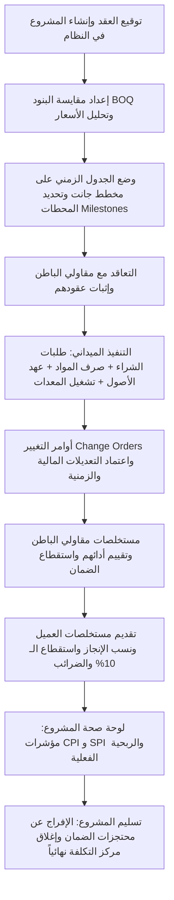

# دليل مديول المقاولات وإدارة المشاريع (TriPro ERP - Construction Module)
### الإصدار المحدّث والشامل (Full Enterprise Edition)

مرحباً بك يا صديقي. هذا الدليل مخصص لمساعدتك في شرح مديول المقاولات وعرضه لشركات المقاولات والإنشاءات والتطوير العقاري بشكل يوضح القيمة الفائقة التي يقدمها، وكيف يحل أكبر مشاكل القطاع (التحكم بالتكاليف، أوامر التغيير، مستخلصات العملاء ومقاولي الباطن، محتجزات الضمان، العهد الميدانية، المخططات الزمنية جانت، والربحية الفعلية) من خلال **واجهات النظام، الأزرار التفاعلية، ودورات العمل الواقعية**، تماماً كما هو مطبق على أرض الواقع في نظام **TriPro ERP**، وبصيغة خالية من أسماء الأكواد أو الملفات البرمجية لتكون سهلة الفهم للجميع.

---

## 1. نظرة عامة والجمهور المستهدف (Overview & Target Audience)

يعتمد مديول المقاولات في نظام **TriPro ERP** على مفهوم **"مراكز التكلفة المفتوحة والمستقلة"** للمشاريع، حيث يربط جميع التحركات المالية والمخزنية والميدانية للمشروع بالحسابات العامة للمنشأة تلقائياً مع مراقبة حية للجدول الزمني ومؤشرات الأداء.

### الفئات المستفيدة داخل شركة المقاولات:
1. **مدير المشروع والمهندس الميداني (Project Manager / Site Engineer):** متابعة نسب الإنجاز الميدانية، طلب صرف المواد، متابعة الجدول الزمني عبر مخطط جانت، وإدخال فواتير العهد النثرية وأصول الموقع.
2. **مهندس المكتب الفني (Technical Office Engineer):** إعداد مقايسات بنود المشروع (BOQ)، تحليل الأسعار، وإدارة وتوثيق أوامر التغيير (Change Orders).
3. **الحسابات والمراجعة (Accounting & Internal Audit):** مراجعة واعتماد مستخلصات مقاولي الباطن، إصدار مستخلصات العميل، متابعة الإفراج عن محتجزات الضمان، ومطابقة الصرف الفعلي بالميزانية.
4. **المدير المالي والمالك (CFO & Owner):** مراقبة ربحية كل مشروع في الوقت الفعلي مقارنة بالمخطط له، فحص مؤشرات صحة المشروع، ومنع تجاوز الميزانيات.

---

## 2. الدليل التفصيلي للشاشات والأزرار والميزات التشغيلية

يتكون مديول المقاولات من منظومة متكاملة من الشاشات التفاعلية التي تغطي كافة جوانب التشغيل والمحاسبة لمواقع البناء:

### 🌟 أولاً: شاشة إعداد المقايسات وتحليل سعر البنود (BOQ Manager)
* **الفكرة:** حجر الأساس للمشروع حيث يتم تفكيك بنود الأعمال وتحديد تكاليفها وسعر البيع المستهدف للعميل.
* **أهم الأزرار والوظائف التشغيلية:**
  * 🔘 **زر "إضافة بند" (Add Item):** يضيف سطراً جديداً لجدول المقايسة لتعريف بند عمل جديد (مثل: حفر وتطهير، صب خرسانات، تشطيبات) مع تحديد اسم البند، والوحدة (م3، م2، طن، إلخ)، والكمية التقديرية.
  * 🔘 **زر "تحليل سعر البنود" (Chevron Analysis):** يفتح نافذة داخلية لتفكيك تكلفة وحدة البند الواحد إلى: (تكلفة المواد، تكلفة العمالة، المصاريف غير المباشرة/التشغيلية) بدلاً من التسعير التقديري العشوائي.
  * 📥 **حقول "تكاليف الوحدة ونسبة الربح" (Cost and Margin Inputs):** حقول إدخال تكلفة الخامات، أجور العمالة، ونسبة الأعباء غير المباشرة مع إدخال نسبة هامش الربح المستهدفة للوحدة (%)، ليقوم النظام آلياً بحساب سعر البيع المقدر للبند وجعل حقل السعر **قراءة فقط (Read-only)** طالما التحليل مفتوح لضمان دقة العمل.
  * 🔘 **زر "حفظ التغييرات" (Save Changes):** يقوم بإجراء عملية ترحيل وتحديث مجمّع (Upsert) لكافة البنود المعدلة وحفظها في قاعدة البيانات مع الحفاظ على ترابطها.
  * 🗑️ **زر "حذف بند" (Trash Icon):** لحذف البنود غير المعتمدة واستبعادها من المقايسة.

---

### 🌟 ثانياً: شاشة أوامر التغيير الهندسية والمطالبات الإضافية (Change Order Manager)
* **الفكرة:** السيطرة على أكثر أسباب الخسائر شيوعاً في المقاولات؛ وهي التعديلات والبنود المستجدة التي يطلبها العميل أثناء التنفيذ دون توثيق مالي رسمي.
* **أهم الأزرار والوظائف التشغيلية:**
  * 🔘 **زر "إنشاء أمر تغيير" (New Change Order):** يفتح نموذجاً لتسجيل التعديل المطلوب (إضافة بنود جديدة، تعديل كميات، أو إلغاء بنود).
  * 📊 **حقلي "الأثر المالي والزمني" (Cost & Schedule Impact):** تحديد الزيادة في قيمة العقد وعدد الأيام الإضافية المضافة للمشروع.
  * 🔘 **زر "اعتماد أمر التغيير" (Approve Change Order):** يقوم بتحديث الميزانية التقديرية وقيمة المقايسة تلقائياً وإضافتها لجدول المستخلصات القادمة للعميل.

---

### 🌟 ثالثاً: شاشة مخطط جانت الزمني التفاعلي (Project Gantt Chart)
* **الفكرة:** لوحة تحكم بصرية زمنية لمتابعة الجدول الزمني للمشروع وربط البنود والمراحل بمواعيد البدء والانتهاء.
* **أهم الأزرار والوظائف التشغيلية:**
  * 📅 **أشرطة التتبع الزمني (Timeline Bars):** عرض كل بند ومرحلة كشريط زمني يوضح نسبة الإنجاز الفعلي (باللون الأخضر) والتأخير (باللون الأحمر).
  * 🔗 **ربط الاعتماديات (Task Dependencies):** توضيح تسلسل الأعمال (مثال: أعمال المحارة لا تبدأ إلا بعد اعتماد أعمال المباني والكهرباء).
  * ⚠️ **تنبيهات المسار الحرج (Critical Path Alert):** إبراز البنود التي يؤدي أي يوم تأخير فيها إلى تأخير تسليم المشروع بالكامل.

---

### 🌟 رابعاً: شاشة مستخلصات العميل وتدقيق الإنجاز (Client Progress Billings)
* **الفكرة:** إعداد المطالبات المالية للمالك (العميل) بناءً على ما تم إنجازه فعلياً في الموقع وترحيلها محاسبياً.
* **أهم الأزرار والوظائف التشغيلية:**
  * 🔘 **زر "إنشاء مستخلص جديد" (Create progress billing):** لفتح نموذج تحضير مطالبة مالية جديدة للعميل وتحديد تاريخ المطالبة ورقمها.
  * 📥 **حقول "نسب إنجاز البنود" (BOQ Item Progress Input):** تمكن المهندس من إدخال نسبة الإنجاز الفعلية لكل بند من المقايسة، ليقوم النظام تلقائياً باحتساب النسبة الإجمالية المكتملة للمشروع والإجمالي المالي المستحق.
  * 📊 **حقلي "الاستقطاعات والدفعة المقدمة" (Deductions & Advance deductions):** يقوم النظام تلقائياً بخصم "محتجز ضمان الأعمال" (عادة 10%) وتوزيعه لحساب الأصول الوسيطة، مع احتساب نسبة خصم الدفعة المقدمة المستهلكة آلياً لتخفيض الصافي.
  * ⚖️ **حقول "الضرائب المعتمدة" (VAT & WHT Rates):** لحساب ضريبة القيمة المضافة (VAT - 14%) وضريبة خصم المنبع (WHT - 1%) تلقائياً وتحديث الصافي المستحق.
  * 🔘 **زر "اعتماد المستخلص وترحيله محاسبياً" (Approve & Post Billing):** يقوم باستدعاء دالة قاعدة البيانات لترحيل الإيرادات وإثبات المديونية على العميل، وحسابات محتجزات الضمان والضرائب.
  * 📎 **زر "المرفقات الميدانية" (Site Attachment Manager):** لرفع صور تقدم الأعمال من الموقع، أو حصر الكميات الموقعة من الاستشاري لتوثيق المطالبة بشكل قانوني.

---

### 🌟 خامساً: شاشة عقود ومستخلصات مقاولي الباطن (Subcontractor Progress Billings)
* **الفكرة:** إدارة وتوثيق الأعمال المنفذة من مقاولي الباطن وتدقيقها مالياً مع ضبط استقطاعات الضمان والدفعات المقدمة وتقييم أدائهم.
* **أهم الأزرار والوظائف التشغيلية:**
  * 🔘 **زر "إنشاء مستخلص مقاول باطن" (Create Sub Billing):** يفتح نموذج مستخلص لأعمال مقاول محدد مرتبطة ببنود عقده.
  * 📥 **حقول "نسب إنجاز بنود المقاول" (Subcontractor Items Progress):** لإدخال نسب إنجاز المقاول لبنوده يدوياً من الميدان لحساب القيمة الإجمالية المنفذة آلياً.
  * 📊 **حقلي "خصومات مقاول الباطن" (Subcontractor Retention & Advance deductions):** أتمتة خصم نسبة محتجز الضمان الخاصة بالمقاول (تأمين الأعمال) وخصم الدفعة المقدمة التي تسلمها المقاول مسبقاً لتفادي صرف مبالغ زائدة له.
  * ⭐ **واجهة "تقييم أداء المقاول" (Subcontractor Evaluation Dialog):** نافذة تظهر للمهندس عند طلب اعتماد المستخلص لتقييم المقاول في (جودة الأعمال، والالتزام بالجدول الزمني) من 1 إلى 5 لبناء سجل أداء الموردين.
  * 🔘 **زر "اعتماد وترحيل مستخلص المقاول" (Approve Sub Billing):** يستدعي دالة قاعدة البيانات لتحميل التكلفة كـ (مصاريف جارية) على مركز تكلفة المشروع، وإثبات مستحقات المقاول في حساب الموردين.
  * 📄 **كشف حساب تحليلي لمقاول الباطن (Subcontractor Statement):** عرض شامل لكافة مستخلصات المقاول، الدفعات النقدية والبنكية المصروفة له، ومتبقي محتجزات الضمان.

---

### 🌟 سادساً: شاشة الإفراج عن محتجزات الضمان (Retention Release Manager)
* **الفكرة:** إدارة واسترداد مبالغ ضمان الأعمال المحتجزة سواء من العميل (المالك) أو لمقاولي الباطن بعد انقضاء فترة الصيانة والضمان (Defects Liability Period).
* **أهم الأزرار والوظائف التشغيلية:**
  * 📋 **جدول "الضمانات المستحقة للإفراج":** يعرض تواريخ الاستحقاق ونسب المبالغ المحتجزة لكل مشروع ومقاول.
  * 🔘 **زر "طلب إفراج عن ضمان":** لإنشاء مطالبة مالية بالإفراج عن محتجز الضمان بعد تقديم محضر الاستلام النهائي للمشروع.
  * 🔘 **زر "ترحيل الإفراج محاسبياً":** تسوية حساب محتجز الضمان ونقله إلى حساب النقدية أو البنك أو حساب المورد المباشر.

---

### 🌟 سابعاً: شاشة إذن صرف مواد للموقع (Material Issue Form)
* **الفكرة:** مراقبة خروج المواد من مخازن الشركة المركزية أو مخزن الموقع وتحميلها على بنود المقايسة لمنع الفوضى والهدر.
* **أهم الأزرار والوظائف التشغيلية:**
  * 🔘 **زر "اختيار المستودع المصدر" (Source Warehouse):** لتحديد المخزن الذي سيتم سحب المواد منه (الأسمنت، الحديد، الكابلات).
  * 🔍 **زر "البحث واختيار الصنف" (SearchableSelect Product):** يتيح تصفح والبحث السريع عن المواد المخزنية المتوفرة وصلاحيتها.
  * 📏 **زر "تحديد وحدة القياس" (UOM Selector):** يتيح اختيار وحدة صرف محددة، ليقوم النظام بحساب التكلفة الفردية والكمية بناءً على معامل التحويل للوحدة المحددة.
  * 🏗️ **زر "ربط الصرف ببند BOQ" (Link to BOQ Item):** يتيح تحديد بند المقايسة المستهدف بدقة لتسجيل الصرف كتكلفة مواد مباشرة عليه، مما يمنع الصرف العشوائي الميداني.
  * 🚨 **نظام "فحص رصيد المخزن" (Stock Availability Checker):** يقوم النظام بفحص الكميات المتاحة بالمستودع المحدد، وفي حال وجود عجز يمنع حفظ الطلب ويعطي تنبيهاً باللون الأحمر يوضح العجز بدقة.
  * 🔘 **زر "حفظ واعتماد الصرف" (Approve & Issue Materials):** يستدعي دالة قاعدة البيانات لتأكيد خصم الكميات من المخزون، وتحميل التكلفة فوراً على المشروع.
  * 🔘 **زر "حفظ كمسودة" (Save Draft):** لحفظ إذن الصرف كمسودة للمراجعة والتدقيق قبل الاعتماد والترحيل.

---

### 🌟 ثامناً: شاشة طلبات الاحتياج والشراء الميداني (Site Requisition Manager)
* **الفكرة:** تمكين مهندس الموقع من طلب المواد والمعدات رسمياً قبل نفادها، وربط الطلب بإدارة المشتريات والمخازن.
* **أهم الأزرار والوظائف التشغيلية:**
  * 🔘 **زر "طلب مواد موقع جديدة" (New Requisition):** اختيار الأصناف والكميات المطلوبة مع تحديد تاريخ الحاجة الماسة إليها بالموقع.
  * 🔘 **زر "تحويل لأمر شراء" (Convert to PO):** بضغطة زر تنقل إدارة المشتريات طلب الموقع المعتمد إلى أمر شراء مباشر لموردي الشركة.

---

### 🌟 تاسعاً: شاشة إدارة عهد أصول الموقع والعهد النقدية (Site Assets Custody & Custody Manager)
* **الفكرة:** الرقابة الصارمة على الأدوات والعدد الثقيلة والخفيفة (الخلاطات، المولدات، ماكينات اللحام، أجهزة الليزر) والعهد المالية المسلمة لمهندسي المواقع.
* **أهم الأزرار والوظائف التشغيلية:**
  * 🛠️ **جدول "الأصول المسلمة للموقع":** تتبع كل أداة أو جهاز في عهدة المهندس مع توثيق الرقم التسلسلي وتاريخ التسليم.
  * 💵 **إدارة العهد النقدية (Custody Manager):** تسجيل فواتير النثريات اليومية وإرفاق صور الإيصالات من الهاتف وتصفيتها آلياً قبل إغلاق المشروع.

---

### 🌟 عاشراً: شاشة إدارة وتكاليف تشغيل المعدات (Equipment Manager)
* **الفكرة:** تتبع ساعات عمل المعدات الثقيلة (المملوكة أو المستأجرة) بالموقع وتحميل تكلفتها على المشروع آلياً.
* **أهم الأزرار والوظائف التشغيلية:**
  * 🔘 **زر "تعريف معدة جديدة في النظام" (Define New Equipment):** لإنشاء معدة جديدة في قائمة التشغيل وربطها بجدول الأصول الثابتة للشركة (`assets`) أو تسجيلها كمعدة خارجية.
  * 📥 **حقل "تكلفة ساعة التشغيل" (Hourly Operating Cost):** إدخال السعر المعياري لتشغيل المعدة في الساعة (شاملاً الوقود والصيانة والمشغل) لتحميله على المشاريع.
  * 🔘 **زر "تسجيل تشغيل معدة" (Log Equipment Usage):** يفتح نموذجاً لتسجيل تشغيل المعدة في يوم محدد، وتحديد عدد ساعات العمل الفعلية بالمشروع.
  * 🔘 **زر "اعتماد وترحيل ساعات تشغيل المعدة" (Approve & Post Usage Log):** يستدعي دالة قاعدة البيانات لاعتماد تشغيل المعدة وترحيل قيمتها المالية (عدد الساعات $\times$ تكلفة الساعة) كـ (مصاريف تشغيلية) على مركز تكلفة المشروع.

---

### 🌟 حادي عشر: مؤشرات صحة وسلامة المشروع وإدارة المحطات (Health Gauges & Milestones)
* **الفكرة:** لوحة تحكم ذكية تلخص للإدارة التنفيذية سلامة المشروع المالية والزمنية بأسلوب المؤشرات العالمية (Earned Value Management).
* **أهم المؤشرات:**
  * 🎛️ **مؤشر أداء التكلفة (Cost Performance Index - CPI):** يوضح هل المشروع ينفق ضمن الميزانية أم يتجاوزها.
  * 🎛️ **مؤشر أداء الجدول الزمني (Schedule Performance Index - SPI):** يوضح هل المشروع متقدم أم متأخر عن الموعد المخطط.
  * 🚩 **إدارة المحطات الرئيسية (Project Milestones):** توثيق تواريخ الانتهاء من الهيكل الخرساني، التشطيبات، والتسليم الابتدائي والنهائي.

---

## 3. دورة العمل المتكاملة في مديول المقاولات (Full Workflow)

```mermaid
graph TD
    A[توقيع العقد وإنشاء المشروع في النظام] --> B[إعداد مقايسة البنود BOQ وتحليل الأسعار]
    B --> C[وضع الجدول الزمني على مخطط جانت وتحديد المحطات Milestones]
    C --> D[التعاقد مع مقاولي الباطن وإثبات عقودهم]
    D --> E[التنفيذ الميداني: طلبات الشراء + صرف المواد + عهد الأصول + تشغيل المعدات]
    E --> F[أوامر التغيير Change Orders واعتماد التعديلات المالية والزمنية]
    F --> G[مستخلصات مقاولي الباطن وتقييم أدائهم واستقطاع الضمان]
    G --> H[تقديم مستخلصات العميل ونسب الإنجاز واستقطاع الـ 10% والضرائب]
    H --> I[لوحة صحة المشروع: مؤشرات CPI و SPI والربحية الفعلية]
    I --> J[تسليم المشروع: الإفراج عن محتجزات الضمان وإغلاق مركز التكلفة نهائياً]
```

---

## 4. تقارير الإدارة الاستراتيجية (Executive Reports)

1. **لوحة معلومات المقاولات (Construction Dashboard):** تعرض إجمالي قيمة المشاريع النشطة، إجمالي المصاريف الفعلية، نسبة الإنجاز المتوسطة، والمبالغ المستحقة للتحصيل.
2. **التقرير الشامل للمشروع (Project Comprehensive Report):** يوضح تفاصيل مالية كاملة للمشروع (BOQ الأصلي، أوامر التغيير، المنصرف الفعلي مقارنة بالمقدر، موقف مقاولي الباطن، المتبقي من الدفعات المقدمة، ومستقطعات الضمان المفرج عنها والمحتجزة).
3. **لوحة قيادة ربحية المشاريع (Project Profitability Dashboard):** تقارن بدقة متناهية الإيرادات المعتمدة بالمصروفات الفعلية وهوامش الربح لكل مشروع.
4. **تقرير تكاليف العمالة والتشغيل (Labor & Operating Costs Report):** يعرض الأجور اليومية وتكاليف العمالة والتشغيل التي تم تحميلها على المشروع مباشرة.
5. **تحليلات مقاولي الباطن (Subcontractor Analytics):** يحلل التزام كل مقاول باطن بالجودة والجدول الزمني ونسب مستخلصاته.

---

## 5. جمل تسويقية لبيع المديول لأصحاب الشركات (Sales Hooks)

> [!TIP]
> **السيناريو الأول: التحكم في سرقة وهدر المواد الخام بالموقع**
> * **سؤال المندوب:** "هل تعاني من ضياع الأرباح بسبب عدم معرفة التكلفة الحقيقية لبنود المشروع أثناء التنفيذ؟"
> * **الحل بالنظام:** "ربط مقايسة الـ BOQ بأذونات صرف المواد وعقود الباطن يعطيك تكلفة البند الفعلية أولاً بأول مقارنة بالسعر التقديري، مما يحميك من تجاوز الميزانيات ويمنع الهدر الميداني للمواد."

---

> [!IMPORTANT]
> **السيناريو الثاني: السيطرة على أوامر التغيير والبنود المستجدة**
> * **سؤال المندوب:** "كم مرة نفذتم أعمالاً إضافية بناءً على طلب العميل الشفهي في الموقع، وتفاجأتم عند المحاسبة برفضه للدفع بحجة أنها غير متفق عليها؟"
> * **الحل بالنظام:** "شاشة أوامر التغيير (Change Orders) توثق أي تعديل هندسي بالأثر المالي والزمني، وتعتمد رسمياً قبل التنفيذ لتضاف تلقائياً لمستخلص العميل القادم دون أي خلاف."

---

> [!NOTE]
> **السيناريو الثالث: السيطرة على محتجزات الضمان ومقاولي الباطن**
> * **سؤال المندوب:** "هل تواجه مشاكل في تتبع مبالغ محتجزات الضمان (تأمين الأعمال 10%) الخاصة بكم لدى المالك أو المستحقة لمقاولي الباطن؟"
> * **الحل بالنظام:** "شاشة الإفراج عن محتجزات الضمان (Retention Release) تحتفظ بمواعيد الإفراج ومحاضر الاستلام، وتضمن عدم ضياع أي مستحقات مالية للشركة أو صرف مبالغ لمقاول قبل انتهاء التزاماته."

---

> [!CAUTION]
> **السيناريو الرابع: تفادي الخسائر المفاجئة للمشاريع**
> * **سؤال المندوب:** "هل تفاجأ بخسارة المشروع بعد فوات الأوان وإغلاق العمل مع العميل وتسليم الموقع؟"
> * **الحل بالنظام:** "مؤشرات صحة المشروع (Health Gauges) ومخطط جانت يعطيانك إنذاراً مبكراً فور حدوث أي انحراف في التكلفة أو تأخير في الجدول الزمني، لتتدخل الإدارة قبل تحول المشروع إلى خسارة."

---

**TriPro ERP** هو النظام الأقوى لشركات المقاولات التي تسعى إلى تحويل مشاريعها الميدانية إلى **مراكز أرباح خاضعة للرقابة المالية والميدانية المطلقة**.
