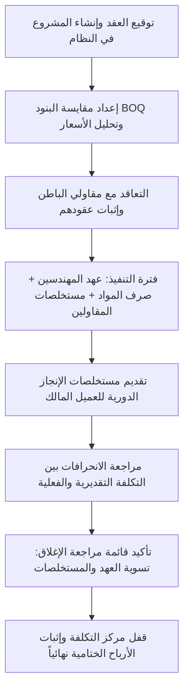

# دليل مديول المقاولات وإدارة المشاريع (TriPro ERP - Construction Module)

مرحباً بك يا صديقي. هذا الدليل مخصص لمساعدتك في شرح مديول المقاولات وعرضه لشركات المقاولات والإنشاءات بشكل يوضح القيمة العالية التي يقدمها، وكيف يحل أكبر مشاكل القطاع (التحكم بالتكاليف، مستخلصات العملاء ومقاولي الباطن، العهد الميدانية، والربحية الفعلية) من خلال **واجهات النظام، الأزرار التفاعلية، ودورات العمل الواقعية**، تماماً كما هو مطبق على أرض الواقع في نظام **TriPro ERP**، وبصيغة خالية من أسماء الأكواد أو الملفات البرمجية لتكون سهلة الفهم للجميع.

---

## 1. نظرة عامة والجمهور المستهدف (Overview & Target Audience)

يعتمد مديول المقاولات في نظام **TriPro ERP** على مفهوم **"مراكز التكلفة المفتوحة"** للمشاريع، حيث يربط جميع التحركات المالية والمخزنية والميدانية للمشروع بالحسابات العامة للمنشأة تلقائياً.

### الفئات المستفيدة داخل شركة المقاولات:
1. **مدير المشروع والمهندس الميداني (Project Manager / Site Engineer):** متابعة نسب الإنجاز الميدانية، طلب صرف المواد، وإدخال فواتير العهد النثرية.
2. **مهندس المكتب الفني (Technical Office Engineer):** إعداد مقايسات بنود المشروع (BOQ) وتحليل الأسعار وحساب الكميات.
3. **الحسابات والمراجعة (Accounting & Internal Audit):** مراجعة واعتماد مستخلصات مقاولي الباطن، وإصدار مستخلصات العميل، ومطابقة الصرف الفعلي بالميزانية المرصودة.
4. **المدير المالي والمالك (CFO & Owner):** مراقبة ربحية كل مشروع في الوقت الفعلي مقارنة بالمخطط له، ومنع تجاوز الميزانيات.

---

## 2. الدليل التفصيلي للشاشات والأزرار والميزات التشغيلية

يتكون مديول المقاولات من 5 شاشات تفاعلية أساسية تغطي كافة جوانب التشغيل والمحاسبة لمواقع البناء:

### 🌟 أولاً: شاشة إعداد المقايسات وتحليل سعر البنود (BOQ Manager)
* **الفكرة:** حجر الأساس للمشروع حيث يتم تفكيك بنود الأعمال وتحديد تكاليفها وسعر البيع المستهدف للعميل.
* **أهم الأزرار والوظائف التشغيلية:**
  * 🔘 **زر "إضافة بند" (Add Item):** يضيف سطراً جديداً لجدول المقايسة لتعريف بند عمل جديد (مثل: حفر وتطهير، صب خرسانات، تشطيبات) مع تحديد اسم البند، والوحدة (م3، م2، طن، إلخ)، والكمية التقديرية.
  * 🔘 **زر "تحليل سعر البنود" (أيقونة السهمين Chevron):** يفتح نافذة داخلية لتفكيك تكلفة وحدة البند الواحد إلى: (تكلفة المواد، تكلفة العمالة، المصاريف غير المباشرة/التشغيلية) بدلاً من التسعير التقديري العشوائي.
  * 📥 **حقول "تكاليف الوحدة ونسبة الربح" (Cost and Margin Inputs):** حقول إدخال تكلفة الخامات، أجور العمالة، ونسبة الأعباء غير المباشرة مع إدخال نسبة هامش الربح المستهدفة للوحدة (%)، ليقوم النظام آلياً بحساب سعر البيع المقدر للبند وجعل حقل السعر **قراءة فقط (Read-only)** طالما التحليل مفتوح لضمان دقة العمل.
  * 🔘 **زر "حفظ التغييرات" (Save Changes):** يقوم بإجراء عملية ترحيل وتحديث مجمّع (Upsert) لكافة البنود المعدلة وحفظها في قاعدة البيانات مع الحفاظ على ترابطها.
  * 🗑️ **زر "حذف بند" (Trash Icon):** لحذف البنود غير المعتمدة واستبعادها من المقايسة.

### 🌟 ثانياً: شاشة مستخلصات العميل وتدقيق الإنجاز (Client Progress Billings)
* **الفكرة:** إعداد المطالبات المالية للمالك (العميل) بناءً على ما تم إنجازه فعلياً في الموقع وترحيلها محاسبياً.
* **أهم الأزرار والوظائف التشغيلية:**
  * 🔘 **زر "إنشاء مستخلص جديد" (Create progress billing):** لفتح نموذج تحضير مطالبة مالية جديدة للعميل وتحديد تاريخ المطالبة ورقمها.
  * 📥 **حقول "نسب إنجاز البنود" (BOQ Item Progress Input):** تمكن المهندس من إدخال نسبة الإنجاز الفعلية لكل بند من المقايسة، ليقوم النظام تلقائياً باحتساب النسبة الإجمالية المكتملة للمشروع والإجمالي المالي المستحق.
  * 📊 **حقلي "الاستقطاعات والدفعة المقدمة" (Deductions & Advance deductions):** يقوم النظام تلقائياً بخصم "محتجز ضمان الأعمال" (عادة 10%) وتوزيعه لحساب الأصول الوسيطة، مع احتساب نسبة خصم الدفعة المقدمة المستهلكة آلياً لتخفيض الصافي.
  * ⚖️ **حقول "الضرائب المعتمدة" (VAT & WHT Rates):** لحساب ضريبة القيمة المضافة (VAT - 14%) وضريبة خصم المنبع (WHT - 1%) تلقائياً وتحديث الصافي المستحق.
  * 🔘 **زر "اعتماد المستخلص وترحيله محاسبياً" (Approve & Post Billing):** يقوم باستدعاء دالة قاعدة البيانات لترحيل الإيرادات وإثبات المديونية على العميل، وحسابات محتجزات الضمان والضرائب.
  * 📎 **زر "المرفقات الميدانية" (Site Attachment Manager):** لرفع صور تقدم الأعمال من الموقع، أو حصر الكميات الموقعة من الاستشاري لتوثيق المطالبة بشكل قانوني.

### 🌟 ثالثاً: شاشة عقود ومستخلصات مقاولي الباطن (Subcontractor Progress Billings)
* **الفكرة:** إدارة وتوثيق الأعمال المنفذة من مقاولي الباطن وتدقيقها مالياً مع ضبط استقطاعات الضمان والدفعات المقدمة وتقييم أدائهم.
* **أهم الأزرار والوظائف التشغيلية:**
  * 🔘 **زر "إنشاء مستخلص مقاول باطن" (Create Sub Billing):** يفتح نموذج مستخلص لأعمال مقاول محدد مرتبطة ببنود عقده.
  * 📥 **حقول "نسب إنجاز بنود المقاول" (Subcontractor Items Progress):** لإدخال نسب إنجاز المقاول لبنوده يدوياً من الميدان لحساب القيمة الإجمالية المنفذة آلياً.
  * 📊 **حقلي "خصومات مقاول الباطن" (Subcontractor Retention & Advance deductions):** أتمتة خصم نسبة محتجز الضمان الخاصة بالمقاول (تأمين الأعمال) وخصم الدفعة المقدمة التي تسلمها المقاول مسبقاً لتفادي صرف مبالغ زائدة له.
  * ⭐ **واجهة "تقييم أداء المقاول" (Subcontractor Evaluation Dialog):** نافذة تظهر للمهندس عند طلب اعتماد المستخلص لتقييم المقاول في (جودة الأعمال، والالتزام بالجدول الزمني) من 1 إلى 5 لبناء سجل أداء الموردين.
  * 🔘 **زر "اعتماد وترحيل مستخلص المقاول" (Approve Sub Billing):** يستدعي دالة قاعدة البيانات لتحميل التكلفة كـ (مصاريف جارية) على مركز تكلفة المشروع، وإثبات مستحقات المقاول في حساب الموردين.

### 🌟 رابعاً: شاشة إذن صرف مواد للموقع (Material Issue Form)
* **الفكرة:** مراقبة خروج المواد من مخازن الشركة المركزية أو مخزن الموقع وتحميلها على بنود المقايسة لمنع الفوضى والهدر.
* **أهم الأزرار والوظائف التشغيلية:**
  * 🔘 **زر "اختيار المستودع المصدر" (Source Warehouse):** لتحديد المخزن الذي سيتم سحب المواد منه (الأسمنت، الحديد، الكابلات).
  * 🔍 **زر "البحث واختيار الصنف" (SearchableSelect Product):** يتيح تصفح والبحث السريع عن المواد المخزنية المتوفرة وصلاحيتها.
  * 📏 **زر "تحديد وحدة القياس" (UOM Selector):** يتيح اختيار وحدة صرف محددة، ليقوم النظام بحساب التكلفة الفردية والكمية بناءً على معامل التحويل للوحدة المحددة.
  * 🏗️ **زر "ربط الصرف ببند BOQ" (Link to BOQ Item):** يتيح تحديد بند المقايسة المستهدف بدقة لتسجيل الصرف كتكلفة مواد مباشرة عليه، مما يمنع الصرف العشوائي الميداني.
  * 🚨 **نظام "فحص رصيد المخزن" (Stock Availability Checker):** يقوم النظام بفحص الكميات المتاحة بالمستودع المحدد، وفي حال وجود عجز يمنع حفظ الطلب ويعطي تنبيهاً باللون الأحمر يوضح العجز بدقة.
  * 🔘 **زر "حفظ واعتماد الصرف" (Approve & Issue Materials):** يستدعي دالة قاعدة البيانات لتأكيد خصم الكميات من المخزون، وتحميل التكلفة فوراً على المشروع.
  * 🔘 **زر "حفظ كمسودة" (Save Draft):** لحفظ إذن الصرف كمسودة للمراجعة والتدقيق قبل الاعتماد والترحيل.

### 🌟 خامساً: شاشة إدارة وتكاليف تشغيل المعدات (Equipment Manager)
* **الفكرة:** تتبع ساعات عمل المعدات الثقيلة (المملوكة أو المستأجرة) بالموقع وتحميل تكلفتها على المشروع آلياً.
* **أهم الأزرار والوظائف التشغيلية:**
  * 🔘 **زر "تعريف معدة جديدة في النظام" (Define New Equipment):** لإنشاء معدة جديدة في قائمة التشغيل وربطها بجدول الأصول الثابتة للشركة (`assets`) أو تسجيلها كمعدة خارجية.
  * 📥 **حقل "تكلفة ساعة التشغيل" (Hourly Operating Cost):** إدخال السعر المعياري لتشغيل المعدة في الساعة (شاملاً الوقود والصيانة والمشغل) لتحميله على المشاريع.
  * 🔘 **زر "تسجيل تشغيل معدة" (Log Equipment Usage):** يفتح نموذجاً لتسجيل تشغيل المعدة في يوم محدد، وتحديد عدد ساعات العمل الفعلية بالمشروع.
  * 🔘 **زر "اعتماد وترحيل ساعات تشغيل المعدة" (Approve & Post Usage Log):** يستدعي دالة قاعدة البيانات لاعتماد تشغيل المعدة وترحيل قيمتها المالية (عدد الساعات $\times$ تكلفة الساعة) كـ (مصاريف تشغيلية) على مركز تكلفة المشروع.

---

## 3. دورة العمل المتكاملة في مديول المقاولات (Full Workflow)

إليك كيف تسير دورة حياة المشروع في النظام من البداية إلى الإغلاق:

```mermaid
graph TD
    A[توقيع العقد وإنشاء المشروع في النظام] --> B[إعداد مقايسة البنود BOQ وتحليل الأسعار]
    B --> C[التعاقد مع مقاولي الباطن وإثبات عقودهم]
    C --> D[فترة التنفيذ: عهد المهندسين + صرف المواد + مستخلصات المقاولين]
    D --> E[تقديم مستخلصات الإنجاز الدورية للعميل المالك]
    E --> F[مراجعة الانحرافات بين التكلفة التقديرية والفعلية]
    F --> G[تأكيد قائمة مراجعة الإغلاق: تسوية العهد والمستخلصات]
    G --> H[قفل مركز التكلفة وإثبات الأرباح الختامية نهائياً]
```

---

## 4. تقارير الإدارة الاستراتيجية (Executive Reports)

تستطيع إدارة الشركة متابعة صحة مشاريعها عبر تقارير رئيسية مدمجة بالنظام:
1. **لوحة معلومات المقاولات (Construction Dashboard):** تعرض إجمالي قيمة المشاريع النشطة، إجمالي المصاريف الفعلية، نسبة الإنجاز المتوسطة، والمبالغ المستحقة للتحصيل.
2. **التقرير الشامل للمشروع (Project Comprehensive Report):** يوضح تفاصيل مالية كاملة للمشروع (BOQ الأصلي، أوامر التغيير، المنصرف الفعلي مقارنة بالمقدر، موقف مقاولي الباطن، المتبقي من الدفعات المقدمة، ومستقطعات الضمان المفرج عنها والمحتجزة).
3. **تقرير تكاليف العمالة والتشغيل (Labor & Operating Costs Report):** يعرض الأجور اليومية وتكاليف العمالة والتشغيل التي تم تحميلها على المشروع مباشرة.

---

## 5. جمل تسويقية لبيع المديول لأصحاب الشركات (Sales Hooks)

> [!TIP]
> **السيناريو الأول: التحكم في سرقة وهدر المواد الخام بالموقع**
> * **سؤال المندوب:** "هل تعاني من ضياع الأرباح بسبب عدم معرفة التكلفة الحقيقية لبنود المشروع أثناء التنفيذ؟"
> * **الحل بالنظام:** "ربط مقايسة الـ BOQ بأذونات صرف المواد وعقود الباطن يعطيك تكلفة البند الفعلية أولاً بأول مقارنة بالسعر التقديري، مما يحميك من تجاوز الميزانيات ويمنع الهدر الميداني للمواد."

---

> [!IMPORTANT]
> **السيناريو الثاني: حساب التكاليف الحقيقية وهوامش أرباح البنود**
> * **سؤال المندوب:** "هل تشتكي من صعوبة تسوية العهد النقدية مع مهندسي المواقع وتراكم الفواتير غير الموثقة؟"
> * **الحل بالنظام:** "نظام إدارة العهد الذكي يتيح للمهندس إدخال فواتيره وتصنيفها من الموقع مباشرة، ولن يتم إغلاق المشروع محاسبياً إلا بعد تصفية وتسوية كافة العهد المفتوحة وتحميلها كـ مصروفات فعلية على المشروع."

---

> [!NOTE]
> **السيناريو الثالث: عقود ومستخلصات مقاولي الباطن بدقة**
> * **سؤال المندوب:** "هل تواجه مشاكل قانونية أو مالية مع مقاولي الباطن بسبب حسابات محتجز ضمان الأعمال أو استهلاك الدفعات المقدمة؟"
> * **الحل بالنظام:** "يقوم النظام باحتساب وخصم محتجز الضمان (الـ Retention) ونسبة الدفعة المقدمة تلقائياً من كل مستخلص، مع الاحتفاظ بجدول تواريخ الإفراج عن الضمانات لمنع اللبس والنزاعات القانونية."

---

> [!CAUTION]
> **السيناريو الرابع: تفادي الخسائر غير المتوقعة للمشاريع**
> * **سؤال المندوب:** "هل تفاجأ بخسارة المشروع بعد فوات الأوان وإغلاق العمل مع العميل وتسليم الموقع؟"
> * **الحل بالنظام:** "شاشة إغلاق المشاريع تعطي ملخص الربحية الفعلي (الإيراد المعتمد ضد المصاريف الفعلية) وتقفل مركز التكلفة تماماً لتمنع ترحيل أي تكاليف سرية بعد التسليم وحماية أرباح الشركة."

---

**TriPro ERP** هو النظام الأقوى لشركات المقاولات التي تسعى إلى تحويل مشاريعها الميدانية إلى **مراكز أرباح خاضعة للرقابة المالية المطلقة**. بالتوفيق في تسويقه وعرضه للعملاء يا صديقي!
