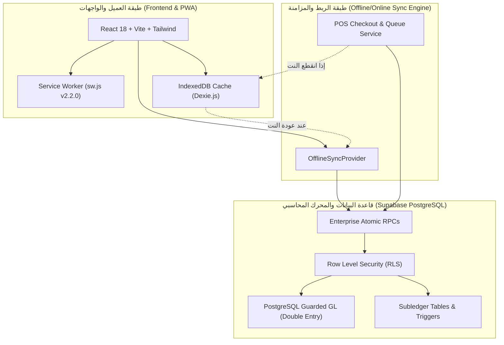

# 🏛️ المعمارية التقنية الشاملة وتوثيق المطورين — TriPro Enterprise ERP
### TriPro Enterprise Architecture & Developer System Reference

---

## 📑 فهرس المحتويات (Table of Contents)
1. [نظرة عامة والتقنيات المستخدمة (System Overview & Tech Stack)](#1-نظرة-عامة-والتقنيات-المستخدمة)
2. [معمارية تعدد المستأجرين وقواعد البيانات (Multi-Tenant & Dual-DB Architecture)](#2-معمارية-تعدد-المستأجرين-وقواعد-البيانات)
3. [المحرك المحاسبي المزدوج والتكامل الرقابي (Accounting Core & GL Integrity)](#3-المحرك-المحاسبي-المزدوج-والتكامل-الرقابي)
4. [معمارية العمل دون اتصال ومزامنة الكاشير (Offline-First POS & PWA Architecture)](#4-معمارية-العمل-دون-اتصال-ومزامنة-الكاشير)
5. [جسر الأستاذ المساعد الموحد (Subledger Registry Bridge)](#5-جسر-الأستاذ-المساعد-الموحد)
6. [نظام الصلاحيات والأمان وفصل المهام (RBAC, RLS & Segregation of Duties)](#6-نظام-الصلاحيات-والأمان-وفصل-المهام)
7. [هيكل المشروع والمسارات (Directory Layout & Code Organization)](#7-هيكل-المشروع-والمسارات)
8. [توثيق الإجراءات المخزنة (Core Database RPCs & APIs)](#8-توثيق-الإجراءات-المخزنة)
9. [دليل إعداد المطور والاختبارات الآلية (Developer Setup & QA Standards)](#9-دليل-إعداد-المطور-والاختبارات-الآلية)

---

## 1. نظرة عامة والتقنيات المستخدمة

يعتمد نظام **TriPro ERP** على بنية سحابية متقدمة (`Enterprise Cloud Architecture`) تجمع بين الواجهات التفاعلية الحديثة المعتمدة على الويب كـ Progressive Web App (PWA) وبين قاعدة بيانات علائقية فائقة الأمان (`PostgreSQL 15`) عبر منصة Supabase.

### 🛠️ حزمة التقنيات (Technology Stack):
* **Frontend Core**: React 18 (مع StrictMode)، TypeScript 5+، Vite Build Engine.
* **UI & Styling**: Tailwind CSS، Lucide Icons، Framer Motion.
* **State & Local Storage**: Dexie.js (IndexedDB Wrapper للمزامنة الأوفلاين)، React Context API.
* **Backend & Database**: Supabase (PostgreSQL 15)، PL/pgSQL Stored Procedures & Triggers، Row Level Security (RLS).
* **Hardware Integrations**: WebSerial API، WebUSB / RawBT Thermal Printers، ETA E-Invoicing Signer (Port 8500).
* **Testing & QA**: Vitest، React Testing Library، `@testing-library/jest-dom` (36 أجنحة اختبار، 188 اختباراً آلياً ناجحاً 100%).



---

## 2. معمارية تعدد المستأجرين وقواعد البيانات

تم تصميم النظام ليعمل بنموذج **Multi-Tenant with Strict Isolation**:
1. **عزل البيانات عبر المستأجرين (`tenant_id / org_id`)**:
   - تحتوي كل الجداول المحاسبية والتشغيلية على عمود `org_id` يرتبط بجدول `organizations`.
   - يتم تفعيل سياسات الأمان على مستوى الصف (`Row Level Security - RLS`) على كافة الجداول بدون استثناء لمنع أي تسريب بيانات بين الشركات.
2. **بيئة الإنتاج المزدوجة (Lenza Dual-DB Strategy)**:
   - قاعدة إنتاج مخصصة لمجموعة لينزا (`Lenza Production DB`) تحتوي على الشجرة المحاسبية المصرية وتهيئة الفروع والمصانع ومحلات التجزئة.
   - قاعدة المستأجرين السحابية (`SaaS Master DB`) تتيح إنشاء شركات جديدة وتهيئتها لحظياً عبر `provision_new_org_complete`.

---

## 3. المحرك المحاسبي المزدوج والتكامل الرقابي

يمتلك النظام محركاً محاسبياً متوافقاً مع **معايير المحاسبة المصرية والدولية (EAS / IFRS)** يفرض رقابة برمجية صلبة على مستوى قاعدة البيانات:

### قواعد التوازن والنزاهة المحاسبية (Immutable GL Constraints):
1. **قاعدة التوازن الإجباري (`fn_enforce_journal_entry_balance`)**:
   لا يمكن لأي قيد في جدول `journal_entries` التحول لحالة `posted` إلا إذا كان:
   $$\sum \text{Debit} = \sum \text{Credit}$$
   وبحد أدنى طرفين محاسبيين (`journal_entry_lines`).
2. **تجميد القيود المرحّلة (`fn_protect_posted_journal_lines`)**:
   يُمنع منعاً باتاً تعديل أو حذف أي سطر قيد مرحل. لتصحيح قيد مرحل، يتم إصدار قيد عكسي أو إلغاء ترحيل معتمد بصلاحيات المدير المالي.
3. **دورة الرواتب والاستحقاق (`Payroll Accrual Engine`)**:
   - نهاية الشهر: يتم تشغيل `run_payroll_accrual_rpc` لتسجيل قيد الاستحقاق:
     - **مدين**: 531 (الرواتب والأجور الأساسية)، 5312 (المكافآت والحوافز).
     - **دائن**: 1223 (السلف المستردة)، 422 (الجزاءات والخصومات)، 2233 (ضريبة كسب العمل)، 2251 (الرواتب المستحقة).
   - يوم الصرف: يتم تشغيل `pay_accrued_payroll_rpc` لصرف الرواتب:
     - **مدين**: 2251 (الرواتب المستحقة).
     - **دائن**: الخزينة أو البنك (1201 / 1202).

---

## 4. معمارية العمل دون اتصال ومزامنة الكاشير (Offline-First POS & PWA Architecture)

تم فحص والتحقق التام من محرك العمل دون اتصال (`Offline POS`) وتبين أنه **مبني ومكتمل بنسبة 100%** ويشمل العناصر التالية:

### 1. قاعدة البيانات المحلية (`Dexie.js IndexedDB - TriProOfflineDB`):
* **الملف المرجعي**: [`services/offlineService.ts`](file:///c:/Users/pc/Desktop/TriPro-ERP/services/offlineService.ts)
* **الجداول المحلية**:
  - `queuedOrders`: طابور الفواتير المنفذة في وضع عدم الاتصال.
  - `products`: دليل الأصناف والباركود والأسعار المخبأة محلياً.
  - `posShifts`: بيانات وردية الكاشير وحالة الدرج.
  - `himsPatients`: ملفات المرضى للكشف السريع.
  - `system_logs`: سجل أخطاء المزامنة والعمليات دون اتصال.

### 2. معالجة العمليات عند انقطاع الاتصال (`Checkout Fallback`):
* **الملف المرجعي**: [`modules/retail/services/posCheckoutService.ts`](file:///c:/Users/pc/Desktop/TriPro-ERP/modules/retail/services/posCheckoutService.ts)
* عند ضغط زر الدفع:
  1. يفحص النظام الاتصال أولاً (`navigator.onLine`).
  2. إذا كان الجهاز غير متصل بالإنترنت، يتم حفظ الفاتورة فوراً في `offlineService.enqueueOrder()` مع وسمها بـ `is_offline: true` وتوليد مفتاح عدم تكرار `offline_ref_id`.
  3. يتم طباعة الإيصال محلياً للعميل دون أي تأخير، وتحديث عداد الفواتير المعلقة في واجهة الكاشير.

### 3. طبقة المزامنة التلقائية والتعافي من التعارضات (`Sync & Conflict Engine`):
* **الملف المرجعي**: [`components/OfflineSyncProvider.tsx`](file:///c:/Users/pc/Desktop/TriPro-ERP/components/OfflineSyncProvider.tsx)
* يرصد النظام عودة الاتصال فورياً عبر حدث `window.addEventListener('online')`، كما ينفذ نبضة مزامنة دورية كل 30 ثانية.
* يستدعي المحرك الإجراء المجمع `sync_offline_pos_orders_batch` أو `sync_offline_pos_order`:
  - **منع التكرار (Idempotency)**: استخدام `offline_ref_id` يمنع تكرار أي فاتورة حتى لو أُعيدت المزامنة عدة مرات.
  - **حسم تعارض الأرصدة (Stock Conflict Resolution)**: إذا كان الرصيد السحابي غير كافٍ بسبب مبيعات فرع آخر، تُسجل الفاتورة وتُخصم الكمية مع تسجيل إشعار رقابي للمخزن بدلاً من إيقاف حركة البيع، حفاظاً على استمرارية العمل أمام العميل.

### 4. عامل الخدمة والتحميل السريع (`Enterprise Service Worker`):
* **الملف المرجعي**: [`public/sw.js`](file:///c:/Users/pc/Desktop/TriPro-ERP/public/sw.js)
* الإصدار الحالي: `V2.2.0-STABLE`.
* **استراتيجيات التخزين المؤقت**:
  - **Cache-First**: للأصول الثابتة المرفوعة بـ Hash من Vite (JS, CSS, Web Fonts).
  - **Network-First مع مهلة 3 ثوانٍ**: لاستدعاءات Supabase REST، للتحول السلس للبيانات المخبأة محلياً فور بطء أو انقطاع الشبكة.
  - **Bypass فوري**: للمنافذ الفيزيائية والأجهزة المحلية مثل بورت التوقيع الإلكتروني لمصلحة الضرائب المصرية (`127.0.0.1:8500`) وطابعات الفواتير الحرارية.

---

## 5. جسر الأستاذ المساعد الموحد (Subledger Registry Bridge)

* **الملف المرجعي**: [`services/subledgerRegistry.ts`](file:///c:/Users/pc/Desktop/TriPro-ERP/services/subledgerRegistry.ts)
* يربط العمليات التشغيلية بالأستاذ العام بطريقة مرنة ومفصولة تماماً (`Decoupled Bridge`):
  - **المقاولات**: مستخلصات العملاء، محتجزات ضمان الأعمال (1249)، ومستخلصات مقاولي الباطن (2229).
  - **المستشفيات HIMS**: حسابات المرضى الداخلي والخارجي، ومطالبات شركات التأمين.
  - **الملاعب والنوادي**: عضويات النوادي (4101)، وحجوزات الملاعب (4102).
  - **المطاعم والتجزئة**: فواتير المبيعات، ومردوداتها، ووسائل الدفع المتعددة (نقدي/شبكة/آجل).

---

## 6. نظام الصلاحيات والأمان وفصل المهام

1. **التحقق من الصلاحيات (RBAC)**:
   - جدول `roles` وجدول `role_permissions`.
   - جدول الصلاحيات الفردية المباشرة للمستخدمين `user_permissions` لتخصيص صلاحيات استثنائية لمستخدم معين دون تعديل دور كامل.
   - الفيو المركزي عالي الأداء: `view_user_effective_permissions` الذي يدمج صلاحيات الدور مع الصلاحيات المخصصة في استعلام واحد محمي.
2. **فصل المهام (Segregation of Duties - SoD)**:
   - موثق في [`docs/POSTING_POLICY_AND_SEGREGATION_OF_DUTIES.md`](file:///c:/Users/pc/Desktop/TriPro-ERP/docs/POSTING_POLICY_AND_SEGREGATION_OF_DUTIES.md).
   - حظر اعتماد القيود أو صرف الرواتب أو إقفال الفترات لمن أنشأها، واشتراط رتبة مالية معتمدة.

---

## 7. هيكل المشروع والمسارات

```
TriPro-ERP/
├── components/                     # المكونات العامة المشتركة (Navbar, Sidebar, OfflineSyncProvider)
├── docs/                           # الأدلة التشغيلية والمعمارية وتوثيق الـ API
│   ├── api/
│   │   └── openapi.json            # مواصفة OpenAPI 3.0.3 لكافة استدعاءات RPC
│   ├── ARCHITECTURE.md             # المعمارية التقنية الشاملة وتوثيق المطورين
│   ├── ENTERPRISE_OPERATIONS_MANUAL.md
│   └── POSTING_POLICY_AND_SEGREGATION_OF_DUTIES.md
├── modules/                        # الموديلات التشغيلية المستقلة
│   ├── accounting/                 # القيود المحاسبية، ميزان المراجعة، شجرة الحسابات
│   │   ├── components/GeneralJournal/ # المكونات المجزأة لدفتر اليومية العامة
│   ├── assets/                     # الأصول الثابتة وحسابات الإهلاك
│   ├── banking/                    # الحسابات البنكية والشيكات وأوراق القبض والدفع
│   ├── construction/               # موديول المقاولات، المشاريع، والمستخلصات
│   ├── hims/                       # النظام الطبي والمستشفيات
│   ├── hr/                         # شؤون الموظفين، الحضور، ومحرك الرواتب
│   ├── manufacturing/              # التصنيع، خطوط الإنتاج، والـ BOM
│   ├── restaurant/                 # المطاعم وإدارة الطاولات
│   ├── retail/                     # مبيعات التجزئة وشاشة الكاشير المتقدمة
│   │   ├── components/POS/         # المكونات المجزأة لشاشة الكاشير
│   ├── sales/                      # فواتير وعروض وأوامر المبيعات
│   ├── settings/                   # شاشات الإعدادات والتهيئات
│   └── stadium/                    # إدارة الملاعب والحجوزات
├── public/                         # الأصول الثابتة و Service Worker ومخطط PWA
│   ├── sw.js                       # Service Worker v2.2.0
│   └── manifest.json               # إعدادات تطبيق الويب التقدمي PWA
├── services/                       # الخدمات المشتركة، الربط مع Supabase، و Dexie
│   └── offlineService.ts           # المحرك المحلي لمزامنة الأوفلاين
├── sql_updates/                    # ملفات الهجرة وتحديثات PostgreSQL المسلسلة تاريخياً
└── tests/                          # اختبارات التكامل والاختبارات الآلية
```

---

## 8. توثيق الإجراءات المخزنة (Core Database RPCs & APIs)

تم توثيق كافة الـ RPCs في ملف المواصفات القياسي [`docs/api/openapi.json`](file:///c:/Users/pc/Desktop/TriPro-ERP/docs/api/openapi.json). فيما يلي جدول بالدوال الأساسية:

| اسم الدالة المخزنة (RPC) | الموديول | الوظيفة المحاسبية والتشغيلية |
| :--- | :--- | :--- |
| `complete_pos_sale_atomic` | Retail POS | تنفيذ بيع متكامل في معاملة واحدة مع حجز وقفل تشاؤمي للأرصدة (`FOR UPDATE`). |
| `sync_offline_pos_order` | Offline Sync | مزامنة فاتورة تم إنشاؤها بدون إنترنت مع منع التكرار عبر `offline_ref_id`. |
| `sync_offline_pos_orders_batch` | Offline Sync | مزامنة دفعة فواتير أوفلاين في طلب واحد لتقليل استهلاك الشبكة. |
| `start_pos_shift` | Retail POS | فتح وردية كاشير جديدة وتثبيت رصيد العهدة الافتتاحي. |
| `close_shift` | Retail POS | إغلاق الوردية ومطابقة النقدية الفعلية مع الحسابات الدفترية. |
| `get_shift_summary` | Retail POS | استخراج التقرير المالي للوردية وتفصيل المدفوعات (كاش/فيزا/آجل). |
| `run_payroll_accrual_rpc` | Payroll & HR | توليد قيد استحقاق الرواتب نهاية الشهر وتوزيعه على مراكز التكلفة. |
| `pay_accrued_payroll_rpc` | Payroll & HR | صرف الرواتب المستحقة من الخزينة أو البنك وإقفال حساب الاستحقاق 2251. |
| `post_sales_invoice` | Accounting | ترحيل فاتورة البيع لدفتر الأستاذ العام وتوليد أطراف المدين والدائن آلياً. |
| `get_next_document_number` | Core Sequence | توليد رقم المستند المتسلسل التالي دون فجوات مع قفل الصف لمنع التكرار. |
| `close_financial_year` | Accounting | إقفال السنة المالية، وتدوير الأرباح/الخسائر، وتجميد الفترة نهائياً. |
| `create_organization_backup` | Disaster Recovery | أخذ نسخة احتياطية مشفرة وشاملة لبيانات الشركة بصيغة JSON. |

---

## 9. دليل إعداد المطور والاختبارات الآلية

### متطلبات البيئة (Prerequisites):
* Node.js v18 أو v20 LTS.
* مدير الحزم npm أو pnpm.
* حساب Supabase مع صلاحية تشغيل الـ Migrations.

### خطوات التشغيل والتطوير (Setup Instructions):
```bash
# 1. استنساخ المستودع
git clone https://github.com/mahmodelrakhawey-svg/TriPro-ERP.git
cd TriPro-ERP

# 2. تثبيت الحزم البرمجية
npm install

# 3. إعداد متغيرات البيئة
# إنشاء ملف .env يحتوي على:
# VITE_SUPABASE_URL=https://your-project.supabase.co
# VITE_SUPABASE_ANON_KEY=your-anon-key

# 4. تشغيل خادم التطوير
npm run dev
```

### معايير جودة الكود والتحقق الآلي (QA Commands):
```bash
# فحص الأنماط ومنع أخطاء Typescript
npx tsc --noEmit

# تشغيل كافة الاختبارات الآلية (188 اختباراً عبر 36 جناح)
npx vitest run
```
> **ملاحظة للمطورين**: لا يُسمح بدمج أي كود على فرع `main` إلا بعد التأكد من نجاح أمر `npx tsc --noEmit` دون أي خطأ (0 errors) واجتياز الـ 188 اختباراً آلياً بنسبة 100%.
