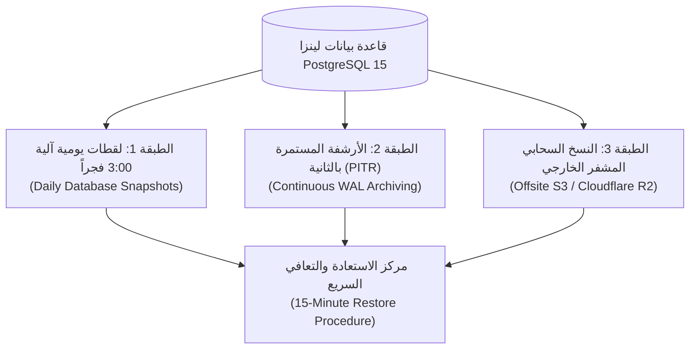

# 🛡️ دليل خطة التعافي من الكوارث والاستعادة بالثانية (Disaster Recovery & PITR Guide)
### شركة لينزا (Lenza Group) — منظومة TriPro Enterprise ERP
**إعداد الإدارة المالية والاستشارات المعمارية للنظام**  
**التاريخ:** 28 سبتمبر 2026 | **الإصدار:** 2.0 (الدليل التنفيذي المعتمد)

---

## 🏛️ 1. المقدمة والأهداف الاستراتيجية لحماية أصول البيانات
تهدف هذه الخطة إلى توفير حصانة مطلقة لكافة البيانات المالية والمخزنية لمجموعة لينزا ضد:
1. انقطاع خدمات الاستضافة السحابية أو تلف الخوادم.
2. الأخطاء البشرية الجسيمة أو محاولات التلاعب غير المصرح بها.
3. انقطاع شبكات الإنترنت في الفروع والمعارض والمصانع.

### ⏱️ مؤشرات التعافي القياسية (Service Level Objectives):
* **زمن استعادة الخدمة (Recovery Time Objective - RTO)**: أقل من **15 دقيقة**.
* **الحد الأقصى لفقدان البيانات (Recovery Point Objective - RPO)**: أقل من **60 ثانية** (Zero Data Loss).

---

## 🔄 2. استراتيجية النسخ الاحتياطي متعدد الطبقات (Multi-Tier Backup Strategy)



### الطبقة الأولى: النسخ الليلي الآلي (Automated 03:00 AM Snapshots)
* يتم أخذ نسخة كاملة من قاعدة البيانات يومياً في تمام الساعة الثالثة فجراً عبر الإجراء المخزن:
  ```sql
  SELECT public.create_organization_backup(p_org_id => 'lenza-org-uuid');
  ```
* تحتفظ المنظومة بآخر نسختين يوميتين بشكل تلقائي في جدول `organization_backups`.

### الطبقة الثانية: الاسترجاع الدقيق بالثانية (Point-in-Time Recovery - PITR)
* تعتمد قاعدة بيانات PostgreSQL في Supabase على حفظ سجلات التغيير المتزامنة (Write-Ahead Logs - WAL).
* تتيح هذه الميزة للمدير المالي والـ IT إعادة تشغيل قاعدة البيانات إلى أي نقطة زمنية سابقة بدقة بالغة (مثلاً: "العودة للوضع في تمام الساعة 02:14:35 عصراً قبل حدوث الخطأ").

### الطبقة الثالثة: النسخ السحابي الخارجي المعزول (Offsite Cloud Storage)
* عبر خدمة `services/offsiteBackupService.ts`:
* يتم تشفير النسخ الاحتياطية بمفتاح AES-256 ورفعها إلى مساحة تخزين سحابية خارجية مستقلة (AWS S3 Bucket أو Cloudflare R2) بعيدة عن خادم التطبيق الرئيسي لضمان الأمان حتى لو تعطل مزود الاستضافة الرئيسي.

---

## 🖨️ 3. حصانة أجهزة الكاشير ونقاط البيع (POS & Hardware Resilience)

1. **العمل دون اتصال الكامل (Offline Dexie IndexedDB)**:
   * في حال انقطاع كابل الإنترنت أو شبكة الـ Wi-Fi بالمعرض، تعمل شاشة الكاشير بطاقتها الكاملة، وتُحفظ الفواتير محلياً مع توليد مفتاح تتبع `offline_ref_id`.
2. **الطباعة المباشرة عبر الهاردوير (ESC/POS & WebUSB)**:
   * موثقة ومفحوصة عبر [`services/thermalPrinterService.ts`](file:///c:/Users/pc/Desktop/TriPro-ERP/services/thermalPrinterService.ts).
   * إرسال أوامر الطباعة وفتح درج النقدية عبر منافذ USB والشبكة مباشرة دون الاعتماد على متصفح الويب.
3. **المزامنة التلقائية عند عودة الشبكة**:
   * يدفع محرك `OfflineSyncProvider` الفواتير المعلقة دفعة واحدة عبر `sync_offline_pos_orders_batch` مع حسم أي تعارض مخزني بذكاء دون إيقاف الكاشير.

---

## 📋 4. سيناريو تجربة الطوارئ (15-Minute Recovery Drill)

في حال حدوث عطل شامل، يتبع مسؤول تكنولوجيا المعلومات الخطوات التالية:
1. **التحقق من حالة قاعدة البيانات**:
   * فحص آخر تقرير صادر من **درع النزاهة والتدقيق المحاسبي (Midnight Integrity Shield)** للتأكد من حالة التوازن.
2. **الاستعادة اللحظية (PITR Restore)**:
   * الدخول إلى لوحة إدارة Supabase -> Database -> Backups.
   * اختيار تاريخ ووقت نقطة الاسترجاع بدقة (Point in Time).
   * الضغط على **Confirm Restore**. يستغرق إنشاء النسخة المستعادة ما بين 5 إلى 10 دقائق.
3. **التحقق من الأركان المحاسبية الأربعة**:
   * تشغيل فحص النزاهة من شاشة الإدارة المالية:
     - توازن الأستاذ العام ($\sum \text{Debit} = \sum \text{Credit}$).
     - مطابقة أرصدة العملاء والموردين.
     - مطابقة تقييم المخزون.
4. **استئناف العمل**:
   * إشعار الفروع والمعارض باستئناف المزامنة تلقائياً.
