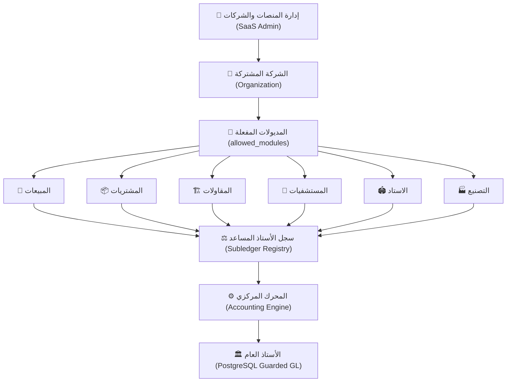

# 📘 الدليل التشغيلي والمعماري الشامل — TriPro Enterprise ERP

---

## 🏛️ الفهرس العام
1. [نظرة عامة على المعمارية الموحدة](#1-نظرة-عامة-على-المعمارية-الموحدة)
2. [سجل الأستاذ المساعد الموحد (Subledger Registry)](#2-سجل-الأستاذ-المساعد-الموحد-subledger-registry)
3. [محددات الأمان والتوازن المحاسبي في PostgreSQL](#3-محددات-الأمان-والتوازن-المحاسبي-في-postgresql)
4. [المحرك المحاسبي المركزي (Accounting Engine)](#4-المحرك-المحاسبي-المركزي-accounting-engine)
5. [دورة إقفال الفترات المالية الشهرية والسنوية](#5-دورة-إقفال-الفترات-المالية-الشهرية-والسنوية)
6. [إدارة الاشتراكات وتفعيل المديولات السحابية (SaaS Modules)](#6-إدارة-الاشتراكات-وتفعيل-المديولات-السحابية-saas-modules)
7. [محرك الفحص والضغط الآلي الشامل (Automated Stress Test)](#7-محرك-الفحص-والضغط-الآلي-الشامل-automated-stress-test)

---

## 1. نظرة عامة على المعمارية الموحدة

يعتمد نظام **TriPro ERP** على بنية سحابية هجينة (`Multi-Tenant Modular Architecture`) تتيح تشغيل مديولات متخصصة لعدة قطاعات (تجاري، تصنيع، مقاولات، مستشفيات، نوادي واستادات، مطاعم) داخل منظومة موحدة ترتبط مباشرة بدفتر الأستاذ العام (`General Ledger`).



---

## 2. سجل الأستاذ المساعد الموحد (Subledger Registry)

- **الملف المرجعي**: `services/subledgerRegistry.ts`
- **الوظيفة**:  
  يعمل كوسيط ديناميكي (`Decoupled Bridge`) يجمع حركات العملاء والموردين من جميع المديولات المفعلة فقط للشركة دون الحاجة لربط الكود بتبعيات صلبة.
- **المديولات المدعومة**:
  1. **المقاولات**: مستخلصات العملاء، محتجزات الضمان (1249)، مستخلصات مقاولي الباطن، وضمان الباطن (2229).
  2. **المستشفيات HIMS**: فواتير المرضى، مطالبات شركات التأمين، وتسويات المرضى.
  3. **الاستاد والنوادي**: اشتراكات العضوية (4101)، حجوزات الملاعب (4102)، وصيانة المرافق والعهد (5101).
  4. **التجاري والمطاعم**: فواتير البيع والشراء، السداد الفوري، المرتجعات، والإشعارات.

---

## 3. محددات الأمان والتوازن المحاسبي في PostgreSQL

- **الملف المرجعي**: `services/migrations/2026-08-23_data_integrity_and_database_constraints.sql`
- **القواعد الصارمة المفروضة على قاعدة البيانات**:
  1. **حظر ترحيل القيود غير المتوازنة (`fn_enforce_journal_entry_balance`)**:  
     مستحيل أن يتحول قيد إلى حالة `posted` إلا إذا كان مجموع المدين مساوياً للدائن تماماً ($Debit = Credit$) وبحد أدنى طرفين محاسبيين.
  2. **تجميد القيود المرحّلة (`fn_protect_posted_journal_lines`)**:  
     منع تعديل أو حذف أطراف أي قيد مرحّل في دفتر الأستاذ العام إلا بعد فك ترحيله رسمياً.
  3. **حماية الحسابات والعملاء والموردين**:  
     رفض الحذف النهائي (`Hard Delete`) لأي حساب مالي أو عميل/مورد مسجل عليه حركات وقيود سابقة.
  4. **منع تكرار أرقام المستندات**:  
     فهارس فريدة تمنع تكرار أرقام الفواتير والسندات للشركة الواحدة.

---

## 4. المحرك المحاسبي المركزي (Accounting Engine)

- **الملف المرجعي**: `services/accountingEngine.ts`
- **الخدمة**: `UnifiedAccountingEngine`
- **الاستخدام البرمجي**:
```typescript
import { AccountingEngine } from './services/accountingEngine';

// إنشاء قيد متوازن ومرحل بضمان تريجر الأمان
const result = await AccountingEngine.createReceiptVoucherEntry({
  organizationId: 'org-uuid',
  voucherId: 'voucher-uuid',
  voucherNumber: 'RV-1001',
  amount: 5000,
  treasuryAccountId: 'acc-treasury-id',
  customerAccountId: 'acc-customer-id',
  customerName: 'شركة النور للمقاولات'
});
```

---

## 5. دورة إقفال الفترات المالية الشهرية والسنوية

### أ. إقفال الفترات الشهرية (`FiscalPeriodManager`):
- **المسار**: `/fiscal-periods`
- **الوظيفة**:  
  قفل أي شهر منتهي (مثل: يناير، فبراير) لمنع تسجيل أو ترحيل أي فاتورة أو قيد بتاريخ قديم يقع في ذلك الشهر بعد تقديم الإقرارات الضريبية.

### ب. إقفال السنة المالية (`FiscalYearClosing`):
- **المسار**: `/fiscal-year-closing`
- **الوظيفة**:  
  تصفير حسابات قائمة الدخل (المصروفات والإيرادات)، وترحيل صافي الربح/الخسارة إلى حساب الأرباح المبقاة (`32`)، وتوليد قيد الإقفال السنوي الآلي `CLOSE-{year}`.

---

## 6. إدارة الاشتراكات وتفعيل المديولات السحابية (SaaS Modules)

- **لوحة التحكم**: شاشة `SaaSAdmin` (`/saas-admin`).
- **آلية التحكم**:  
  لكل شركة مصفوفة `allowed_modules`، على سبيل المثال:
  - باقة المقاولات: `['accounting', 'inventory', 'purchases', 'construction']`
  - باقة المستشفيات: `['accounting', 'hims', 'inventory', 'hr']`
  - باقة الاستاد الرياضي: `['accounting', 'stadium', 'sales']`

تقوم الواجهة الجانبية ومحرك الحسابات بتكييف القوائم والتقارير فوراً وفق هذه الباقة.

---

## 7. محرك الفحص والضغط الآلي الشامل (Automated Stress Test)

- **الملف المرجعي**: `services/stressTestEngine.ts`
- **الشاشة**: `/stress-test`
- **القدرة الاختبارية**:  
  توليد واختبار 100+ قيد وحركة مالية حية عبر كافة المديولات ومطابقتها فورياً مع ميزان المراجعة والأستاذ العام بدقة 100% بالقرش (الفرق = 0.00 ج.م)، مع ميزة التنظيف الآمن الفوري.

---
**TriPro ERP — Enterprise Grade Architecture © 2026**
