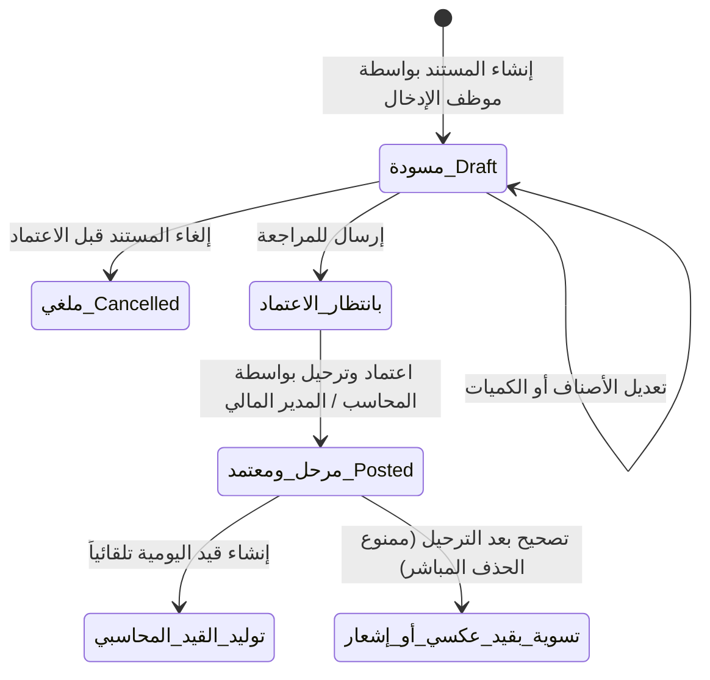

# 🛡️ ميثاق سياسة الصلاحيات والترحيل المحاسبي وفصل المهام (Segregation of Duties & Posting Policy)
### شركة لينزا (Lenza Group) — نظام TriPro ERP
**إعداد الإدارة المالية والاستشارات المعمارية للنظام**  
**التاريخ:** 28 سبتمبر 2026  
**الإصدار:** 1.0 (دليل السياسات والرقابة الداخلية)

---

## 1. المقدمة والأهداف الاستراتيجية

يهدف هذا الميثاق إلى فرض أعلى معايير **الحوكمة المالية والرقابة الداخلية (Internal Financial Controls & Auditability)** داخل شركة "لينزا"، وذلك عبر:
1. **منع الأخطاء البشرية والاحتيال (Fraud & Error Prevention):** تطبيق مبدأ فصل المهام (Segregation of Duties) بحيث لا يملك أي موظف بمفرده دورة إنشاء المستند واعتماده وترحيله وسداده.
2. **حماية القوائم المالية والمراكز الضريبية:** ضمان عدم ترحيل أي عملية إلى دفتر الأستاذ العام إلا بعد المراجعة والتحقق المحاسبي.
3. **ثبات مسار التدقيق (Immutable Audit Trail):** الالتزام بالمعايير المحاسبية المعتمدة (IFRS / GAAP) التي تحظر الحذف أو التعديل المباشر على الحركات المالية المرحّلة.

---

## 2. مصفوفة الصلاحيات وفصل المهام (Roles & Permissions Matrix)

| الدور الوظيفي (Role) | شاشات الإدخال المسموحة | الصلاحية على الفواتير والسندات | الصلاحية على قيود اليومية | صلاحيات الإقفال والتسويات |
| :--- | :--- | :--- | :--- | :--- |
| **الكاشير ومبيعات التجزئة** `cashier`, `sales`, `van_sales` | نقاط البيع (POS)، فواتير المبيعات، مرتجع المبيعات الأولي | إنشاء وحفظ كـ **مسودة (Draft)**، أو فواتير نقاط بيع مباشرة مقيدة بالوردية | **ممنوع تماماً** من الاطلاع أو التحرير | ممنوع من تعديل الأسعار أو التجاوز المالي |
| **أمين المخزن** `storekeeper` | أذون الاستلام، التحويلات المخزنية، أذون الصرف، الجرد | إنشاء سندات التحويل وأذون الصرف كـ **مسودة** بانتظار الاعتماد | **ممنوع تماماً** من تحرير القيود | ممنوع من التسويات الجردية بدون اعتماد مالي |
| **محاسب العمليات** `accountant` | فواتير المشتريات، سندات القبض والصرف، فحص القيود | مراجعة الفواتير والسندات، مطابقة كشوف الحسابات | إنشاء قيود اليومية كـ **مسودة (Draft)** ومراجعتها | ممنوع من إغلاق السنة المالية أو إلغاء ترحيل قيود معتمدة |
| **المدير المالي** `cfo`, `bakery_cfo`, `admin` | كافة الشاشات والتقارير التنفيذية وموازين المراجعة | **اعتماد وترحيل (Post)** كافة الفواتير والسندات | **اعتماد وترحيل قيود اليومية**، وتوليد القيود العكسية | **كامل الصلاحية:** إغلاق وإعادة فتح السنة المالية، تعيين شجرة الحسابات |

---

## 3. دورة حياة المستندات المالية والقيود (Document Lifecycle)

### القواعد الذهبية للحالات:
1. **حالة المسودة (Draft):**
   * يحق لمنشئ المستند تعديل أي بند أو حذف المستند بالكامل.
   * **الأثر المحاسبي:** صفري تماماً؛ لا يظهر في دفتر الأستاذ ولا يؤثر على رصيد العميل أو المورد أو ميزان المراجعة.
2. **حالة الترحيل والاعتماد (Posted):**
   * يقوم المحرك المحاسبي الموحد (`UnifiedAccountingEngine`) بإنشاء قيد اليومية فوراً وبشكل متوازن.
   * **القفل البرمجي:** تُقفل الفاتورة أو السند أو القيد تلقائياً ويُمنع الحذف أو التعديل بالكامل (`Locked`).

---

## 4. سياسة التصحيح والتسويات بعد الترحيل (Audit Trail & Corrections)

وفقاً للمعايير الرقابية الدولية، **لا يوجد زر "حذف" لمستند مرحل**، وبدلاً من ذلك يتم التصحيح عبر الأدوات النظامية التالية:

| الحالة المالية المراد تصحيحها | الإجراء الممنوع (الخطر) | الإجراء النظامي المعتمد في TriPro ERP |
| :--- | :--- | :--- |
| **خطأ في فاتورة مبيعات مرحلة** | حذف الفاتورة من قاعدة البيانات | إصدار **إشعار دائن (Credit Note)** أو **مرتجع مبيعات رسمي** يلغي الأثر المالي والضريبي موثقاً. |
| **خطأ في فاتورة مشتريات مرحلة** | تعديل قيمة الفاتورة يدوياً | إصدار **إشعار مدين (Debit Note)** موجه للمورد مع إثبات السبب. |
| **خطأ في قيد يومية يدوي مرحل** | مسح أطراف القيد أو فتح السجل للتعديل | استخدام ميزة **عكس القيد (Reversing Entry)** لتصفير أثر القيد الأصلي، ثم إنشاء القيد الصحيح برقم مرجعي جديد. |

---

## 5. خطة التطبيق المرحلي لشركة لينزا (Implementation Plan)

1. **التهيئة التقنية (مساء اليوم مع التحديثات):**
   * تجهيز الأكواد لمنح صلاحيات الترحيل والاعتماد للأدوار الإشرافية والمالية.
   * إتاحة زر "حفظ كمسودة" لجميع محرري الفواتير.
2. **جلسة توجيه الموظفين (غداً صباحاً):**
   * إخطار الكاشير وموظفي المبيعات والمخازن بأن دورهم ينتهي عند حفظ الفاتورة أو السند.
   * إخطار الإدارة المالية بمراجعة قسم "الفواتير غير المرحّلة" يومياً واعتمادها بضغطة زر.
3. **الحصاد المؤسسي:**
   * الوصول إلى حسابات دقيقة 100%، خالية من أي تدخلات يدوية غير مبررة، وجاهزة دائماً لتقارير الفحص الضريبي ومراجعي الحسابات القانونيين.
