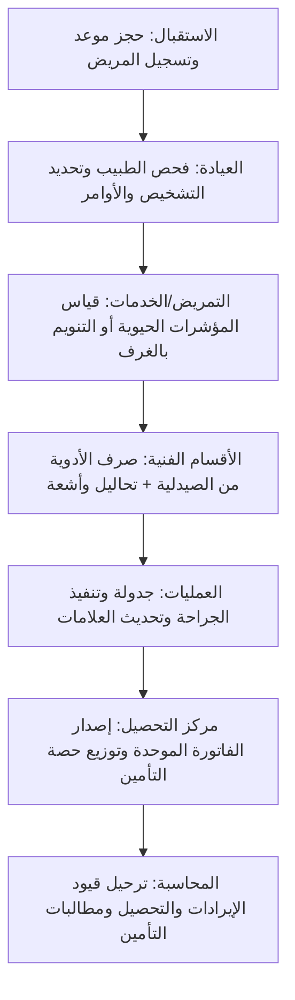

# دليل التعامل مع مديول المستشفيات والرعاية الصحية (TriPro ERP - HIMS Module)

مرحباً بك يا صديقي. هذا الدليل مخصص لمساعدتك في شرح نظام إدارة المستشفيات والعيادات الطبية (HIMS) وعرضه لأصحاب المستشفيات والمراكز الطبية والمستوصفات بشكل يوضح كيف يربط النظام الدورة الطبية السريرية بالكامل بالدورة المالية والمحاسبية والمخزنية.

---

## 1. نظرة عامة والجمهور المستهدف (Overview & Target Audience)
نظام **TriPro HIMS** هو نظام معلومات رعاية صحية متكامل (Hospital Information Management System) يربط الاستقبال، العيادات الخارجية، غرف التنويم، العمليات، التمريض، المختبر، الأشعة، والصيدلية، بمركز الفوترة الموحد ودفتر الأستاذ العام للمستشفى.

### الفئات المستفيدة داخل المستشفى:
1. **موظفو الاستقبال وقبول المرضى (Admissions & Front Desk):** حجز المواعيد، تسجيل المرضى، وتسكين المنومين في الأسرة والغرف.
2. **الأطباء (Doctors):** تصفح السجل الطبي للمريض (EMR)، كتابة التشخيصات والوصفات الطبية والأوامر الطبية (تحاليل، أشعة).
3. **طاقم التمريض (Nurses):** قياس وتسجيل المؤشرات الحيوية، إدارة خطة العلاج الدوائي الموصوف للمريض.
4. **الفنيون (معمل/أشعة):** استقبال طلبات التحاليل والأشعة، سحب العينات، وتسجيل النتائج والتقارير الطبية.
5. **الصيدلاني (Pharmacist):** صرف الأدوية الموصوفة إلكترونياً وتحديث مخزون الصيدلية تلقائياً.
6. **الحسابات والتحصيل ومطالبات التأمين (Billing & Insurance):** إصدار الفاتورة الموحدة للزيارة، معالجة نسب تحمل التأمين، وتوليد مطالبات التأمين المجمعة وتسويتها.

---

## 2. الميزات الرئيسية لبيع النظام (Key Selling Points)

عند التفاوض مع أصحاب المراكز الطبية والمستشفيات، ركز على هذه الميزات السبع الكبرى:

### 🌟 أولاً: السجل الطبي الإلكتروني الموحد (Electronic Medical Record - EMR)
* **الفكرة:** ملف طبي رقمي موحد لكل مريض يحتوي على تاريخه الصحي بالكامل.
* **المميزات التشغيلية:**
  * عرض التاريخ المرضي، الحساسية، والتشخيصات النشطة السابقة.
  * متابعة المؤشرات الحيوية (Vitals) عبر رسوم بيانية (الضغط، النبض، الحرارة، مستوى الأكسجين، نسبة الألم).
  * ربط الطبيب بالتمريض؛ أي دواء أو أمر يكتبه الطبيب يظهر فوراً في لوحة التمريض للتنفيذ.

### 🌟 ثانياً: شاشة الطبيب الذكية (Doctor Desktop)
* **الفكرة:** واجهة عمل واحدة مريحة للطبيب تمكنه من فحص المريض وكتابة كافة الأوامر بسرعة.
* **المميزات التشغيلية:**
  * كتابة شكوى المريض، الملاحظات السريرية، والتشخيصات (ICD-10).
  * **الوصفة الإلكترونية (E-Prescription):** اختيار الأدوية وجرعاتها وتكرارها، لترسل تلقائياً لصيدلية المستشفى.
  * **الأوامر الطبية (Order Entry):** إرسال طلبات تحاليل للمعمل أو أشعة لمركز الأشعة بضغطة زر دون بونات ورقية.

### 🌟 ثالثاً: محطة التمريض وطلب الأسرة (Nurse Station & Ward Bed Management)
* **الفكرة:** مراقبة الأقسام الداخلية والأسرة وتوزيع المرضى عليها بصرياً.
* **المميزات التشغيلية:**
  * **لوحة توزيع الأسرة:** عرض مرئي لغرف التنويم (العناية المركزة، الأقسام الداخلية، الأطفال) وحالة كل سرير (شاغر، مشغول بمريض، بانتظار التنظيف).
  * **محطة التمريض:** لوحة عمل للممرضين تظهر الأدوية المطلوب إعطائها في مواعيدها ومتابعة تنفيذ الأوامر الطبية وتدوين العلامات الحيوية.

### 🌟 رابعاً: الفوترة اللحظية الموحدة (Instant Hospital Billing Engine)
* **الفكرة:** تجميع كافة تكاليف زيارة المريض (كشف، إقامة أسرة، أدوية، تحاليل، أشعة، عمليات) في فاتورة واحدة تلقائياً دون تداخل يدوي.
* **المميزات التشغيلية:**
  * استدعاء دالة `hims_prepare_invoice` لحساب التكاليف فوراً بناءً على الخدمات التي تلقاها المريض خلال الزيارة.
  * دعم الدفعات المقدمة (Deposits) وتأمين الحالات الطارئة.
  * حساب فوري لنسبة تحمل المريض (Co-pay) ونسبة تحمل شركة التأمين.
  * **المحاسبة الآلية:** عند تأكيد التحصيل (`hims_finalize_billing`) يوزع النظام الأرصدة: (مدين للدرج/البنك بقيمة الكاش + مدين لشركة التأمين بقيمة تغطيتها $\leftarrow$ دائن لحسابات إيرادات الخدمات الطبية بكل قسم).

### 🌟 خامساً: إدارة مطالبات التأمين الطبي وتوليد الدفعات (Insurance Claims Manager)
* **الفكرة:** معالجة المشكلة الأكبر للمستشفيات وهي تأخر ورفض مطالبات شركات التأمين.
* **المميزات التشغيلية:**
  * تسجيل عقود شركات التأمين والنسب المعتمدة لكل فئة.
  * **المطالبة المجمعة (Batch Claim):** تجميع كافة فواتير المرضى التابعين لشركة تأمين معينة (مثال: بوبا أو التعاونية) في مطالبة مجمعة واحدة بضغطة زر عبر دالة `hims_create_insurance_batch` لتسهيل المراجعة.
  * **تسوية المطالبات:** إثبات المبالغ المحصلة من شركات التأمين وتوزيعها في الحسابات البنكية فوراً لمعرفة الديون المتبقية على كل شركة.

### 🌟 سادساً: فرز وتصنيف الطوارئ (ER Triage Board)
* **الفكرة:** تنظيم العمل داخل قسم الطوارئ بناءً على خطورة الحالة وليس بأسبقية الحضور.
* **المميزات التشغيلية:**
  * تصنيف المرضى فور وصولهم حسب المعايير العالمية:
    * **الحالات الحرجة جداً (Red - Immediate):** إنقاذ حياة.
    * **الحالات المتوسطة (Yellow - Urgent):** خطيرة ولكن مستقرة.
    * **الحالات البسيطة (Green - Non-Urgent):** نزلات البرد والجروح البسيطة.
  * توجيه الأطباء والتمريض فوراً للحالات ذات الأولوية الحمراء.

### 🌟 سابعاً: تكامل المعامل، الأشعة، وبنك الدم (Lab, Radiology & Blood Bank)
* **الفكرة:** شاشات تشغيلية خاصة بالأقسام الفنية متكاملة مخزنياً وطبياً.
* **المميزات التشغيلية:**
  * **المعمل والأشعة:** استقبال العينات وتتبعها (Specimen Tracking)، تسجيل النتائج والتقارير الطبية، ورفع نتائج الأشعة والتحاليل لتظهر مباشرة للطبيب المعالج في ملف المريض.
  * **بنك الدم:** تتبع أكياس الدم المتوفرة، فصائلها، المتبرعين، وعمليات الصرف لغرف العمليات لضمان عدم حدوث عجز طارئ.

---

## 3. دورة عمل المريض داخل المستشفى (Patient Journey)

---

## 4. تقارير الإدارة ومؤشرات الأداء (HIMS Reports & Analytics)

1. **التقرير التنفيذي للمستشفى (HIMS Executive Dashboard):** يوضح نسب إشغال الأسرة، عدد المرضى الخارجيين والمنومين، الإيرادات حسب القسم، ووقت انتظار المرضى.
2. **تقارير ربحية الخدمات الطبية (HIMS Profitability Reports):** يحلل تكلفة تقديم الخدمات الطبية (أدوات، أجر الطبيب، غازات طبية) مقابل سعر بيع الخدمة لتحديد أكثر الأقسام الطبية ربحية.
3. **مؤشرات أداء الأطباء (Doctor KPIs):** متابعة إنتاجية كل طبيب (عدد الكشوفات، حجم الإيرادات المولدة، ونسب رضاء المرضى).

---

## 5. جمل تسويقية لبيع المديول لأصحاب المستشفيات (Sales Hooks)

* **"هل تعاني من تسريب الأموال وضياع رسوم الخدمات الطبية بين الأقسام وفاتورة الخروج؟"**
  * *الحل:* محرك الفوترة الموحد يجمع تلقائياً أي كشف أو دواء أو تحليل أو يوم إقامة في فاتورة واحدة لحظية، ولا يمكن ترحيل المريض للخروج إلا بعد تصفيتها.
* **"هل تشتكي من تأخر تسويات شركات التأمين الطبي وصعوبة مراجعة الفواتير الفردية؟"**
  * *الحل:* نظام المطالبات المجمعة (Batch Claims) يجمع فواتير كل شركة تأمين في ملف واحد منظم يرسل للشركة بضغطة زر مع متابعة السداد البنكي والخصومات آلياً.
* **"هل تبحث عن تحسين تجربة المريض وتقليل أوقات الانتظار وتجنب الأخطاء الطبية الورقية؟"**
  * *الحل:* الملف الطبي الإلكتروني (EMR) يربط الطبيب بالصيدلية والمختبر والتمريض فوراً، فتصل الوصفة للصيدلي والتحليل للمعمل في نفس ثانية إدخالها من الطبيب.
* **"هل تواجه صعوبة في تتبع المخزون الطبي وصلاحيات الأدوية والمستلزمات الحساسة؟"**
  * *الحل:* تكامل المديول مع المخازن يخصم المواد الطبية والأدوية المستهلكة في العمليات والتنويم فور استخدامها، مع تنبيهات صلاحية الأدوية لتقليل الهدر.

---
**TriPro HIMS** هو الخيار الأمثل للمؤسسات الطبية التي تبحث عن **الدقة السريرية والتحكم المالي والإداري المطلق**. بالتوفيق في تسويق المديول يا صديقي!
