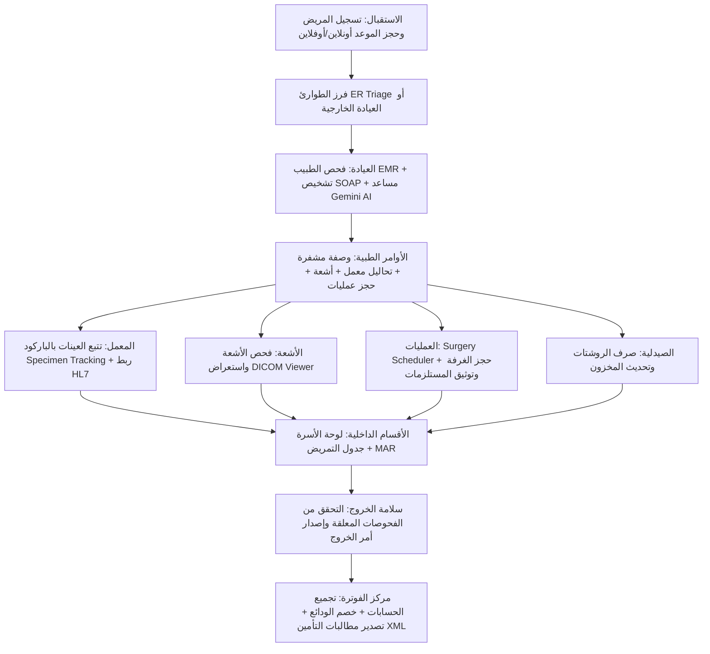

# دليل مديول المستشفيات والرعاية الصحية (TriPro ERP - HIMS Module)
### الإصدار المحدّث والشامل (Full Enterprise Edition)

مرحباً بك يا صديقي. هذا الدليل مخصص لمساعدتك في شرح نظام إدارة المستشفيات والمراكز الطبية والمستوصفات (HIMS) وعرضه لأصحاب المستشفيات والمراكز الطبية بشكل يوضح كيف يربط النظام الدورة الطبية السريرية بالكامل (عيادات، عمليات، تمريض، معامل، أشعة، صيدلية) بالدورة المالية والمحاسبية والمخزنية ومطالبات التأمين، مع تقديم أحدث التقنيات والذكاء الاصطناعي والصمود أوفلاين.

---

## 1. نظرة عامة والجمهور المستهدف (Overview & Target Audience)

نظام **TriPro HIMS** هو نظام معلومات رعاية صحية متكامل (Hospital Information Management System) يربط الاستقبال، العيادات الخارجية، غرف التنويم والأسرة، غرف العمليات الجراحية، التمريض، المختبر، الأشعة، بنك الدم، والصيدلية، بمركز الفوترة الموحد ودفتر الأستاذ العام للمستشفى ومطالبات التأمين المجمعة.

### الفئات المستفيدة داخل المستشفى:
1. **موظفو الاستقبال وقبول المرضى (Admissions & Front Desk):** حجز المواعيد، تسجيل المرضى، وتسكين المنومين في الأسرة والغرف أوفلاين وأونلاين.
2. **الأطباء (Doctors):** تصفح السجل الطبي (EMR)، كتابة التشخيصات (SOAP & ICD-10)، الوصفات المشفرة، والأوامر الطبية بدعم من الذكاء الاصطناعي التشخيصي.
3. **الجراحون وطاقم العمليات (Surgeons & OR Team):** حجز غرف العمليات، جدولة الجراحات، وتوثيق استهلاك المستلزمات الطبية وأجور الجراحين.
4. **طاقم التمريض (Nurses):** تسجيل المؤشرات الحيوية، جدول إعطاء الأدوية اللحظي (MAR)، ومتابعة جداول النوباتجيات (Staff Roster).
5. **الفنيون (معمل/أشعة):** استقبال الطلبات، تتبع عينات المختبر بالأنابيب والباركود، والربط المباشر مع أجهزة التحاليل (HL7) وسيرفرات الأشعة (PACS DICOM).
6. **الصيدلاني (Pharmacist):** صرف الأدوية إلكترونياً، مراجعة التفاعلات الدوائية، ومتابعة الأدوية الراكدة وتواريخ الصلاحية عبر لوحة الصيدلية.
7. **الحسابات والتأمين (Billing & Insurance):** الفاتورة الموحدة للزيارة، خصم الودائع، ونسب التحمل، وتوليد وتصدير ملفات مطالبات التأمين بصيغة XML المعتمدة.

---

## 2. الدليل التفصيلي للشاشات والأزرار والميزات التشغيلية

يتكون مديول المستشفيات من منظومة متكاملة من الشاشات السريرية والتشغيلية المتقدمة:

### 🌟 أولاً: السجل الطبي الإلكتروني الموحد (Electronic Medical Record - EMR)
* **الفكرة:** ملف طبي رقمي موحد لكل مريض يحتوي على تاريخه الصحي بالكامل مع خط زمني (Timeline) تفاعلي.
* **المميزات التشغيلية:**
  * عرض التاريخ المرضي، الحساسية، والتشخيصات النشطة السابقة.
  * **الملاحظات الطبية المنهجية (SOAP Notes):** كتابة الملاحظات وفق المعيار العالمي (Subjective, Objective, Assessment, Plan).
  * متابعة المؤشرات الحيوية (Vitals) عبر رسوم بيانية تفاعلية (الضغط، النبض، الحرارة، مستوى الأكسجين، مؤشر الألم).
  * ربط الطبيب بالتمريض؛ أي دواء أو أمر يكتبه الطبيب يظهر فوراً في لوحة التمريض وجدول MAR للتنفيذ.

---

### 🌟 ثانياً: شاشة الطبيب الذكية والذكاء الاصطناعي (Doctor Desktop & AI Assistant)
* **الفكرة:** واجهة عمل متطورة للطبيب تمكنه من فحص المريض وكتابة كافة الأوامر بسرعة بدعم من نماذج الذكاء الاصطناعي.
* **المميزات التشغيلية:**
  * **المساعد الطبي بالذكاء الاصطناعي (Gemini AI Assistant):** توفير مقترحات تشخيصية مساعدة ومراجعة تداخلات الأدوية بأعلى دقة.
  * **الوصفة الإلكترونية المشفرة (Cryptographic E-Prescription):** اختيار الأدوية وتوقيعها رقمياً بتشفير يمنع التزوير وإرسالها فوراً للصيدلية.
  * **الأوامر الطبية الإلكترونية (CPOE):** إرسال طلبات تحاليل للمعمل أو أشعة لمركز الأشعة بضغطة زر دون بونات ورقية.

---

### 🌟 ثالثاً: جدولة وحجز وتنفيذ العمليات الجراحية (Surgery Scheduler & OR Management)
* **الفكرة:** إدارة غرف العمليات الجراحية (Operating Rooms - OR)، وتنسيق الجداول بين الجراحين وأطباء التخدير والتمريض، والرقابة على تكاليف الجراحة.
* **المميزات التشغيلية:**
  * 📅 **جدول غرف العمليات (Surgery Scheduler):** حجز الغرفة وتحديد موعد الجراحة، اسم الجراح الرئيسي، وطبيب التخدير، ونوع العملية.
  * 💉 **شاشة تنفيذ العملية (Surgery Execution Form):** تسجيل زمن بدء وانتهاء الجراحة، واستهلاك الأدوية التخديرية والمستلزمات الطبية المعقمة بالقطعة من مخزن العمليات.
  * 💵 **ترحيل أتعاب الجراحة:** حساب أتعاب الفريق الطبي وتكلفة إشغال غرفة العمليات وإضافتها للفاتورة الختامية للمريض آلياً.

---

### 🌟 رابعاً: جدول ونوباتجيات الطاقم الطبي والتمريض (Staff Roster Manager)
* **الفكرة:** تنظيم نوباتجيات الأطباء والمقيمين وهيئة التمريض وتوزيع المناوبات الصباحية والمسائية والليلية.
* **المميزات التشغيلية:**
  * 🗓️ **توزيع الورديات:** جدولة وتغطية الأقسام الحيوية (العناية المركزة، الطوارئ، الحضانات) وضمان عدم وجود عجز تمريضي.
  * 🔄 **تبديل النوباتجيات:** تسجيل طلبات الإبدال والإجازات الطارئة مع إشعار رئيس القسم.

---

### 🌟 خامساً: لوحة قيادة الصيدلية المتقدمة (Pharmacy Dashboard)
* **الفكرة:** الربط المباشر بين العيادات والصيدلية لصرف الروشتات وضبط الرقابة على الأدوية ومخزونها.
* **المميزات التشغيلية:**
  * 💊 **صرف الوصفات الفوري:** استقبال الروشتات المشفرة وصرفها بالباركود مع خصم رصيد الأدوية تلقائياً.
  * ⚠️ **تنبيهات الصلاحية والرواكد (Expiry & Near-Expiry Alerts):** رادار يحذر من الأدوية التي اقترب تاريخ انتهائها لمنع الخسائر المالية.
  * 🔔 **حد الطلب الدوائي:** إشعار إدارة المشتريات تلقائياً عند اقتراب أي دواء حيوي من النفاد.

---

### 🌟 سادساً: لوحة المختبر وتتبع العينات بالباركود (Lab Dashboard & Specimen Tracking)
* **الفكرة:** تسريع نواتج التحاليل الطبية ومنع الخطأ الكارثي في تبديل أو فقدان عينات المرضى.
* **المميزات التشغيلية:**
  * 🧪 **تتبع العينات بالباركود (Specimen Barcode Tracking):** طباعة ملصق باركود فريد لكل أنبوب تحليل فور سحب الدم، وتتبع مسار العينة (تم السحب $\rightarrow$ قيد المعالجة $\rightarrow$ تم الفحص $\rightarrow$ اعتمدت النتيجة).
  * 🔌 **الربط المباشر مع أجهزة التحاليل (HL7 / ASTM Analyzer Integration):** استقبال نتائج التحاليل مباشرة من أجهزة المعمل الآلية إلى ملف المريض دون كتابة يدوية.

---

### 🌟 سابعاً: لوحة الأشعة التشخيصية وسيرفرات الباكس (Radiology & PACS DICOM Viewer)
* **الفكرة:** ربط أجهزة الأشعة (X-Ray, CT, MRI, Ultrasound) بالنظام مباشرة.
* **المميزات التشغيلية:**
  * 🩻 **محطة عرض DICOM المتطورة:** استعراض صور الأشعة التشخيصية عالية الدقة مباشرة من المتصفح مع أدوات التكبير، والقياس، وضبط التباين.
  * 📄 **كتابة التقارير الإشعاعية:** إدخال تقرير طبيب الأشعة وإرفاقه بملف المريض فوراً ليتصفحه الطبيب المعالج.

---

### 🌟 ثامناً: محطة التمريض وجدول MAR ولوحة المنومين (Nurse Station, MAR & Inpatients)
* **الفكرة:** رقمنة الرعاية التمريضية للمرضى المقيمين في الأسرة وغرف التنويم.
* **المميزات التشغيلية:**
  * 🕒 **جدول إعطاء الأدوية اللحظي (MAR):** لوحة تفاعلية تحدد مواعيد الجرعات بالساعة، مع تأكيد الممرض لإعطاء الجرعة بضغطة زر لمنع تكرار أو نسيان العلاج.
  * 🛏️ **لوحة توزيع الأسرة والمنومين (Ward Bed & Inpatient Dashboard):** عرض مرئي لحالة كل سرير (شاغر، مشغول، بانتظار تنظيف) وتتبع التطور اليومي لحالة المريض المنوم.

---

### 🌟 تاسعاً: فرز الطوارئ وتكامل بنك الدم (ER Triage Board & Blood Bank)
* **الفكرة:** الاستجابة الفورية للحالات الحرجة وإدارة مخزون الفصائل وأكياس الدم.
* **المميزات التشغيلية:**
  * 🚨 **فرز الطوارئ حسب المعايير العالمية:** تصنيف الحالات فور وصولها (أحمر: فوري، أصفر: عاجل، أخضر: غير عاجل) مع تنبيهات تأخير الاستجابة.
  * 🩸 **بنك الدم:** تتبع المتبرعين، اختبارات التوافق (Cross-matching)، ومراقبة رصيد أكياس الدم ومشتقاتها (بلازما، صفائح).

---

### 🌟 عاشراً: محرك الفوترة الطبي اللحظي ومطالبات التأمين وتصدير XML (Billing & Insurance XML)
* **الفكرة:** القضاء على تسريب الإيرادات وتسريع استرداد أموال التأمين الطبي.
* **المميزات التشغيلية:**
  * 🧾 **الفوترة الفورية الموحدة:** تجميع رسوم الكشف، الإقامة، الأدوية، التحاليل، العمليات في فاتورة واحدة تلقائياً مع خصم الودائع المقدمة آلياً.
  * 📑 **محرك مطالبات التأمين المجمعة (Batch Claims):** تجميع كافة فواتير المرضى التابعين لشركة تأمين معينة في مطالبة واحدة.
  * 📤 **تصدير المطالبات بصيغة XML المعتمدة:** توليد ملف XML معتمد لرفعه على منصات وبوابات شركات التأمين دون رفض أو أخطاء.

---

### 🌟 حادي عشر: معايير السلامة عند الخروج والصمود بدون إنترنت (Safety & Offline Mode)
* **المميزات التشغيلية:**
  * 🛡️ **تنبيهات سلامة الخروج (Discharge Safety):** منع خروج المريض إذا كانت هناك فحوصات أو أدوية معلقة لم تعتمد، مع ميزة **التراجع عن قرار الخروج (Undo-Discharge)** لإعادة تسكين المريض إذا تدهورت حالته.
  * 📴 **العمل أوفلاين الكامل (Offline Mode):** تسجيل المرضى بالاستقبال وفتح الزيارات وكتابة ملاحظات الأطباء يعمل بكفاءة حتى عند انقطاع الإنترنت مع مزامنة سحابية تلقائية فور عودة الشبكة.

---

## 3. دورة عمل المريض داخل المستشفى (Patient Journey)

```mermaid
graph TD
    A[الاستقبال: تسجيل المريض وحجز الموعد أونلاين/أوفلاين] --> B[فرز الطوارئ ER Triage أو العيادة الخارجية]
    B --> C[العيادة: فحص الطبيب EMR + تشخيص SOAP + مساعد Gemini AI]
    C --> D[الأوامر الطبية: وصفة مشفرة + تحاليل معمل + أشعة + حجز عمليات]
    D --> E[المعمل: تتبع العينات بالباركود Specimen Tracking + ربط HL7]
    D --> F[الأشعة: فحص الأشعة واستعراض DICOM Viewer]
    D --> G[العمليات: Surgery Scheduler + حجز الغرفة وتوثيق المستلزمات]
    D --> H[الصيدلية: صرف الروشتات وتحديث المخزون]
    E & F & G & H --> I[الأقسام الداخلية: لوحة الأسرة + جدول التمريض MAR]
    I --> J[سلامة الخروج: التحقق من الفحوصات المعلقة وإصدار أمر الخروج]
    J --> K[مركز الفوترة: تجميع الحسابات + خصم الودائع + تصدير مطالبات التأمين XML]
```

---

## 4. جمل تسويقية لبيع المديول لأصحاب المستشفيات (Sales Hooks)

> [!TIP]
> **السيناريو الأول: إنهاء أزمة رفض مطالبات التأمين الطبي**
> * **سؤال المندوب:** "كم مائة ألف تخسرونها أو تتأخر عليكم شهرياً بسبب أخطاء مراجعي شركات التأمين ورفض الفواتير الورقية؟"
> * **الحل بالنظام:** "محرك مطالبات TriPro يجمع فواتير المرضى ويفحص نسب التغطية ويصدر ملف المطالبة المجمعة بصيغة XML المعتمدة عالمياً بضغطة زر واحدة لتسريع التحصيل ومنع الرفض."

---

> [!IMPORTANT]
> **السيناريو الثاني: منع تسريب الإيرادات والمستلزمات في العمليات والمعامل**
> * **سؤال المندوب:** "هل تتأكدون بنسبة 100% أن كل حقنة تخدير، أو شاش معقم في غرفة العمليات، أو محلول معملي تم إضافته لفاتورة المريض ولم يضع كخسارة على المستشفى؟"
> * **الحل بالنظام:** "شاشة تنفيذ العمليات الجراحية والخصم المخزني الآلي للمحاليل يربط استهلاك الأدوات الطبية بفاتورة المريض فور استخدامها آلياً دون أي تدخل بشري."

---

> [!NOTE]
> **السيناريو الثالث: العمل المستمر حتى عند انقطاع الإنترنت**
> * **سؤال المندوب:** "ماذا يحدث لو انقطع الإنترنت عن المستشفى خلال استقبال حالات طوارئ حرجة؟"
> * **الحل بالنظام:** "النظام صُمم ليعمل بنمط Offline حقيقي؛ موظف الاستقبال يسجل المريض والطبيب يدون ملاحظاته، وتتم المزامنة التلقائية مع السحابة فور عودة الاتصال دون أي تعطيل لإنقاذ حياة المرضى."

---

**TriPro HIMS** هو الخيار الأرقى والأشمل للمؤسسات الطبية التي تبحث عن **الدقة السريرية، تكامل الأقسام، والسيطرة المالية والإدارية المطلقة**.
