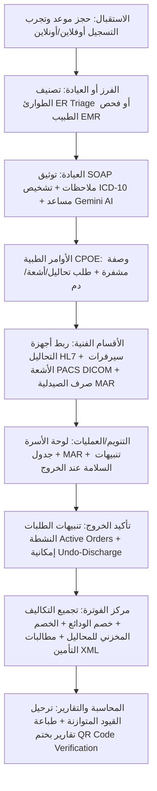

# دليل التعامل مع مديول المستشفيات والرعاية الصحية (TriPro ERP - HIMS Module)

مرحباً بك يا صديقي. هذا الدليل مخصص لمساعدتك في شرح نظام إدارة المستشفيات والعيادات الطبية (HIMS) وعرضه لأصحاب المستشفيات والمراكز الطبية والمستوصفات بشكل يوضح كيف يربط النظام الدورة الطبية السريرية بالكامل بالدورة المالية والمحاسبية والمخزنية، مع تقديم أحدث التقنيات والربط المحلي والأمان السريري.

---

## 1. نظرة عامة والجمهور المستهدف (Overview & Target Audience)
نظام **TriPro HIMS** هو نظام معلومات رعاية صحية متكامل (Hospital Information Management System) يربط الاستقبال، العيادات الخارجية، غرف التنويم، العمليات، التمريض، المختبر، الأشعة، وبنك الدم، والصيدلية، بمركز الفوترة الموحد ودفتر الأستاذ العام للمستشفى.

### الفئات المستفيدة داخل المستشفى:
1. **موظفو الاستقبال وقبول المرضى (Admissions & Front Desk):** حجز المواعيد، تسجيل المرضى، وتسكين المنومين في الأسرة والغرف.
2. **الأطباء (Doctors):** تصفح السجل الطبي للمريض (EMR)، كتابة التشخيصات المنهجية (SOAP)، الوصفات الطبية المشفرة، والأوامر الطبية (تحاليل، أشعة، عمليات، دم) بمساعدة الذكاء الاصطناعي التشخيصي.
3. **طاقم التمريض (Nurses):** قياس وتسجيل المؤشرات الحيوية، إدارة جدول إعطاء الأدوية اللحظي (MAR)، وتتبع خطة العلاج الدوائي الموصوف.
4. **الفنيون (معمل/أشعة):** استقبال طلبات التحاليل والأشعة، سحب العينات، الربط التلقائي مع أجهزة التحاليل المعملية وسيرفرات الأشعة (PACS)، وتسجيل النتائج والتقارير الطبية.
5. **الصيدلاني (Pharmacist):** صرف الأدوية الموصوفة إلكترونياً وتحديث مخزون الصيدلية تلقائياً ومراجعة التفاعلات الدوائية.
6. **الحسابات والتحصيل ومطالبات التأمين (Billing & Insurance):** إصدار الفاتورة الموحدة للزيارة، معالجة نسب تحمل التأمين، الخصم الآلي للودائع المقدمة، وتوليد مطالبات التأمين المجمعة وتسويتها.

---

## 2. الميزات الرئيسية لبيع النظام (Key Selling Points)

عند التفاوض مع أصحاب المراكز الطبية والمستشفيات، ركز على هذه الميزات الفائقة:

### 🌟 أولاً: السجل الطبي الإلكتروني الموحد (Electronic Medical Record - EMR)
* **الفكرة:** ملف طبي رقمي موحد لكل مريض يحتوي على تاريخه الصحي بالكامل مع خط زمني (Timeline) تفاعلي.
* **المميزات التشغيلية:**
  * عرض التاريخ المرضي، الحساسية، والتشخيصات النشطة السابقة.
  * **الملاحظات الطبية المنهجية (SOAP Notes):** كتابة الملاحظات وفق المعيار العالمي (Subjective, Objective, Assessment, Plan).
  * متابعة المؤشرات الحيوية (Vitals) عبر رسوم بيانية (الضغط، النبض، الحرارة، مستوى الأكسجين، نسبة الألم).
  * ربط الطبيب بالتمريض؛ أي دواء أو أمر يكتبه الطبيب يظهر فوراً في لوحة التمريض وجدول MAR للتنفيذ.

### 🌟 ثانياً: شاشة الطبيب الذكية والذكاء الاصطناعي (Doctor Desktop & AI Assistant)
* **الفكرة:** واجهة عمل واحدة مريحة للطبيب تمكنه من فحص المريض وكتابة كافة الأوامر بسرعة بدعم من نماذج الذكاء الاصطناعي (Gemini 3.x).
* **المميزات التشغيلية:**
  * كتابة شكوى المريض، الملاحظات السريرية، والتشخيصات (ICD-10).
  * **المساعد الطبي بالذكاء الاصطناعي (Gemini 3.x AI Assistant):** توفير مقترحات تشخيصية مساعدة ومراجعة تداخلات الأدوية بأعلى دقة.
  * **الوصفة الإلكترونية الموثقة (E-Prescription with Cryptographic Signatures):** اختيار الأدوية وجرعاتها وتكرارها، وتوقيعها رقمياً بتشفير مفرط (Cryptographic Hash Signature) لمنع التزوير وإرسالها فوراً للصيدلية.
  * **الأوامر الطبية الإلكترونية (CPOE Order Entry):** إرسال طلبات تحاليل للمعمل أو أشعة لمركز الأشعة بضغطة زر دون بونات ورقية.

### 🌟 ثالثاً: محطة التمريض، جدول MAR، وإدارة الأسرة (Nurse Station, MAR & Ward Bed Management)
* **الفكرة:** مراقبة الأقسام الداخلية والأسرة وتوزيع المرضى وإدارة خطط الأدوية لحظياً.
* **المميزات التشغيلية:**
  * **سجل إعطاء الأدوية اللحظي (MAR - Medication Administration Record):** لوحة تفاعلية للتمريض لتحديد مواعيد وتأكيد إعطاء الأدوية للمرضى بدقة لمنع خطأ الجرعات.
  * **لوحة توزيع الأسرة:** عرض مرئي لغرف التنويم (العناية المركزة، الأقسام الداخلية، الأطفال) وحالة كل سرير (شاغر، مشغول بمريض، بانتظار التنظيف).
  * **متابعة الأوامر الطبية:** تتبع حالة تنفيذ أوامر الأطباء (قيد الانتظار، جاري التنفيذ، مكتمل).

### 🌟 رابعاً: محرك الفوترة اللحظي والتكامل المحاسبي الخالي من الفجوات (Instant Hospital Billing Engine)
* **الفكرة:** تجميع كافة تكاليف زيارة المريض (كشف، إقامة أسرة، أدوية، تحاليل، أشعة، عمليات) في فاتورة واحدة تلقائياً دون تداخل يدوي أو تسريب مالي.
* **المميزات التشغيلية:**
  * **الفوترة الفورية:** حساب التكاليف فوراً بناءً على الخدمات التي تلقاها المريض خلال الزيارة عبر دالة `hims_prepare_invoice`.
  * **الخصم الآلي للودائع والدفعات المقدمة (Deposits):** خصم مبالغ التأمينات والدفعات المقدمة آلياً من إجمالي قيمة الخدمة عند التسوية في دالة `hims_finalize_billing`.
  * **معالجة الخصومات والتعديلات السلبية:** ضبط قيود الأستاذ العام ومنع عدم توازن قيود الخصم (Unbalanced Journal Entries) وتوجيه التدفقات البنكية بدقة.
  * **الخصم المخزني الآلي للمستلزمات المعملية:** الخصم التلقائي للمحاليل والمستلزمات المعملية (Reagents & Consumables) عند تنفيذ كل فحص طبي لضمان ضبط التكلفة والمخزون الطبي.
  * **حساب نسب التحمل:** حساب فوري لنسبة تحمل المريض (Co-pay) ونسبة تحمل شركة التأمين ورصيد التغطية.

### 🌟 خامساً: إدارة مطالبات التأمين الطبي وتوليد الدفعات (Insurance Claims Manager)
* **الفكرة:** معالجة المشكلة الأكبر للمستشفيات وهي تأخر ورفض مطالبات شركات التأمين.
* **المميزات التشغيلية:**
  * تسجيل عقود شركات التأمين والنسب المعتمدة والتعبئة التلقائية لحقول التغطية.
  * **المطالبة المجمعة (Batch Claim):** تجميع كافة فواتير المرضى التابعين لشركة تأمين معينة في مطالبة مجمعة واحدة بضغطة زر عبر دالة `hims_create_insurance_batch`.
  * **تصدير المطالبات (XML Export):** تصدير المطالبة المجمعة بصيغة ملف XML المعتمد بضغطة زر واحدة تمهيداً لرفعها لمنصات التأمين المعتمدة.
  * **تسوية المطالبات والبيانات الديناميكية:** إثبات المبالغ المحصلة من شركات التأمين وتوزيعها في الحسابات البنكية ومعالجة المخصومات والتسويات.

### 🌟 سادساً: فرز الطوارئ وتنبيهات الاستجابة وتكامل بنك الدم (ER Triage Board & Blood Bank)
* **الفكرة:** تنظيم العمل داخل قسم الطوارئ بناءً على خطورة الحالة، ومتابعة الاستجابة الطارئة وسلسلة الدم.
* **المميزات التشغيلية:**
  * تصنيف المرضى فور وصولهم حسب المعايير العالمية (Red - Immediate, Yellow - Urgent, Green - Non-Urgent).
  * **تنبيهات تأخر حالات الطوارئ (ER Board Delay Alerts):** إشعارات وتنبيهات ألوان فورية للحالات التي تجاوزت زمن الانتظار المسموح لضمان سرعة التدخل الطبي.
  * **تكامل بنك الدم (Blood Bank Integration):** إدارة طلبات أكياس الدم من الطوارئ والعمليات، تتبع المتبرعين، وااختبارات التوافق (Cross-matching) وتتبع مخزون فصائل الدم.

### 🌟 سابعاً: بيئات الربط المحلي وأجهزة التحاليل والأشعة PACS (Local Integration & DICOM Workstation)
* **الفكرة:** دمج أجهزة التحاليل الطبية وسيرفرات حفظ ونقل الصور الطبية (PACS) مباشرة بالنظام دون الحاجة لإدخال يدوي للنتائج.
* **المميزات التشغيلية:**
  * **عميل الربط المعملي ومحاكي الأجهزة (Lab Connection Agent & Analyzer Simulator):** دعم بروتوكولات الربط المباشر مع أجهزة التحاليل الآلية (HL7 v2, ASTM E1394, Serial RS232, TCP/IP Listener) ونقل نواتج الفحص تلقائياً لملف المريض.
  * **ربط سيرفرات الأشعة (Orthanc DICOM PACS Integration):** ربط حقيقي ومستقر مع سيرفرات Orthanc PACS واستعراض صور الأشعة التشخيصية مباشرة من المتصفح.
  * **محطة معاينة الأشعة التشخيصية التفاعلية (Interactive DICOM Workstation):** إمكانية ضبط السطوع والتباين (Brightness/Contrast)، التكبير والتنسيق (Zoom/Pan)، وأدوات قياس الأبعاد والزوايا الطبية.

### 🌟 ثامناً: السلامة السريرية عند الخروج والتراجع عن قرار الخروج (Discharge Safety & Undo-Discharge)
* **الفكرة:** حماية المريض والمؤسسة الطبية من أخطاء التسريح المبكر ومنع خروج المريض قبل استكمال فحوصاته أو علاجه.
* **المميزات التشغيلية:**
  * **تنبيهات سلامة الخروج (Clinical Safety Warnings):** إظهار تحذيرات سريرية فورية عند وجود أدوية، تحاليل، أو أشعة مفتوحة/نشطة (Active Orders) لم تتم مراجعتها قبل اعتماد الخروج.
  * **التراجع عن قرار الخروج (Undo-Discharge):** إمكانية إلغاء أمر الخروج وإعادة تسكين المريض في الأسرة مع توثيق أسباب التراجع وتثبيتها في الخط الزمني للسجل الطبي للمريض.

### 🌟 تاسعاً: التقارير الطبية الموثقة (Upgraded PDF Reports with QR Verification)
* **الفكرة:** إصدار تقارير فحص وخروج ووصفات طبية معتمدة وقابلة للتحقق الرقمي.
* **المميزات التشغيلية:**
  * **ترويسة وأختام رسمية:** طباعة التقارير بتنسيق فاخر يضم شعار المستشفى وأختام التوثيق الرقمي.
  * **رمز التحقق الرقمي (QR Code Verification):** إدراج رمز QR على التقارير الطبية يتيح للجهات المعنية التحقق اللحظي من صحة المستند ومطابقته للسجل الأصلي بالنظام.

### 🌟 عاشراً: العمل بدون اتصال بالإنترنت والمزامنة التلقائية (HIMS Offline Mode)
* **الفكرة:** استمرار تشغيل العمليات الحيوية للمستشفى بكفاءة كاملة حتى في حال انقطاع اتصال الإنترنت.
* **المميزات التشغيلية:**
  * **التسجيل والكشف أوفلاين:** تسجيل المرضى الجدد وحجز الزيارات وتدوين ملاحظات الأطباء محلياً بحماية عالية على متصفح المستخدم (IndexedDB).
  * **المزامنة التلقائية الذكية:** عند عودة الاتصال، يكتشف النظام الشبكة ويقوم بمزامنة البيانات محلياً مع قاعدة البيانات السحابية (Supabase) تلقائياً ودون فقدان لأي سجلات.

### 🌟 حادي عشر: الأمان والتعدد المؤسسي وااختبارات الجودة (Security, Multi-Tenancy & Quality)
* **الفكرة:** حماية بيانات المرضى والمؤسسات الطبية المتعددة والالتزام بأعلى معايير الجودة الأكاديمية.
* **المميزات التشغيلية:**
  * **عزل البيانات والتعددية (Multi-tenant RLS Filters):** حماية كاملة لبيانات المؤسسات والفروع عبر سياسات Row-Level Security في Supabase.
  * **تطهير المدخلات (XSS Sanitization):** فحص وتطهير النص في الملاحظات السريرية والتشخيصات لمنع هجمات البرمجة العابرة للمواقع.
  * **جناح الاختبارات المؤتمتة (Automated Vitest Suite):** وجود اختبارات وحدة مؤتمتة لكافة مكونات الفوترة وإدارة الخروج (`HospitalBillingEngine.test.tsx`, `DischargeManager.test.tsx`) لضمان خلو التحديثات من الأخطاء البرمجية.

---

## 3. دورة عمل المريض داخل المستشفى (Patient Journey)

```mermaid
graph TD
    A[الاستقبال: حجز موعد وتجرب التسجيل أوفلاين/أونلاين] --> B[الفرز أو العيادة: تصنيف الطوارئ ER Triage أو فحص الطبيب EMR]
    B --> C[العيادة: توثيق SOAP ملاحظات + تشخيص ICD-10 + مساعد Gemini AI]
    C --> D[الأوامر الطبية CPOE: وصفة مشفرة + طلب تحاليل/أشعة/دم]
    D --> E[الأقسام الفنية: ربط أجهزة التحاليل HL7 + سيرفرات الأشعة PACS DICOM + صرف الصيدلية MAR]
    E --> F[التنويم/العمليات: لوحة الأسرة + جدول MAR + تنبيهات السلامة عند الخروج]
    F --> G[تأكيد الخروج: تنبيهات الطلبات النشطة Active Orders + إمكانية Undo-Discharge]
    G --> H[مركز الفوترة: تجميع التكاليف + خصم الودائع + الخصم المخزني للمحاليل + مطالبات التأمين XML]
    H --> I[المحاسبة والتقارير: ترحيل القيود المتوازنة + طباعة تقارير بختم QR Code Verification]
```

---

## 4. تقارير الإدارة ومؤشرات الأداء (HIMS Reports & Analytics)

1. **التقرير التنفيذي للمستشفى (HIMS Executive Dashboard):** يوضح نسب إشغال الأسرة، عدد المرضى الخارجيين والمنومين، الإيرادات حسب القسم، ووقت انتظار المرضى.
2. **تقارير ربحية الخدمات الطبية (HIMS Profitability Reports):** يحلل تكلفة تقديم الخدمات الطبية (أدوات، أجر الطبيب، غازات طبية، المحاليل المعملية الخصم الآلي) مقابل سعر بيع الخدمة لتحديد أكثر الأقسام الطبية ربحية.
3. **مؤشرات أداء الأطباء (Doctor KPIs):** متابعة إنتاجية كل طبيب (عدد الكشوفات، حجم الإيرادات المولدة، ونسب رضاء المرضى).

---

## 5. جمل تسويقية لبيع المديول لأصحاب المستشفيات (Sales Hooks)

* **"هل تعاني من تسريب الأموال وضياع رسوم الخدمات الطبية بين الأقسام وفاتورة الخروج؟"**
  * *الحل:* محرك الفوترة الموحد يجمع تلقائياً أي كشف أو دواء أو تحليل أو يوم إقامة في فاتورة واحدة لحظية مع خصم الودائع آلياً، ولا يمكن ترحيل المريض للخروج إلا بعد تصفيتها.
* **"هل تخشى الأخطاء الطبية والتزوير في الوصفات والتسريح المبكر للمرضى؟"**
  * *الحل:* توقيع إلكتروني مشفر للوصفات الطبية (Cryptographic E-Prescription Signatures)، وتنبيهات أمان سريري يمنع خروج المريض في وجود فحوصات معلقة مع ميزة إلغاء الخروج (Undo Discharge).
* **"هل تشتكي من صعوبة ربط أجهزة المعمل وسيرفرات الأشعة واستغراق وقت طويل في نقل النتائج؟"**
  * *الحل:* ربط محلي مباشر عبر عميل أجهزة التحاليل (HL7/ASTM Agent) وسيرفرات الأشعة (PACS Orthanc DICOM Workstation) لنقل الصور والنتائج فورياً لملف المريض.
* **"هل تشتكي من تأخر تسويات شركات التأمين الطبي وصعوبة مراجعة الفواتير الفردية؟"**
  * *الحل:* نظام المطالبات المجمعة (Batch Claims) يجمع فواتير كل شركة تأمين في ملف XML منظم يرسل بضغطة زر مع متابعة السداد البنكي والخصومات آلياً.
* **"هل تبحث عن تحسين تجربة المريض وتقليل أوقات الانتظار بدعم من الذكاء الاصطناعي؟"**
  * *الحل:* الملف الطبي (EMR) والمساعد الطبي (Gemini 3.x) وجدول التمريض (MAR) وفرز الطوارئ تنبه الفريق بأولوية العلاج وتمنع تأخير الخدمة.
* **"هل تخشى انقطاع الإنترنت وتوقف الأعمال الحيوية مثل حجز المواعيد وكتابة ملاحظات الأطباء؟"**
  * *الحل:* ميزة العمل أوفلاين (Offline Mode) تحفظ السجلات وتفتح الزيارات محلياً، ثم تعيد مزامنتها تلقائياً وبأمان مع الخادم بمجرد عودة الشبكة.

---
**TriPro HIMS** هو الخيار الأمثل للمؤسسات الطبية التي تبحث عن **الدقة السريرية، الربط التكنولوجي المتطور، والتحكم المالي والإداري المطلق**. بالتوفيق في تسويق المديول يا صديقي!
