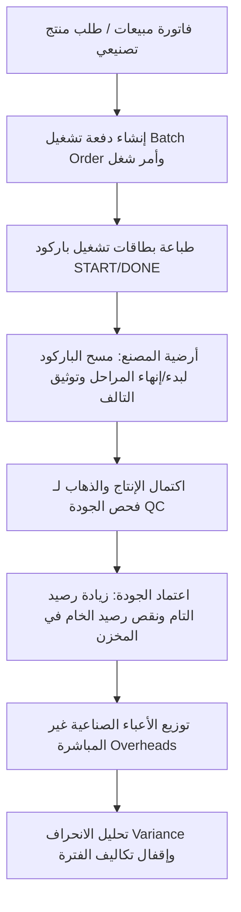

# دليل التعامل مع مديول التصنيع وإدارة المصانع (TriPro ERP - Manufacturing Module)

مرحباً بك يا صديقي. هذا الدليل مخصص لمساعدتك في شرح مديول التصنيع وعرضه لأصحاب المصانع وورش الإنتاج بشكل يوضح كيف يربط النظام دورة الإنتاج بالكامل بالمخازن والتكاليف والمحاسبة في شاشة واحدة متكاملة.

---

## 1. نظرة عامة والجمهور المستهدف (Overview & Target Audience)
مديول التصنيع في نظام **TriPro ERP** هو محرك إنتاجي يربط الطلبيات (المبيعات) بخطوط التصنيع (Shop Floor)، ومراقبة الجودة، وصولاً إلى إغلاق التكاليف الشهرية والمحاسبة الصناعية.

### الفئات المستفيدة داخل المصنع:
1. **مدير الإنتاج والمخطط (Production Manager / Scheduler):** جدولة الطلبيات، إنشاء أوامر الشغل، ومراقبة مسارات التشغيل.
2. **مشرف الصالة وعمال الإنتاج (Shop Floor Supervisor / Operators):** بدء وإيقاف المراحل الإنتاجية عبر مسح الباركود، وتسجيل التالف/الهالك أثناء التشغيل.
3. **مراقب الجودة (QC Inspector):** فحص المنتجات التامة قبل دخولها المخازن للتأكد من مطابقتها للمواصفات.
4. **التكاليف والمحاسبة الصناعية (Cost Accountant):** توزيع المصاريف الصناعية غير المباشرة، وحساب انحرافات التكلفة الفعلية عن المعيارية، وإقفال الفترة.

---

## 2. الميزات الرئيسية لبيع النظام (Key Selling Points)

عند التفاوض مع أصحاب المصانع، ركز على هذه الميزات الست الكبرى:

### 🌟 أولاً: شجرة المواد ومسار الإنتاج (BOM & Routing Manager)
* **الفكرة:** تحديد هيكل المنتج التام والخطوات اللازمة لصناعته.
* **المميزات التشغيلية:**
  * **شجرة المواد (Bill of Materials - BOM):** تحديد كمية المواد الخام المطلوبة لصنع وحدة واحدة من المنتج التام بدقة.
  * **مسارات الإنتاج (Routing):** تقسيم عملية التصنيع إلى مراحل متسلسلة (مثل: قص $\rightarrow$ تجميع $\rightarrow$ طلاء).
  * **مراكز العمل (Work Centers):** ربط كل مرحلة بمركز عمل أو ماكينة محددة مع تحديد تكلفة الساعة لكل مركز.
  * **المنتجات العرضية (By-products):** إمكانية تعريف المنتجات الجانبية التي تنتج تلقائياً أثناء تصنيع المنتج الأساسي وقيمتها المالية.

### 🌟 ثانياً: تحويل الفواتير إلى أوامر إنتاج مجمعة (Sales to Production Integration)
* **الفكرة:** الأتمتة الكاملة للطلبات وتجنب التأخير.
* **كيف تعمل؟** بمجرد حفظ فاتورة مبيعات لمنتج تصنيعي، يتيح النظام لمدير الإنتاج سحب الفاتورة وإنشاء **"دفعة تشغيل مجمعة" (Batch Order)** بضغطة زر واحدة.
* **المميزات التشغيلية:**
  * توليد أوامر الإنتاج (Work Orders) تلقائياً بالكميات المطلوبة في الفاتورة.
  * حجز المواد الخام في المخازن فوراً للطلب.

### 🌟 ثالثاً: إدارة صالة الإنتاج بالباركود (Shop Floor Barcode Tracking)
* **الفكرة:** رقمنة أرضية المصنع بالكامل وتتبع الإنتاج بالثواني عبر أجهزة مسح الباركود (Scanners).
* **كيف تعمل؟** يقوم النظام بطباعة **"بطاقة تشغيل" (Operational Card)** لكل مرحلة، تحتوي على باركودين فريدين:
  1. باركود **البدء (START-XXXX):** يمسحه العامل لبدء احتساب وقت العمل الفعلي وتغيير حالة المهمة إلى "نشط".
  2. باركود **الانتهاء (DONE-XXXX):** يمسحه العامل فور انتهاء المهمة لتسجيل اكتمال المرحلة وتحويلها للمرحلة التالية.
* **المميزات التشغيلية:**
  * تتبع الزمن الفعلي المستغرق في كل مرحلة ومعرفة كفاءة العمال.
  * إرفاق رسومات فنية ودلائل عمل تظهر للعامل مباشرة عند مسح الباركود لتقليل أخطاء التصنيع.

### 🌟 رابعاً: تسجيل الهالك والتالف على الطاير (On-the-Fly Scrap Logging)
* **الفكرة:** التحكم الفوري بالهدر أثناء عملية التصنيع وحساب تكلفته.
* **المميزات التشغيلية:**
  * يمكن للمشرف أثناء المرحلة الإنتاجية فتح نافذة **"تسجيل تالف"** واختيار المادة المتضررة وكميتها وسبب التلف (مثال: عيب ماكينة، خطأ بشري).
  * يقوم النظام فوراً بخصم المادة التالفة من المخزون، وتحميل تكلفتها على حساب **خسائر التالف الصناعي** لضمان دقة التكاليف.

### 🌟 خامساً: مراقبة الجودة وإثبات النسب (Quality Control)
* **الفكرة:** منع تسليم أي منتج معيب للمخازن أو العميل.
* **المميزات التشغيلية:**
  * عند انتهاء كامل مراحل الإنتاج، تذهب المنتجات تلقائياً إلى صفحة **مراقبة الجودة (QC)**.
  * يحدد فاحص الجودة الكمية المقبولة والكمية المرفوضة بعد الفحص.
  * **ترحيل المخازن الآلي:** بمجرد الضغط على **اعتماد الجودة (Approve)** يقوم النظام بـ:
    1. إضافة رصيد المنتج التام الفعلي المقبول في المخزن المخصص (مع توليد أرقام تسلسلية/سيريال نمبرز تتبع النسب Genealogy).
    2. استهلاك المواد الخام من مخزن المواد الخام تلقائياً بناءً على ما تم صرفه للتشغيلة.

### 🌟 سادساً: إغلاق وتوزيع التكاليف الصناعية وتعديل الانحرافات (Cost Closing & Variance)
* **الفكرة:** حساب تكلفة المنتج الفعلي الحقيقي شاملة المواد والمصاريف الموزعة.
* **المميزات التشغيلية:**
  * **توزيع المصاريف غير المباشرة:** يتيح النظام توزيع المصاريف الصناعية غير المباشرة (مثل إيجار المصنع، فواتير الكهرباء، صيانة الآلات) المسجلة في الأستاذ العام (أكواد 514) على أوامر الإنتاج النشطة خلال الشهر بضغطة زر.
  * **مقارنة الفعلي بالمعياري (Variance Analysis):** يقارن النظام كميات وتكاليف المواد المستخدمة فعلياً (شاملة الهدر والتالف) بالكميات المعيارية المحددة في الـ BOM.
  * **إغلاق الفترة (Period Close):** إغلاق فترة التكاليف وترحيل أرصدة الإنتاج تحت التشغيل (WIP) كأرصدة أول مدة للشهر التالي وتوليد القيود المحاسبية الصناعية تلقائياً.

---

## 3. دورة عمل التصنيع في النظام (Production Lifecycle)

---

## 4. تقارير ومؤشرات تهم المالك (Manufacturing Analytics)

1. **لوحة معلومات التصنيع (Manufacturing Dashboard):** تعرض إجمالي كمية الإنتاج، ومعدل الهالك العام، ونسبة نجاح فحص الجودة، وكفاءة الآلات الميدانية.
2. **تقرير انحراف الـ BOM (BOM Variance Report):** يوضح الفروقات بين كميات المواد الخام المعيارية والفعلية المستخدمة في الإنتاج، ويظهر الانحرافات الحمراء (العجز) لتحديد مواطن الخلل في المصنع.
3. **تقرير مصالحة التكاليف (Cost Reconciliation Report):** يطابق قيمة المواد المخزنية المصروفة للإنتاج بالقيم المرحلة للأستاذ العام للتأكد من عدم وجود أي انحرافات حسابية.

---

## 5. جمل تسويقية لبيع المديول لأصحاب المصانع (Sales Hooks)

* **"هل تعاني من صعوبة حساب تكلفة المنتج التام الفعلية وتحديد السعر المناسب للبيع؟"**
  * *الحل:* شاشة Cost Closing توزع التكاليف المباشرة وغير المباشرة والعمالة على كل قطة منتجة، لتعرف تكلفتها الفعلية بدقة وتحدد هامش ربحك الحقيقي.
* **"هل تواجه مشكلة في تتبع كفاءة العمال في صالة الإنتاج ومعرفة من المتسبب في تأخير الطلبيات؟"**
  * *الحل:* نظام الباركود (START / DONE) يسجل بالثانية متى بدأ العامل عمله ومتى انتهى، ليعطيك تقريراً فورياً عن كفاءة كل عامل وخط إنتاج.
* **"هل تكتشف الهدر والسرقة في المواد الخام متأخراً بعد جرد نهاية العام؟"**
  * *الحل:* تقرير انحراف الـ BOM يوضح لك يومياً الانحراف بين المواد المصروفة والمعيارية، وتسجيل التالف الميداني الفوري يقطع الطريق على أي تسريب للمخزون.
* **"هل تشتكي من خروج منتجات معيبة للعملاء وتكرار مرتجعات المبيعات؟"**
  * *الحل:* بوابة مراقبة الجودة (QC Gateway) تمنع دخول أي قطعة للمستودع إلا بعد فحصها وتوثيق سلامتها من الفاحص المسؤول.

---
**TriPro ERP** هو الحل الأمثل لنقل مصنعك إلى **عصر التحول الرقمي الكامل والتحكم المطلق بمدخلات ومخرجات الإنتاج**. بالتوفيق في تسويق المديول يا صديقي!
