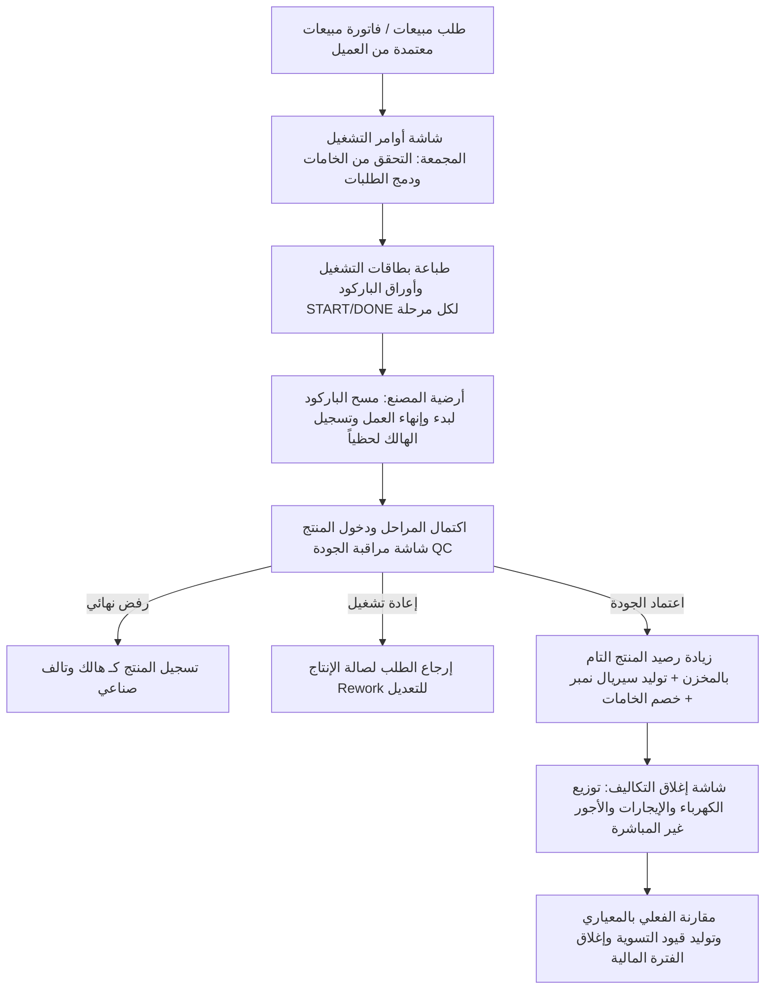

# دليل مديول التصنيع وإدارة الإنتاج (TriPro ERP - Manufacturing Module)

مرحباً بك يا صديقي. هذا الدليل مخصص ومصمم خصيصاً لمساعدتك (كمندوب مبيعات، أو مستشار تطبيق، أو مستخدم للنظام) في شرح مديول التصنيع وعرضه لأصحاب المصانع، ورش الإنتاج، والعملاء. يركز هذا الدليل على **واجهات النظام، الأزرار التفاعلية، ودورات العمل الواقعية** مع إبراز القيمة التشغيلية والمالية لكل ميزة، تماماً كما هو مطبق على أرض الواقع في نظام **TriPro ERP**، وبصيغة خالية من أسماء الأكواد أو الملفات البرمجية لتكون سهلة الفهم للجميع.

---

## 1. نظرة عامة والجمهور المستهدف (Overview & Target Audience)

نظام **TriPro ERP - مديول التصنيع** هو محرك إنتاجي متكامل يربط طلبات المبيعات بخطوط التصنيع الفعلي، ومراقبة الجودة، وصولاً إلى حساب التكلفة الحقيقية وإغلاق الفترة المالية. يساعد النظام على رقمنة أرضية المصنع بالكامل وتحويل العمليات الورقية إلى مؤشرات رقمية لحظية.

### الفئات المستفيدة داخل المصنع:
1. **مدير الإنتاج والمخطط (Production Manager / Planner):** لتخطيط أوامر التشغيل، ومراقبة الطاقة الاستيعابية، والتحقق من توفر المواد الخام قبل بدء التصنيع.
2. **مشرف الصالة وعمال الإنتاج (Shop Floor Supervisors & Operators):** لبدء وإنهاء المراحل الإنتاجية وتوثيق المواد المستهلكة والتالفة عبر الباركود دون الحاجة للكتابة الورقية.
3. **مراقب الجودة (QC Inspector):** لفحص المنتجات التامة أو نصف المصنعة واعتماد مطابقتها للمواصفات قبل دخولها المستودعات.
4. **المحاسب الصناعي وإدارة التكاليف (Cost Accountant / Management):** لتوزيع المصاريف غير المباشرة (مثل الكهرباء والإيجارات وصيانة الآلات) على المنتجات، وتحديد الانحرافات وحساب هوامش الربح الحقيقية.

---

## 2. الدليل التفصيلي للشاشات والأزرار والميزات التشغيلية

فيما يلي استعراض لأهم 5 شاشات تفاعلية يتكون منها مديول التصنيع، مع توضيح أهم الأزرار والوظائف داخل كل شاشة:

### 🌟 أولاً: شاشة شجرة المواد ومسارات التصنيع (Routing & BOM Manager)
* **الفكرة:** هي حجر الأساس للتصنيع، حيث يتم فيها تعريف المكونات المطلوبة لإنتاج كل قطعة (الـ BOM) والخطوات المتسلسلة لإنتاجها.
* **أهم الأزرار والوظائف التشغيلية:**
  * 🔘 **زر "إضافة مركز عمل" (Add Work Center):** يُهيكل ويُعرّف ماكينة محددة أو خط إنتاج أو ورشة عمل داخل المصنع، مع إمكانية تحديد تكلفة الساعة التشغيلية لكل مركز عمل والأعباء الإضافية المرتبطة به.
  * 🔘 **زر "إضافة خطوة تشغيل" (Add Operation Step):** يُستخدم لتقسيم عملية تصنيع المنتج إلى مراحل مرتبة (مثل: قص الخشب $\rightarrow$ تجميع الهيكل $\rightarrow$ صنفرة $\rightarrow$ دهان وتلميع). ويتم ربط كل خطوة بمركز العمل الخاص بها وتحديد الوقت المعياري المستغرق بالدقائق.
  * 🔘 **زر "ربط المواد الخام" (Link Raw Materials):** يُستدعى داخل كل خطوة تشغيل لتحديد أي المواد الخام تُستعمل في هذه الخطوة وبأي كمية بدقة، مما يمنع صرف المواد للمصنع بشكل عشوائي.
  * 🔘 **زر "رفع الرسومات والمرفقات" (Upload Attachments):** يتيح إرفاق المخططات الهندسية أو كتيبات إرشادات السلامة والتركيب بكل مرحلة، لتظهر مباشرة للعامل على خط الإنتاج أثناء عمله.

### 🌟 ثانياً: شاشة إدارة أوامر التشغيل المجمعة (Sales to Production - Batching)
* **الفكرة:** الربط الذكي بين قسم المبيعات وقسم الإنتاج لدمج الطلبيات وتوفير وقت ضبط الماكينات وتجنب نقص الخامات.
* **أهم الأزرار والوظائف التشغيلية:**
  * 📋 **جدول "الفواتير المعلقة" (Pending Invoices & Sales Orders):** يعرض تلقائياً كافة فواتير المبيعات وأوامر البيع التي وافق عليها العملاء وتحتوي على منتجات تحتاج إلى تصنيع.
  * 🔘 **زر "تحقق من توفر المواد" (Check Material Availability):** يقوم النظام بفحص أرصدة مخازن المواد الخام فوراً للطلبيات المحددة، وفي حال وجود أي عجز يظهر تنبيه فوري باللون الأحمر يوضح المواد الناقصة وكمية العجز بدقة (Shortage Alarm).
  * 🔘 **زر "إنشاء دفعة إنتاج مجمعة" (Merge & Create Batch Order):** يتيح دمج طلبات عملاء متعددين في دفعة تصنيع واحدة موحدة (Batch) بضغطة زر، مما يساهم في تقليل الهدر وزمن إعداد الماكينات.
  * 🔘 **زر "بدء الإنتاج للأوامر المحددة" (Start Production Batch):** لتنشيط الدفعات المجمعة وإرسالها مباشرة لصالة الإنتاج كمهام جارية.
  * 🔘 **زر "إعادة جدولة الطلبيات المتأثرة" (Reschedule Affected Orders):** يُستخدم لتأجيل أو إعادة جدولة الطلبيات التي تعاني من نقص في المواد الخام لحين توريدها وتجنب تعطيل بقية خطوط الإنتاج.

### 🌟 ثالثاً: شاشة إدارة صالة الإنتاج والباركود (Shop Floor Manager)
* **الفكرة:** رقمنة أرضية المصنع بالكامل وتتبع حركة الإنتاج ثانية بثانية عبر القوارئ الإلكترونية (Scanners) لضمان الدقة وتجنب الأوراق.
* **أهم الأزرار والوظائف التشغيلية:**
  * 💻 **لوحة "المهام الجارية" (Shop Floor Tasks):** شاشة مخصصة لعمال التشغيل تعرض المهام المطلوبة منهم وحالة كل مهمة (معلقة، نشطة، مكتملة).
  * 🖨️ **أيقونة "طباعة بطاقة التشغيل" (Print Operation Card):** لطباعة بطاقة ورقية ترافق المواد داخل المصنع وتحتوي على باركودين فريدين لكل مرحلة.
  * 🏷️ **باركود "بدء العمل" (START Barcode):** يمسحه العامل إلكترونياً عند بدء العمل الفعلي على الماكينة، ليتحول لون المهمة للأزرق (نشطة) ويبدأ النظام تلقائياً باحتساب زمن التشغيل الفعلي.
  * 🏷️ **باركود "إتمام العمل" (DONE Barcode):** يمسحه العامل فور انتهاء المرحلة لتسجيل كمية الوحدات التامة وإيقاف المؤقت التلقائي وحساب الكفاءة.
  * 🔘 **زر "تسجيل هالك وتالف" (On-the-Fly Scrap Logging):** نافذة تظهر فوراً للعامل أو المشرف لتسجيل أي مواد تلفت أثناء التشغيل مع توضيح السبب (مثل: عيب ماكينة، خطأ بشري)، حيث يخصمها النظام فوراً من المخزون ويحسب قيمتها كخسائر تالف صناعي.
  * 🔘 **زر "المنتجات الجانبية" (By-products):** يتيح للعامل تسجيل أي منتجات ثانوية أو عرضية ذات قيمة مالية نتجت أثناء تصنيع المنتج الأساسي ليتم تخزينها وحساب قيمتها.

### 🌟 رابعاً: شاشة مركز مراقبة الجودة والاعتماد (Quality Control Manager)
* **الفكرة:** البوابة الأمنية والرقابية التي تضمن عدم خروج أي قطعة معيبة للعملاء وتوثيق سلامة المنتجات قبل التخزين النهائي.
* **أهم الأزرار والوظائف التشغيلية:**
  * 📋 **جدول "الدفعات المكتملة بانتظار الفحص":** شاشة مخصصة لفني الجودة يستعرض من خلالها الدفعات التي انتهت مراحل إنتاجها وتنتظر الفحص والاعتماد.
  * 🔘 **زر "اعتماد الجودة" (Approve / Pass):** عند مطابقة المنتج للمواصفات، يؤدي الضغط على هذا الزر إلى أتمتة الخطوات التالية فوراً:
    1. إضافة رصيد المنتج التام في مستودع المنتجات الجاهزة مع توليد أرقام تسلسلية فريدة (Serial Numbers) لكل قطعة لضمان تتبعها مستقبلاً.
    2. استهلاك المواد الخام تلقائياً من مستودع المواد الأولية بناءً على ما تم صرفه فعلياً للتشغيلة.
    3. إنشاء القيود المحاسبية الختامية وتحديث الأرصدة المالية.
  * 🔘 **زر "إعادة تشغيل" (Rework):** يُستخدم لإرجاع الدفعة أو أجزاء منها لخط الإنتاج مرة أخرى لإصلاح عيب ما مع كتابة الملاحظات اللازمة للمشرف.
  * 🔘 **زر "رفض / هالك" (Reject / Scrap):** يُستخدم لاستبعاد القطع المعيبة تماماً التي لا يمكن إصلاحها، وتسجيل تكلفة المواد المستخدمة فيها كخسائر تشغيل.

### 🌟 خامساً: شاشة إغلاق التكاليف الشهرية والمحاسبة الصناعية (Cost Closing Dashboard)
* **الفكرة:** الربط المالي والمحاسبي الذي يُغلق الفترة التكاليفية ويوزع المصاريف غير المباشرة بالتساوي ويحدد ربحية المصنع.
* **أهم الأزرار والوظائف التشغيلية:**
  * 📅 **فلاتر "تحديد الفترة المالية" (Year / Month Filters):** لاختيار الشهر والسنة المراد مراجعة تكاليفها وإغلاقها.
  * 🔘 **زر "توزيع الأعباء الصناعية غير المباشرة" (Allocate Overheads):** بضغطة زر واحدة، يقوم النظام بجمع كافة المصاريف العامة للمصنع (مثل: إيجار المصنع، فواتير الكهرباء والمياه، رواتب المشرفين والخدمات، صيانة الآلات) من شجرة الحسابات، ويقوم بتوزيعها بعدالة على أوامر الإنتاج الجارية خلال الشهر بناءً على ساعات العمل الفعلية المسجلة.
  * 📊 **نافذة "تقرير مصالحة التكاليف" (Cost Reconciliation Report):** لمطابقة قيمة المواد المستهلكة في صالة الإنتاج مخزنياً مع القيود المحاسبية المقابلة لها في الأستاذ العام لضمان عدم وجود أي فروقات أو أخطاء حسابية.
  * 🔘 **زر "إغلاق الفترة التكاليفية" (Period Close):** لتجميد تكاليف الشهر وتوليد قيود تسوية الفروقات آلياً، وترحيل قيمة البضاعة التي لا تزال تحت التشغيل (WIP) كأرصدة افتتاحية للشهر الجديد.

---

## 3. دورة حياة أمر الإنتاج داخل النظام (Production Lifecycle)

يوضح المخطط التالي تسلسل العمليات من لحظة الشراء أو طلب العميل وحتى خروج المنتج تام الصنع للمستودع وإغلاق تكلفته:

```mermaid
graph TD
    A[طلب مبيعات / فاتورة مبيعات معتمدة من العميل] --> B[شاشة أوامر التشغيل المجمعة: التحقق من الخامات ودمج الطلبات]
    B --> C[طباعة بطاقات التشغيل وأوراق الباركود START/DONE لكل مرحلة]
    C --> D[أرضية المصنع: مسح الباركود لبدء وإنهاء العمل وتسجيل الهالك لحظياً]
    D --> E[اكتمال المراحل ودخول المنتج شاشة مراقبة الجودة QC]
    E -->|رفض نهائي| F[تسجيل المنتج كـ هالك وتالف صناعي]
    E -->|إعادة تشغيل| G[إرجاع الطلب لصالة الإنتاج Rework للتعديل]
    E -->|اعتماد الجودة| H[زيادة رصيد المنتج التام بالمخزن + توليد سيريال نمبر + خصم الخامات]
    H --> I[شاشة إغلاق التكاليف: توزيع الكهرباء والإيجارات والأجور غير المباشرة]
    I --> J[مقارنة الفعلي بالمعياري وتوليد قيود التسوية وإغلاق الفترة المالية]
```

---

## 4. التقارير الذكية ومؤشرات الأداء للملاك والإدارة (Manufacturing Analytics)

يوفر النظام مجموعة من التقارير البيانية والتحليلية التي تساعد الإدارة العليا على اتخاذ القرارات:

1. **لوحة قيادة التصنيع (Manufacturing Dashboard):**
   * شاشة تفاعلية تعرض في ثوانٍ: عدد أوامر الإنتاج النشطة حالياً، متوسط كفاءة تشغيل الآلات، عدد حالات انحراف المواد المرتفعة، وعدد الدفعات التي تنتظر فحص الجودة.
2. **تقرير انحراف المواد (BOM Variance Report):**
   * يقارن كميات المواد الخام التي حددتها شجرة المنتج (المعيار) مع الكميات التي استهلكها العمال فعلياً في صالة الإنتاج. يُظهر التقرير الانحرافات باللون الأحمر (في حال زيادة الاستهلاك والهدر) لمساعدة الإدارة في ضبط السرقة والهدر، مع ميزة التصدير الفوري لملفات Excel.
3. **شاشة تتبع تسلسل ونسب المنتجات (Genealogy Viewer):**
   * شاشة بحث سحرية؛ بمجرد كتابة الرقم التسلسلي (Serial Number) لمنتج تم بيعه لعميل، يستعرض النظام شجرة كاملة توضح: متى صُنع المنتج بالثانية، ومن هو العامل المشرف، وعلى أي ماكينة، والأهم: قائمة بالمواد الخام الدقيقة التي دخلت في تكوينه وأرقام شحناتها ومورديها، وهي ميزة أساسية للمصانع الغذائية والطبية والهندسية لضمان سلامة المنتج وسهولة السحب من السوق.
4. **تقرير تفاصيل تكلفة الوحدة (Unit Cost Drill Down):**
   * يحلل هيكل تكلفة المنتج التام بالتفصيل، موضحاً نسبة مساهمة (المواد الخام، أجور العمالة المباشرة، الأعباء الصناعية غير المباشرة الموزعة) في التكلفة الإجمالية للقطعة الواحدة، مما يساعد في وضع سياسات تسعير ذكية.
5. **تقرير ربحية الإنتاج (Production Profitability Report):**
   * يقارن التكلفة الفعلية الحقيقية للمنتج بعد إقفال الشهر بسعر بيعه الفعال في الفواتير ليعطي المدير المالي صافي نسبة الربح المحققة في كل دفعة تصنيعية.
6. **سجل تنبيهات التصنيع (Manufacturing Alerts Log):**
   * يعطي تنبيهات وإشعارات فورية للإدارة عند تخطي زمن تصنيع أي مرحلة للوقت المسموح به، أو تجاوز الهدر الميداني للنسب الطبيعية.
7. **تقرير ملخص الإنتاج تحت التشغيل (WIP Monthly Summary):**
   * يوضح حركة البضاعة التي لا تزال في صالة الإنتاج ولم تنتهِ بعد، لحساب قيمة المواد المخزنية المحبوسة في صالة التصنيع بدقة في نهاية كل شهر وعرضها بالميزانية العمومية.

---

## 5. جمل تسويقية ذهبية لبيع المديول لأصحاب المصانع (Sales Hooks)

يمكن لمندوب المبيعات استخدام هذه السيناريوهات الواقعية لإقناع أصحاب المصانع بشراء النظام:

> [!TIP]
> **السيناريو الأول: مشكلة الهدر والسرقة المجهولة**
> * **سؤال المندوب:** "هل تكتشف عجزاً أو ضياعاً في المواد الخام الأساسية بنهاية العام عند الجرد السنوي وتجد صعوبة في معرفة أين ذهبت؟"
> * **الحل بالنظام:** "مع شاشة *انحراف المواد (BOM Variance)* ونظام تسجيل الهالك الميداني الفوري، سيعرف النظام بالجرام كمية المواد المستهلكة في كل أمر تشغيل، وسيرسل لك إشعاراً أحمر فوراً بأي هدر يتجاوز الحدود المعيارية أثناء تشغيل الماكينة."

---

> [!IMPORTANT]
> **السيناريو الثاني: غموض التكلفة الفعلية وضياع الأرباح**
> * **سؤال المندوب:** "هل تسعّر منتجاتك بناءً على تكلفة تقديرية للمواد الخام فقط، وتفاجأ بنهاية العام أن أرباحك أقل بكثير بسبب إيجار المصنع والكهرباء والعمالة التي لم تحسب بدقة لكل قطعة؟"
> * **الحل بالنظام:** "شاشة *إغلاق التكاليف (Cost Closing)* تجمع أوتوماتيكياً فواتير كهرباء المصنع والإيجارات وصيانة الماكينات، وتوزعها بعدالة على القطع المنتجة خلال الشهر، لتعطيك تكلفة إنتاج حقيقية 100% تساعدك على وضع سعر بيع يضمن هامش ربحك الفعلي."

---

> [!NOTE]
> **السيناريو الثالث: غياب الرقابة على عمال المزارع والصالات**
> * **سؤال المندوب:** "هل تواجه صعوبة في متابعة إنتاجية العمال، ومعرفة من المتسبب في تأخير تسليم الطلبات للعملاء؟"
> * **الحل بالنظام:** "من خلال شاشة *صالة الإنتاج (Shop Floor)* ونظام الباركود، كل ما يفعله العامل هو مسح باركود البدء والانتهاء، ليقوم النظام تلقائياً بحساب كفاءة كل عامل وماكينة بدقة ويظهر لك تقريراً تفصيلياً يوضح مواطن البطء والإنتاجية."

---

> [!CAUTION]
> **السيناريو الرابع: شكاوى الجودة وسحب المنتجات المعيبة**
> * **سؤال المندوب:** "إذا اشتكى عميل من عيب في قطعة اشتراها منك قبل أشهر، كيف تكتشف ما إذا كانت المشكلة في مادة خام معيبة من أحد الموردين لكي تطالبه بالتعويض؟ أو هل تحتاج لمعرفة أي دفعات أخرى تضررت لتسحبها قبل أن يشتكي بقية العملاء؟"
> * **الحل بالنظام:** "عبر شاشة *تتبع النسب (Genealogy Viewer)*، يمكنك كتابة الرقم التسلسلي للقطعة التالفة لترى فوراً تاريخ تصنيعها، ومصدر المواد الخام التي دخلت فيها باليوم والشحنة واسم المورد، مع القدرة على سحب الدفعات المشابهة لحماية سمعة مصنعك."

---

**TriPro ERP - مديول التصنيع** هو خيارك الأقوى والأمثل لنقل المنشآت الصناعية من الفوضى الورقية إلى التحكم المالي والتشغيلي اللحظي والمطلق. بالتوفيق في عرض المديول وتسويقه يا صديقي!
