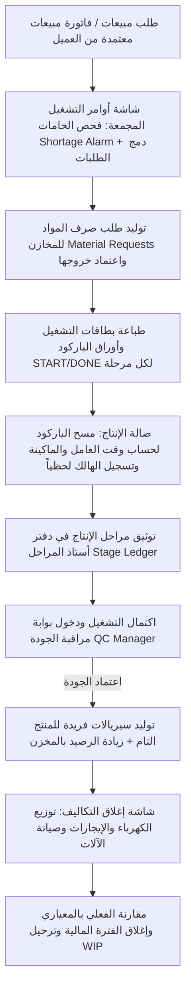

# دليل مديول التصنيع وإدارة الإنتاج (TriPro ERP - Manufacturing Module)
### الإصدار المحدّث والشامل (Full Enterprise Edition)

مرحباً بك يا صديقي. هذا الدليل مخصص ومصمم خصيصاً لمساعدتك (كمندوب مبيعات، أو مستشار تطبيق، أو مستخدم للنظام) في شرح مديول التصنيع وعرضه لأصحاب المصانع، ورش الإنتاج، والعملاء. يركز هذا الدليل على **واجهات النظام، الأزرار التفاعلية، ودورات العمل الواقعية** مع إبراز القيمة التشغيلية والمالية لكل ميزة، تماماً كما هو مطبق على أرض الواقع في نظام **TriPro ERP**، وبصيغة خالية من أسماء الأكواد أو الملفات البرمجية لتكون سهلة الفهم للجميع.

---

## 1. نظرة عامة والجمهور المستهدف (Overview & Target Audience)

نظام **TriPro ERP - مديول التصنيع** هو محرك إنتاجي متكامل يربط طلبات المبيعات بخطوط التصنيع الفعلي، مراكز العمل، طلبات صرف الخامات، أستاذ المراحل الإنتاجية، ومراقبة الجودة، وصولاً إلى حساب التكلفة الحقيقية وإغلاق الفترة المالية. يساعد النظام على رقمنة أرضية المصنع بالكامل وتحويل العمليات الورقية إلى مؤشرات رقمية لحظية.

### الفئات المستفيدة داخل المصنع:
1. **مدير الإنتاج والمخطط (Production Manager / Planner):** لتخطيط أوامر التشغيل، ومراقبة الطاقة الاستيعابية، والتحقق الاستباقي من توفر المواد الخام قبل بدء التصنيع.
2. **مشرف الصالة وعمال الإنتاج (Shop Floor Supervisors & Operators):** لبدء وإنهاء المراحل الإنتاجية وتوثيق المواد المستهلكة والتالفة عبر الباركود دون الحاجة للكتابة الورقية.
3. **أمين مستودع الخامات (Raw Materials Storekeeper):** تلبية طلبات صرف المواد للتشغيل وفق كميات أمر الإنتاج بدقة.
4. **مراقب الجودة (QC Inspector):** لفحص المنتجات التامة أو نصف المصنعة واعتماد مطابقتها للمواصفات وتوليد السيريالات قبل دخولها المستودعات.
5. **المحاسب الصناعي وإدارة التكاليف (Cost Accountant / Management):** لمتابعة أستاذ المراحل، وتوزيع المصاريف غير المباشرة (الكهرباء، الإيجارات، الصيانة) على المنتجات، وتحديد الانحرافات وحساب هوامش الربح الحقيقية.

---

## 2. الدليل التفصيلي للشاشات والأزرار والميزات التشغيلية

يتكون مديول التصنيع من منظومة متكاملة من الشاشات التفاعلية المتقدمة:

### 🌟 أولاً: شاشة شجرة المواد ومسارات التصنيع (Routing & BOM Manager)
* **الفكرة:** حجر الأساس للتصنيع، حيث يتم فيها تعريف المكونات المطلوبة لإنتاج كل قطعة (الـ BOM) والخطوات المتسلسلة لإنتاجها.
* **أهم الأزرار والوظائف التشغيلية:**
  * 🔘 **زر "إضافة مركز عمل" (Add Work Center):** يُهيكل ويُعرّف ماكينة محددة أو خط إنتاج أو ورشة عمل داخل المصنع، مع إمكانية تحديد تكلفة الساعة التشغيلية لكل مركز عمل والأعباء الإضافية المرتبطة به.
  * 🔘 **زر "إضافة خطوة تشغيل" (Add Operation Step):** يُستخدم لتقسيم عملية تصنيع المنتج إلى مراحل مرتبة (مثل: قص $\rightarrow$ تجميع $\rightarrow$ صنفرة $\rightarrow$ دهان وتلميع). ويتم ربط كل خطوة بمركز العمل الخاص بها وتحديد الوقت المعياري المستغرق بالدقائق.
  * 🔘 **زر "ربط المواد الخام" (Link Raw Materials):** يُستدعى داخل كل خطوة تشغيل لتحديد أي المواد الخام تُستعمل في هذه الخطوة وبأي كمية بدقة، مما يمنع صرف المواد للمصنع بشكل عشوائي.
  * 🔘 **زر "رفع الرسومات والمرفقات" (Upload Attachments):** يتيح إرفاق المخططات الهندسية أو كتيبات إرشادات السلامة والتركيب بكل مرحلة لتظهر للعامل على خط الإنتاج.

---

### 🌟 ثانياً: شاشة إدارة أوامر التشغيل المجمعة والبحث اللحظي (Sales to Production - Batching)
* **الفكرة:** الربط الذكي بين قسم المبيعات وقسم الإنتاج لدمج الطلبيات وتوفير وقت ضبط الماكينات وتجنب نقص الخامات مع محرك بحث فوري.
* **أهم الأزرار والوظائف التشغيلية:**
  * 🔍 **محرك البحث اللحظي للمنتجات (Instant Word/Letter Search):** يتيح كتابة أي حرف أو كلمة للوصول الفوري للمنتجات ومكوناتها دون انتظار تحميل القوائم الضخمة.
  * 📋 **جدول "الفواتير المعلقة" (Pending Invoices & Sales Orders):** يعرض تلقائياً كافة فواتير المبيعات وأوامر البيع التي تحتوي على منتجات تحتاج إلى تصنيع.
  * 🚨 **زر "تحقق من توفر المواد" (Check Material Availability):** يقوم النظام بفحص أرصدة مخازن المواد الخام فوراً للطلبيات المحددة، وفي حال وجود أي عجز يظهر تنبيه فوري باللون الأحمر يوضح المواد الناقصة وكمية العجز بدقة (Shortage Alarm).
  * 🔘 **زر "إنشاء دفعة إنتاج مجمعة" (Merge & Create Batch Order):** يتيح دمج طلبات عملاء متعددين في دفعة تصنيع واحدة موحدة (Batch) بضغطة زر لتقليل الهدر وزمن إعداد الماكينات.
  * 🔘 **زر "بدء الإنتاج للأوامر المحددة" (Start Production Batch):** لتنشيط الدفعات المجمعة وإرسالها مباشرة لصالة الإنتاج كمهام جارية.

---

### 🌟 ثالثاً: شاشة طلبات صرف خامات التشغيل (Material Requests List)
* **الفكرة:** الربط الرسمي بين صالة الإنتاج وأمين مستودع المواد الخام؛ فلا تصرف أي مادة من المستودع إلا بناءً على طلب إلكتروني مرتبط بأمر التشغيل.
* **المميزات التشغيلية:**
  * 📋 **توليد طلب المواد الآلي:** فور اعتماد أمر الإنتاج، يولد النظام طلباً يحتوي على كافة المواد المطلوبة للتشغيلة وفق شجرة الـ BOM.
  * 🔘 **زر "صرف واعتماد الخامات":** يقوم أمين المستودع بمطابقة الكميات واعتماد خروجها، ليتم خصمها من مستودع الخامات الرئيسي وتحميلها لحساب "المخزون تحت التشغيل WIP" للمصنع.

---

### 🌟 رابعاً: شاشة إدارة صالة الإنتاج والباركود الميداني (Shop Floor Manager)
* **الفكرة:** رقمنة أرضية المصنع بالكامل وتتبع حركة الإنتاج ثانية بثانية عبر القوارئ الإلكترونية (Scanners) لضمان الدقة وتجنب الأوراق.
* **أهم الأزرار والوظائف التشغيلية:**
  * 💻 **لوحة "المهام الجارية" (Shop Floor Tasks):** شاشة مخصصة لعمال التشغيل تعرض المهام المطلوبة منهم وحالة كل مهمة (معلقة، نشطة، مكتملة).
  * 🖨️ **أيقونة "طباعة بطاقة التشغيل" (Print Operation Card):** لطباعة بطاقة ورقية ترافق المواد داخل المصنع وتحتوي على باركودين فريدين لكل مرحلة.
  * 🏷️ **باركود "بدء العمل" (START Barcode):** يمسحه العامل إلكترونياً عند بدء العمل الفعلي على الماكينة، ليتحول لون المهمة للأزرق (نشطة) ويبدأ النظام تلقائياً باحتساب زمن التشغيل الفعلي.
  * 🏷️ **باركود "إتمام العمل" (DONE Barcode):** يمسحه العامل فور انتهاء المرحلة لتسجيل كمية الوحدات التامة وإيقاف المؤقت التلقائي وحساب الكفاءة.
  * 🔘 **زر "تسجيل هالك وتالف" (On-the-Fly Scrap Logging):** نافذة تظهر فوراً للعامل أو المشرف لتسجيل أي مواد تلفت أثناء التشغيل مع توضيح السبب ليخصمها النظام فوراً من المخزون ويحسب قيمتها كخسائر تالف صناعي.
  * 🔘 **زر "المنتجات الجانبية" (By-products):** يتيح تسجيل أي منتجات ثانوية أو عرضية ذات قيمة مالية نتجت أثناء تصنيع المنتج الأساسي ليتم تخزينها وحساب قيمتها.

---

### 🌟 خامساً: دفتر أستاذ المراحل الإنتاجية (Stage Ledger)
* **الفكرة:** رقابة مالية وهندسية متناهية الدقة تحسب تكلفة كل مرحلة إنتاجية على حدة، وتحدد أين تتركز التكاليف في مسار المنتج.
* **المميزات التشغيلية:**
  * 📊 **تتبع تكاليف المرحلة:** تفصيل تكلفة المواد المستهلكة، ساعات تشغيل الماكينة، وأجور العمالة لكل خطوة.
  * ⚠️ **كشف اختناقات الخطوط (Bottlenecks):** يوضح أي مرحلة تستغرق وقتاً أطول من المخطط له وتسبب تعطيل باقي المراحل.

---

### 🌟 سادساً: مركز مراقبة الجودة والاعتماد والتتبع (Quality Control Manager)
* **الفكرة:** البوابة الأمنية والرقابية التي تضمن عدم خروج أي قطعة معيبة للعملاء وتوثيق سلامة المنتجات قبل التخزين النهائي مع توليد السيريالات.
* **أهم الأزرار والوظائف التشغيلية:**
  * 📋 **جدول "الدفعات المكتملة بانتظار الفحص":** شاشة مخصصة لفني الجودة يستعرض من خلالها الدفعات التي انتهت مراحل إنتاجها وتنتظر الفحص والاعتماد.
  * 🔘 **زر "اعتماد الجودة" (Approve / Pass):** عند مطابقة المنتج للمواصفات، يؤدي الضغط على هذا الزر إلى أتمتة الخطوات التالية فوراً:
    1. إضافة رصيد المنتج التام في مستودع المنتجات الجاهزة مع **توليد أرقام تسلسلية فريدة (Serial Numbers)** لكل قطعة لضمان تتبعها مستقبلاً.
    2. استهلاك المواد الخام تلقائياً من مستودع المواد الأولية بناءً على ما تم صرفه فعلياً.
    3. إنشاء القيود المحاسبية الختامية وتحديث الأرصدة المالية.
  * 🔘 **زر "إعادة تشغيل" (Rework):** يُستخدم لإرجاع الدفعة أو أجزاء منها لخط الإنتاج مرة أخرى لإصلاح عيب ما مع كتابة الملاحظات اللازمة.
  * 🔘 **زر "رفض / هالك" (Reject / Scrap):** يُستخدم لاستبعاد القطع المعيبة تماماً التي لا يمكن إصلاحها، وتسجيل تكلفة المواد المستخدمة فيها كخسائر تشغيل.

---

### 🌟 سابعاً: شاشة إغلاق التكاليف الشهرية والمحاسبة الصناعية (Cost Closing Dashboard)
* **الفكرة:** الربط المالي والمحاسبي الذي يُغلق الفترة التكاليفية ويوزع المصاريف غير المباشرة بالتساوي ويحدد ربحية المصنع.
* **أهم الأزرار والوظائف التشغيلية:**
  * 📅 **فلاتر "تحديد الفترة المالية" (Year / Month Filters):** لاختيار الشهر والسنة المراد مراجعة تكاليفها وإغلاقها.
  * 🔘 **زر "توزيع الأعباء الصناعية غير المباشرة" (Allocate Overheads):** بضغطة زر واحدة، يقوم النظام بجمع كافة المصاريف العامة للمصنع (إيجار المصنع، الكهرباء، رواتب المشرفين، صيانة الآلات) من شجرة الحسابات، ويقوم بتوزيعها بعدالة على أوامر الإنتاج الجارية خلال الشهر بناءً على ساعات العمل الفعلية المسجلة.
  * 📊 **نافذة "تقرير مصالحة التكاليف" (Cost Reconciliation Report):** لمطابقة قيمة المواد المستهلكة في صالة الإنتاج مخزنياً مع القيود المحاسبية المقابلة لها في الأستاذ العام لضمان عدم وجود أي فروقات.
  * 🔘 **زر "إغلاق الفترة التكاليفية" (Period Close):** لتجميد تكاليف الشهر وتوليد قيود تسوية الفروقات آلياً، وترحيل قيمة البضاعة التي لا تزال تحت التشغيل (WIP) كأرصدة افتتاحية للشهر الجديد.

---

## 3. دورة حياة أمر الإنتاج داخل النظام (Production Lifecycle)

```mermaid
graph TD
    A[طلب مبيعات / فاتورة مبيعات معتمدة من العميل] --> B[شاشة أوامر التشغيل المجمعة: فحص الخامات Shortage Alarm + دمج الطلبات]
    B --> C[توليد طلب صرف المواد للمخازن Material Requests واعتماد خروجها]
    C --> D[طباعة بطاقات التشغيل وأوراق الباركود START/DONE لكل مرحلة]
    D --> E[صالة الإنتاج: مسح الباركود لحساب وقت العامل والماكينة وتسجيل الهالك لحظياً]
    E --> F[توثيق مراحل الإنتاج في دفتر أستاذ المراحل Stage Ledger]
    F --> G[اكتمال التشغيل ودخول بوابة مراقبة الجودة QC Manager]
    G -->|اعتماد الجودة| H[توليد سيريالات فريدة للمنتج التام + زيادة الرصيد بالمخزن]
    H --> I[شاشة إغلاق التكاليف: توزيع الكهرباء والإيجارات وصيانة الآلات]
    I --> J[مقارنة الفعلي بالمعياري وإغلاق الفترة المالية وترحيل WIP]
```

---

## 4. التقارير الذكية ومؤشرات الأداء للملاك والإدارة (Manufacturing Analytics)

1. **لوحة قيادة التصنيع (Manufacturing Dashboard):** تعرض في ثوانٍ أوامر الإنتاج النشطة، متوسط كفاءة الماكينات، والدفعات بانتظار فحص الجودة.
2. **كفاءة الماكينات ومراكز العمل (Work Center Efficiency Table / OEE):** تقيس الفاقد الزمني والإنتاجي لكل ماكينة وتوضح الماكينات التي تحتاج صيانة.
3. **تقرير تتبع تسلسل ونسب المنتجات (Genealogy Viewer):** كتابة السيريال نمبر لأي قطعة مبيعة يستعرض شجرة كاملة توضح تاريخ تصنيعها، الماكينة، العامل، وشحنات المواد الخام ومورديها بدقة متناهية.
4. **تقرير معدل دوران المواد الخام (Raw Materials Turnover):** تحليل سرعة استهلاك الخامات في الإنتاج لتجنب ركود الأموال في خامات مكدسة.
5. **تقرير انحراف تكلفة المراحل (Stage Variance Report):** يقارن التكلفة الفعلية والوقت الفعلي لكل مرحلة تشغيلية بالمعياري لاكتشاف الخلل.
6. **تقرير ملخص الإنتاج تحت التشغيل (WIP Monthly Summary):** يوضح قيمة المواد المحبوسة في صالة الإنتاج لعرضها بدقة بالميزانية العمومية.

---

## 5. جمل تسويقية ذهبية لبيع المديول لأصحاب المصانع (Sales Hooks)

> [!TIP]
> **السيناريو الأول: مشكلة الهدر والسرقة المجهولة**
> * **سؤال المندوب:** "هل تكتشف عجزاً في المواد الخام الأساسية بنهاية العام عند الجرد السنوي وتجد صعوبة في معرفة أين ذهبت؟"
> * **الحل بالنظام:** "مع شاشة انحراف المواد (BOM Variance) ونظام تسجيل الهالك الميداني بالباركود، سيعرف النظام بالجرام كمية المواد المستهلكة في كل أمر تشغيل، وسيرسل لك إشعاراً أحمر فوراً بأي هدر يتجاوز الحدود المعيارية."

---

> [!IMPORTANT]
> **السيناريو الثاني: غموض التكلفة الفعلية وضياع الأرباح**
> * **سؤال المندوب:** "هل تسعّر منتجاتك بناءً على تكلفة تقديرية للمواد الخام فقط، وتفاجأ بنهاية العام أن أرباحك أقل بكثير بسبب مصاريف الكهرباء والإيجار التي لم توزع بدقة؟"
> * **الحل بالنظام:** "شاشة إغلاق التكاليف تجمع آلياً فواتير كهرباء المصنع والإيجارات وصيانة الآلات، وتوزعها بعدالة على القطع المنتجة خلال الشهر بناءً على ساعات التشغيل، لتعطيك تكلفة إنتاج حقيقية 100%."

---

> [!NOTE]
> **السيناريو الثالث: تتبع العيوب وسحب المنتجات من السوق**
> * **سؤال المندوب:** "إذا اشتكى عميل من عيب في قطعة اشتراها منك، كيف تعرف مصدر الخامات وموردها وأي دفعات أخرى تضررت؟"
> * **الحل بالنظام:** "عبر شاشة تتبع النسب (Genealogy Viewer)، بمجرد إدخال السيريال نمبر يظهر لك تاريخ تصنيع القطعة بدقة ومورد المادة الخام لتطالبه بالتعويض وتسحب باقي الدفعة لحماية سمعتك."

---

**TriPro ERP - مديول التصنيع** هو خيارك الأقوى والأمثل لنقل المنشآت الصناعية من الفوضى الورقية إلى التحكم المالي والتشغيلي اللحظي والمطلق.
