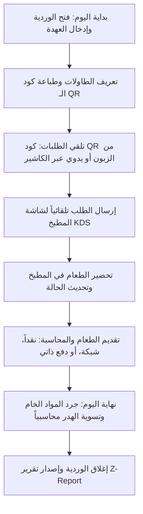

# دليل التعامل مع مديول المطاعم ونقاط البيع (TriPro ERP - Restaurant Module)

مرحباً بك يا صديقي. هذا الدليل مخصص لمساعدتك في شرح مديول المطاعم وعرضه للعملاء المحتملين بشكل احترافي، يوضح الميزات التي يقدمها البرنامج والحلول العملية لمشاكلهم التشغيلية والمالية اليومية.

---

## 1. نظرة عامة والجمهور المستهدف (Overview & Target Audience)
مديول المطاعم في نظام **TriPro ERP** هو حل متكامل يربط المبيعات بالمطبخ بالمخازن بالإدارة المالية والمحاسبية في شاشة واحدة. 

### الفئات المستفيدة داخل المطعم:
1. **الكاشير (Cashier):** سرعة إدخال الطلبات، إدارة الطاولات، وقفل الوردية بدون أخطاء حسابية.
2. **النادل / الويتر (Waiter):** سهولة نقل وتعديل ودمج الطلبات بين الطاولات، ومتابعة حالة الوجبات.
3. **طاقم المطبخ (Kitchen Staff):** رؤية الطلبات فوراً مع التعديلات والملاحظات وتحديث حالتها خطوة بخطوة.
4. **مسؤول المستودع (Inventory Manager):** جرد المطبخ في نهاية اليوم وتسوية الفروقات والهدر بسهولة.
5. **المدير المالي والمالك (Owner & Financial Manager):** رؤية نسب الربحية، تكلفة الوجبات، ومراقبة المبيعات وتجنب تسريب الأموال أو المخزون.

---

## 2. الميزات الرئيسية لبيع النظام (Key Selling Points)

عند التواصل مع العملاء، ركز على هذه الميزات الخمس الكبرى:

### 🌟 أولاً: قائمة الطعام الذكية والطلب الذاتي عبر QR Code (Public Self-Ordering)
* **الفكرة:** لكل طاولة رمز QR فريد يتم إنشاؤه من النظام وطباعته.
* **كيف تعمل؟** يقوم الزبون بمسح الرمز بهاتفه، لتظهر له قائمة طعام تفاعلية وجذابة خاصة بالمطعم.
* **المميزات التشغيلية:**
  * تصفح قائمة الطعام بالصور والأسعار المحدثة والعروض النشطة تلقائياً.
  * إمكانية تخصيص الطلب (مثال: حجم البيتزا، نوع الخبز، إضافات مثل جبن إضافي أو صوص) مع احتساب الفروقات المالية فوراً.
  * كتابة ملاحظات خاصة للمطبخ مباشرة (مثل: "بدون بصل" أو "سبايسي زيادة").
  * **الطلب والدفع:** يمكن للزبون إرسال الطلب مباشرة للمطبخ والدفع لاحقاً نقداً عند المغادرة، أو **الدفع الإلكتروني الفوري** عبر الهاتف لتأكيد الطلب.
  * **طلب الحساب:** يمكن للزبون ضغط زر "طلب الحساب" من هاتفه، فيظهر تنبيه فوري وامض وجذاب للكاشير على شاشة الـ POS لإرسال الفاتورة.
  * **الفائدة للعميل:** توفير تكلفة تشغيل الويترز، وتسريع دورة خدمة الطاولات، وتقليل أخطاء أخذ الطلبات.

### 🌟 ثانياً: شاشة كاشير ونقاط بيع متكاملة وسريعة (Advanced POS Screen)
* **الفكرة:** شاشة واحدة مجهزة لدعم اللمس لإدارة المبيعات بالكامل.
* **المميزات التشغيلية:**
  * **إدارة الطاولات:** عرض مرئي ملون للطاولات حسب حالتها: (متاحة - باللون الأخضر، مشغولة - باللون الأحمر، محجوزة - باللون الأصفر).
  * **متابعة الجلسة:** يظهر على الطاولة المشغولة عداد وقت فعلي بالدقائق لمعرفة كم مضى على جلوس الزبائن.
  * **إجراءات مرنة:** 
    * **تحويل الطاولة (Transfer):** نقل طلبات زبون من طاولة مشغولة إلى طاولة أخرى متاحة بضغطة زر.
    * **دمج الطاولات (Merge):** دمج حساب طاولتين مشغولتين معاً (مثل جلوس عائلتين أو أصدقاء معاً).
    * **حجز طاولة:** تسجيل حجز طاولة باسم العميل ووقت الوصول المتوقع.
  * **العمل بدون إنترنت (Offline Support):** النظام يدعم الاستمرار في البيع وإصدار الفواتير محلياً حتى في حال انقطاع الإنترنت، مع المزامنة التلقائية عند عودة الاتصال.
  * **الطباعة الفورية:** طباعة إيصالات المبيعات أو إرسال "بون" الطلب مباشرة لطابعة المطبخ.

### 🌟 ثالثاً: شاشة المطبخ الذكية (Kitchen Display System - KDS)
* **الفكرة:** استبدال البونات الورقية التقليدية التي تضيع أو تتسخ بشاشة رقمية تفاعلية داخل المطبخ.
* **المميزات التشغيلية:**
  * عرض الطلبات مقسمة ومنظمة حسب الطاولة أو نوع الطلب (سفري، توصيل، محلي).
  * حساب وقت التحضير الفعلي لكل وجبة لمعرفة مدى تأخر المطبخ.
  * **تلوين الحالات تلقائياً:** (جديد باللون الأزرق $\leftarrow$ جاري التحضير باللون الأصفر $\leftarrow$ جاهز باللون الأخضر).
  * **إبراز التعديلات والملاحظات:** تظهر الإضافات في كبسولات ملونة واضحة، وتظهر ملاحظات الحساسية أو الطلبات الخاصة بنص أحمر وامض لضمان انتباه الطباخ.
  * **تنبيهات صوتية:** يصدر النظام صوتاً عند وصول أي طلب جديد للمطبخ.

### 🌟 رابعاً: إدارة الوصفات وحساب التكاليف الدقيق (Recipe & Costing Management)
* **الفكرة:** ربط وجبات المبيعات بالمواد الخام الموجودة في المستودعات (شجرة المكونات - BOM).
* **كيف تعمل؟** عند بيع "ساندوتش برجر"، يخصم النظام تلقائياً من المخزون: (قطعة خبز برجر، 150 جرام لحم، شريحة جبن، 20 جرام صوص).
* **المميزات التشغيلية:**
  * تحديد الكمية الدقيقة المطلوبة من كل مادة خام لصنع الوجبة.
  * **احتساب التكاليف الإضافية:** إمكانية إضافة تكلفة العمالة (Labor Cost) والمصاريف التشغيلية (Overhead) كقيمة ثابتة أو كنسبة مئوية من تكلفة المواد.
  * **معرفة هامش الربح الفعلي:** مقارنة سعر بيع الوجبة بإجمالي تكلفة تحضيرها (مواد خام + عمالة + تشغيل) لمعرفة الربح الحقيقي لكل صنف.

### 🌟 خامساً: تسوية هدر المستودعات والجرد اليومي (Kitchen End-Day Count & Discrepancies)
* **الفكرة:** معالجة المشكلة الكبرى في المطاعم وهي ضياع أو سرقة المواد الخام أو هدرها.
* **كيف تعمل؟** يقوم مدير المطبخ في نهاية اليوم بفتح شاشة الجرد وإدخال كميات المواد الخام الفعلية المتبقية.
* **المميزات التشغيلية:**
  * يقوم النظام بمقارنة الكمية الفعلية بالكمية المتوقعة حسابياً (المتبقية بناءً على المبيعات).
  * احتساب قيمة العجز المالي (الفرق $\times$ تكلفة المادة الخام).
  * **التسوية المحاسبية الآلية:** بمجرد تأكيد الجرد، يقوم النظام بـ:
    1. تعديل كميات المخزن تلقائياً لتطابق الواقع.
    2. إنشاء قيد محاسبي فوري يرحل قيمة العجز إلى حساب **"مصروفات الهدر والتالف" (Wastage Expense)** ويخصمها من **"مخزون المواد الخام"**.

---

## 3. دورة العمل التفصيلية (Step-by-Step User Flow)

لكي تشرح للعميل كيف سيتعامل موظفوه مع البرنامج يومياً، اعرض عليه هذه الخطوات المتسلسلة:

### الخطوة 1: بدء الوردية (Start Shift)
يفتح الكاشير شاشة الـ POS في الصباح. يطالبه النظام بإدخال مبلغ **"العهدة الافتتاحية"** المتوفرة في درج النقود لبدء الوردية، وتوثق هذه العملية في الحسابات النقدية فوراً لمنع التلاعب.

### الخطوة 2: تهيئة الطاولة وقائمة الطعام
يقوم مدير المطعم بتحديد الطاولات وسعتها (مثلاً طاولة VIP تتسع لـ 6 أشخاص) وتوليد رموز الـ QR الخاصة بها، وربط الوجبات بالوصفات والمكونات.

### الخطوة 3: معالجة الطلبات (Order Processing)
* **مسار الخدمة الذاتية:** يمسح الزبون الـ QR، يختار إضافاته، ويرسل الطلب.
* **مسار الكاشير:** يأتي الزبون للكاونتر، يحدد الكاشير نوع الطلب (محلي، سفري، توصيل)، يختار الوجبات، ويضيف أي ملاحظات، ثم يؤكد الطلب.

### الخطوة 4: التنفيذ في المطبخ (Kitchen Execution)
يظهر الطلب فوراً على شاشة المطبخ (KDS). 
* يضغط رئيس الطهاة على الوجبة لتغيير حالتها إلى **"جاري التحضير"** (لتنبيه الويترز والزبون عبر شاشته).
* عند الانتهاء، يضغط **"جاهز"**، ليقوم الويتر بتقديم الطعام للزبون ويغير حالتها إلى **"تم التقديم"** لتختفي من الشاشة.

### الخطوة 5: الدفع وإصدار الفاتورة (Checkout)
* يطلب الزبون الحساب (سواء ذاتياً عبر الجوال أو يطلب من الويتر).
* يفتح الكاشير طاولة الزبون، ويحدد طريقة الدفع (كاش، بطاقة/شبكة، أو دفع عبر الموقع).
* يطبع الكاشير الفاتورة الضريبية المعتمدة ويتم إغلاق طاولة الزبون لتتحول حالتها فوراً إلى **"متاحة"** لاستقبال زبائن آخرين.

### الخطوة 6: جرد نهاية اليوم وتصفية العجز
في نهاية الوردية، يقوم مدير المطبخ بجرد المواد الخام المتبقية (مثل كمية الجبن، أكياس الصوص، اللحوم).
* يدخل الكميات الفعلية في شاشة **جرد المطبخ**.
* يعالج النظام الفروقات ويعدل المخزن ويسجل القيود المحاسبية للهدر فوراً.

### الخطوة 7: إغلاق الوردية وترحيل المبيعات (Close Shift & Z-Report)
يقوم الكاشير بطلب إغلاق الوردية. 
* يظهر له النظام تقريراً ملخصاً بالعمليات (المبيعات النقدية المتوقعة، مبيعات الشبكة، رصيد البداية).
* يُدخل الكاشير مبلغ النقدية الفعلي المتواجد في الدرج.
* يحتسب النظام **الفارق (عجز أو زيادة)** ويسجل ملاحظات الكاشير.
* عند الضغط على تأكيد، يقوم النظام بإغلاق الوردية نهائياً وترحيل كافة القيود المحاسبية للأرباح والخسائر والصندوق العام للمطعم.

---

## 4. تقارير الإدارة والمتابعة (Reporting & Analytics)

يمكنك توضيح كيف يستطيع مالك المطعم متابعة أداء عمله من أي مكان من خلال 4 تقارير أساسية مدمجة:
1. **تقرير مبيعات المطعم (Restaurant Sales Report):** يوضح حجم المبيعات الإجمالي مقسماً حسب الأيام والتصنيفات (وجبات، مشروبات، إلخ).
2. **المبيعات حسب الموظف (Sales by User Report):** تقييم أداء الكاشيرية والويترز ومعرفة من الأكثر تحقيقاً للمبيعات.
3. **تقرير تحليل الهدر والتالف (Wastage Analysis Report):** يوضح أسباب الهدر (مثال: وجبة تالفة، انتهاء صلاحية، خطأ في التحضير) وكمياتها وتكلفتها الإجمالية، وهو سلاح الإدارة لتقليل الخسائر.
4. **تقرير أرباح المطعم (Restaurant Profit Report):** يقارن تكاليف تحضير الوجبات (الناتجة من وصفة المكونات BOM والتشغيل) بأسعار بيعها الفعلية، ليعطي المالك رقماً دقيقاً لصافي ربحية كل وجبة وكل قسم.

---

## 5. نصائح تسويقية ذكية لبيع المديول (Marketing Tips)

عند عرض البرنامج لأصحاب المطاعم، استخدم هذه العبارات الجاذبة التي تحاكي مشاكلهم التشغيلية:

* **"هل تشتكي من هروب الزبائن بسبب تأخر الويتر في تسجيل الطلب أو إحضار الحساب؟"**
  * *الحل:* نظام الـ QR الذاتي يتيح للزبون الطلب والدفع وطلب الحساب من جواله فوراً دون انتظار الويتر.
* **"هل تشك بأن هناك سرقة في المواد الخام أو هدر مفرط في المطبخ يلتهم أرباحك؟"**
  * *الحل:* ربط الوجبات بالوصفات وجرد نهاية اليوم الآلي يضبط الكميات بالجرام، ويرحل قيمة الهدر كخسارة محاسبية واضحة لتحديد الخلل ومحاسبة المقصر.
* **"هل تتعب في حساب أرباحك الصافية وتفاجأ بنهاية الشهر بمصاريف لم تحسب لها حساباً؟"**
  * *الحل:* تقرير أرباح المطعم يربط سعر البيع بالتكلفة الفعلية للمواد الخام شاملة العمالة ومصاريف التشغيل الموزعة، لتعرف ربحك بالقرش قبل نهاية الشهر.
* **"هل تضيع الطلبات والتعديلات بين الويتر والمطبخ وتسبب استياء الزبائن؟"**
  * *الحل:* شاشة KDS داخل المطبخ تعرض التعديلات والملاحظات بشكل أحمر وامض وواضح مع تنبيه صوتي لضمان خروج الطلب كما يرغب فيه العميل تماماً.

---
**TriPro ERP** هو الاستثمار الأفضل لأي مطعم يبحث عن **التنظيم، والسرعة، والتحكم المطلق في المخزون والأرباح**. بالتوفيق في تسويق البرنامج يا صديقي!
