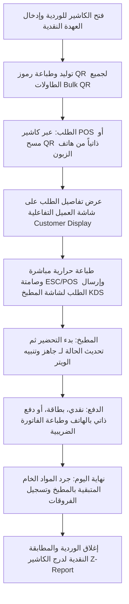

# دليل مديول المطاعم ونقاط البيع (TriPro ERP - Restaurant & POS Module)
### الإصدار المحدّث والشامل (Full Enterprise Edition)

مرحباً بك يا صديقي. هذا الدليل مخصص لمساعدتك في شرح مديول المطاعم والكافيهات وعرضه للعملاء المحتملين بشكل احترافي، يوضح الميزات الفائقة التي يقدمها البرنامج والحلول العملية لمشاكلهم التشغيلية والمالية اليومية من خلال **واجهات النظام، الأزرار التفاعلية، ودورات العمل الواقعية**، تماماً كما هو مطبق على أرض الواقع في نظام **TriPro ERP**، وبصيغة سهلة الفهم وخالية من التعقيد البرمجي.

---

## 1. نظرة عامة والجمهور المستهدف (Overview & Target Audience)

نظام **TriPro ERP - مديول المطاعم** هو حل متكامل يربط مبيعات صالة الطعام (طاولات، سفري، توصيل) بشاشات العرض للعملاء، وشاشات المطبخ الرقمية، ثم بمستودعات المواد الخام والتكلفة بالجرام، وانتهاءً بالإدارة المالية والقيود المحاسبية الآلية، مع دعم كامل للعمل أوفلاين والطباعة الحرارية المباشرة.

### الفئات المستفيدة داخل المطعم:
1. **الكاشير (Cashier):** لفتح وإغلاق الورديات، وتسجيل الطلبات بسرعة، وإدارة عمليات الدفع والطباعة الفورية للفواتير.
2. **الزبون (Guest):** استعراض شاشة تفاعلية أمامه، أو مسح رمز QR من طاولته للطلب الذاتي والدفع الإلكتروني.
3. **طاقم المطبخ (Kitchen Staff):** رؤية الطلبات وإضافاتها وملاحظات الحساسية فوراً على شاشات تفاعلية دون بونات ورقية تقليدية.
4. **مسؤول المستودع وجرد المطبخ (Inventory Manager):** تتبع استهلاك المواد الخام وتصفيات نهاية اليوم وحساب الهدر الميداني بالجرام.
5. **المدير المالي والمالك (Owner & Financial Manager):** مراقبة نسب الربحية، تكلفة الوجبات، ومراقبة حركة الصندوق المالي ومنع تسريب الإيرادات والسرقة.

---

## 2. الدليل التفصيلي للشاشات والأزرار والميزات التشغيلية

يتكون مديول المطاعم من منظومة متكاملة من الشاشات التفاعلية الحديثة:

### 🌟 أولاً: شاشة كاشير ونقاط البيع المتكاملة والسريعة (Advanced POS Screen)
* **الفكرة:** شاشة البيع المركزية المجهزة باللمس لإدارة الجلسات والطاولات والمبيعات والعهد النقدية.
* **أهم الأزرار والوظائف التشغيلية:**
  * 🔘 **زر "حجز طاولة" (Reserve Table):** يفتح نافذة لتسجيل اسم العميل ووقت الوصول المتوقع لتعليق الطاولة باللون الأصفر (محجوزة) لمنع حجزها لعميل آخر.
  * 🔘 **زر "تحويل طاولة" (Transfer Table):** يتيح نقل كامل طلبات الجلسة والطلبات المفتوحة من طاولة إلى أخرى بضغطة زر.
  * 🔘 **زر "دمج الطاولات" (Merge Tables):** يدمج حساب جلستين مفتوحتين في فاتورة واحدة مجمعة عند رغبة الزبائن.
  * 🔘 **زر "طلب الحساب" (Request Bill / Print Proforma):** يتيح طباعة بون أولي (غير مدفوع) للزبون لمراجعة الأصناف قبل الدفع.
  * 🔘 **زر "إتمام الدفع" (Confirm Payment):** يفتح نافذة الدفع لاختيار طريقة السداد (نقدي CASH أو شبكة/بطاقة CARD أو تقسيم الدفع Split) مع إمكانية إدخال قيمة الخصومات واستبدال نقاط الولاء.
  * 🔘 **زر "تأكيد الطلب وإرساله للمطبخ" (Accept & Send to Kitchen):** يرحل الأصناف مباشرة إلى شاشة المطبخ (KDS) ويطبع بون التحضير آلياً في الأقسام المختصة.
  * 🔘 **زر "فتح/إغلاق الوردية" (Start/Close Shift):** لتسجيل العهدة الافتتاحية والمطابقة النقدية الختامية بنهاية اليوم، حيث يطلب النظام إدخال النقد الفعلي بالدرج ويحتسب العجز أو الزيادة آلياً (Z-Report).
  * 🔘 **أزرار "سفري" (Takeaway) و "توصيل" (Delivery):** لفتح طلبات سريعة خارج نطاق الطاولات، مع إمكانية ربط الطلب بعنوان العميل والطيار ورسوم التوصيل.
  * 🔘 **زر "استبدال نقاط الولاء" (Redeem Points):** لخصم مبالغ مالية بناءً على رصيد نقاط العميل المسجل في برنامج الولاء المدمج بالنظام.

---

### 🌟 ثانياً: شاشة العميل التفاعلية المواجهة للزبون (Customer-Facing Display)
* **الفكرة:** شاشة ثانية مستقلة تُعرض أمام العميل على الكاونتر أثناء تسجيل الكاشير للطلب لتعزيز الشفافية وتجربة العميل والترويج للوجبات.
* **أهم المميزات التشغيلية:**
  * 📺 **العرض اللحظي للطلب:** يرى الزبون كل صنف يضربه الكاشير مع سعره وتعديلاته الخاصة فورياً.
  * 💵 **إجمالي الحساب والضرائب:** عرض إجمالي الحساب والخصومات ومقدار الضريبة المضافة بوضوح تام.
  * 📢 **العروض الترويجية المصورة:** عرض بانرات وإعلانات للوجبات الجديدة والخصومات أثناء عدم استخدام الشاشة لجذب الزبائن لطلب المزيد.

---

### 🌟 ثالثاً: جسر الطباعة الحرارية المباشرة والصامتة (ESC/POS Direct Printer Bridge)
* **الفكرة:** طباعة الفواتير وبونات المطبخ فوراً وبشكل صامت فائق السرعة على الطابعات الحرارية (USB / Network / Bluetooth) دون الحاجة لفتح شاشة حوار الطباعة الخاصة بالمتصفح (No Browser Dialog).
* **المميزات التشغيلية:**
  * ⚡ **طباعة في أجزاء من الثانية:** تزيد سرعة الكاشير وتمنع تشكل الطوابير.
  * 🖨️ **فصل أقسام المطبخ:** إرسال بون المشروبات إلى بار المشروبات وبون الوجبات الساخنة إلى مطبخ الطهي تلقائياً.
  * ✂️ **القص الآلي وفتح درج النقدية:** إرسال أمر فتح درج الكاشير آلياً وقص الورق بعد اكتمال الفاتورة.

---

### 🌟 رابعاً: شاشة قائمة الطعام والطلب الذاتي عبر QR Code (Public Self-Ordering)
* **الفكرة:** واجهة ويب جذابة تفتح على جوال العميل بمسح رمز QR الفريد المطبوع على طاولته لطلب الطعام والدفع مباشرة دون انتظار الويتر.
* **أهم الأزرار والوظائف التشغيلية:**
  * 🔘 **زر "تخصيص الوجبة" (Customize Item / Modifiers):** يفتح خيارات حجم الوجبة (كبير/وسط/صغير)، ونوع الخبز، والإضافات (صوصات، جبن إضافي، نوع اللحم) مع تحديث فوري للسعر.
  * 💬 **حقل "ملاحظات خاصة للمطبخ" (Special Instructions):** لإدخال تعليمات خاصة بالطهي أو الحساسية من مكونات معينة تظهر بلون أحمر وامض في المطبخ لضمان سلامة العميل.
  * 🔘 **زر "تأكيد وإرسال الطلب" (Send Order):** يرسل الطلب مباشرة إلى نظام الـ POS والمطبخ.
  * 🔘 **زر "طلب الحساب/الويتر" (Call Waiter / Bill Request):** يرسل إشارة لاسلكية فورية تظهر كأيقونة وامضة حمراء على طاولة العميل بشاشة الكاشير لتنبيه الموظفين.

---

### 🌟 خامساً: نافذة توليد وطباعة أكواد الـ QR الجماعية (Bulk QR Code Modal)
* **الفكرة:** بدلاً من توليد باركود لكل طاولة يدوياً وتضييع الوقت، تتيح هذه الأداة إنشاء وتصدير كافة أكواد الـ QR لكافة طاولات الصالة بضغطة زر واحدة.
* **المميزات التشغيلية:**
  * 🖨️ **تصدير جاهز للطباعة الفاخرة:** إنشاء ملف موحد يحتوي على الباركود الخاص بكل طاولة مع شعار المطعم ورقم الطاولة بدقة عالية جاهزة للطباعة على الأكريليك أو الستاندات.

---

### 🌟 سادساً: أداة نسخ وتكرار الإضافات والمعدلات السريعة (Copy Modifiers Tool)
* **الفكرة:** تسريع إعداد قائمة الطعام؛ فبدلاً من إعادة كتابة الإضافات (مثل درجات الاستواء، أنواع الصوصات، أحجام المشروبات) لكل وجبة على حدة، يتم نسخها بين الأقسام بضغطة زر.
* **المميزات التشغيلية:**
  * 📋 **نسخ مجمّع:** اختيار صنف مصدر ونسخ جميع مجموعات إضافاته لعدة أصناف جديدة في ثوانٍ معدودة.

---

### 🌟 سابعاً: شاشة المطبخ الرقمية الذكية (Kitchen Display System - KDS)
* **الفكرة:** شاشة تواصل رقمية داخل المطبخ تستبدل البونات الورقية وتمنح الطهاة رؤية واضحة للطلبات ومواعيد تحضيرها لتقليل أخطاء التحضير.
* **أهم الأزرار والوظائف التشغيلية:**
  * 🔘 **زر "بدء التحضير" (Start Preparing):** يحوّل حالة الوجبة من "جديد" (باللون الأزرق) إلى "جاري التحضير" (باللون الأصفر) لحساب زمن التحضير الدقيق لكل صنف.
  * 🔘 **زر "جاهز للتسليم" (Mark as Ready):** يحوّل حالة الوجبة إلى "جاهز" (باللون الأخضر) ويرسل إشعاراً للويتر أو يعرض الرقم على شاشة تسليم الطلبات الخارجية.
  * 🔘 **زر "تم التقديم" (Mark as Served):** يُخفي الوجبة أو الطلب بالكامل من شاشة المطبخ بعد تسليمها للزبون.
  * ⏱️ **مؤقت "زمن الانتظار" (ElapsedTime Tracker):** عداد تلقائي يوضح بالدقائق والثواني الوقت المنقضي منذ طلب الوجبة للتنبيه بوجبات الطاولات المتأخرة.
  * 🏷️ **كبسولات "الإضافات والملاحظات" (Modifiers & Notes):** عرض مميز باللون الأزرق الفاتح للإضافات، واللون الأحمر الوامض للملاحظات الطارئة (مثل الحساسية) لجذب انتباه الطباخ فوراً.

---

### 🌟 ثامناً: شاشة إدارة الوصفات والمكونات والتكاليف (Recipe & Costing Management)
* **الفكرة:** ربط وجبات المبيعات بالمواد الخام في المستودعات لخصمها تلقائياً وتحديد التكلفة الإجمالية بدقة لضمان التسعير العادل.
* **أهم الأزرار والوظائف التشغيلية:**
  * 🔍 **زر "البحث وإضافة مادة خام" (Add Raw Material Ingredient):** يتيح سحب المواد الأولية من المخزون (مثل: دقيق، لحم، جبن) وربطها بالوجبة.
  * ⚖️ **حقل "الكمية المطلوبة للتحضير" (Required Quantity):** إدخال كمية استهلاك المادة الخام بدقة (بالجرام، الميلي، أو القطعة) لصياغة شجرة المكونات (BOM).
  * 💵 **حقلي "أجور العمالة المباشرة" (Labor Cost) و "المصاريف التشغيلية" (Overhead Cost):** لحساب وتوزيع تكاليف التشغيل والرواتب والكهرباء لكل وجبة.
  * 📊 **مؤشر "صافي تكلفة الوجبة" (Total Recipe Cost):** حاسبة ذكية تجمع تكاليف المواد الخام المستعملة والعمالة والأعباء لتعطي التكلفة المعيارية وتوضح هامش الربح الحقيقي بناءً على سعر البيع.
  * 🔘 **زر "إدارة مجموعات الإضافات" (Modifier Groups):** لإنشاء خيارات مخصصة للوجبة، مع تحديد ما إذا كانت المجموعة إجبارية أو اختيارية وتكلفة وسعر بيع كل خيار.

---

### 🌟 تاسعاً: شاشة تسوية هدر المستودعات والجرد اليومي للمطبخ (Kitchen End-Day Count)
* **الفكرة:** معالجة الفروقات بين كميات المواد الخام المتوقعة بالبرنامج والكميات الفعلية المتبقية بالمطبخ في نهاية اليوم وترحيل الهدر مالياً ومخزنياً.
* **أهم الأزرار والوظائف التشغيلية:**
  * 🔘 **زر "اختيار مستودع المطبخ" (Select Kitchen Warehouse):** لتوجيه عملية الجرد لمخزن المطبخ الفرعي.
  * 🔘 **زر "بدء الجرد وجلب الكميات المتوقعة":** يجلب تلقائياً كافة المواد الخام وأرصدتها الحالية المسجلة في النظام.
  * 📥 **حقول "إدخال الكمية الفعلية" (Actual Qty Input):** إدخال الكميات المتبقية التي تم عدّها يدوياً بنهاية الوردية.
  * 📈 **عمود "الفارق المالي والمخزني":** يقوم النظام تلقائياً باحتساب الفرق وقيمة العجز أو الزيادة بضرب الفرق في تكلفة المادة الخام.
  * 🔘 **زر "ترحيل الجرد والتسوية الآلية" (Post & Reconcile):** يحدّث أرصدة المخزون تلقائياً ويولد قيداً محاسبياً فورياً يرحل العجز إلى حساب "مصروفات الهدر والتالف بالمطبخ".

---

### 🌟 عاشراً: العمل بدون اتصال بالإنترنت وحل نزاعات المخزون تلقائياً (Resilient Offline POS Engine)
* **الفكرة:** انقطاع الإنترنت هو الكابوس الأكبر لأي مطعم؛ يضمن TriPro ERP استمرار الكاشير في أخذ الطلبات وطباعة الفواتير وفتح الأدراج دون أي توقف.
* **المميزات التشغيلية:**
  * 📴 **استمرار البيع الكامل Offline:** تسجيل وحفظ الفواتير محلياً على الجهاز فور انقطاع النت.
  * 🔄 **المزامنة التلقائية اللحظية (Batch Sync):** فور عودة الإنترنت، يرفع النظام الفواتير تلقائياً إلى السحابة.
### 🌟 حادي عشر: شاشة ونظام إدارة التشفية وتفكيك الذبائح واللحوم (Meat Butchering & Yield Management)
> 🥩 **الميزة التنافسية الأقوى لمطاعم اللحوم والمشويات والستيك هاوس والبرجر وسلاسل الجزارة!**
* **الفكرة:** حل المعضلة الأكبر في المطاعم المتخصصة؛ عندما يشتري المطعم "عجل كامل" أو "ذبيحة خروف" بسعر إجمالي للوزن القائم (مثلاً 100 كجم بسعر 350 ج.م للكيلو)، كيف نحسب تكلفة كل قطعة مستخرجة (الفلتو، الريب آي، الإنتركوت، المفروم، والريش) ونفصل وزن العظم والدهن والفاقد الطبيعي في التبخير (Shrinkage) دون أن تخسر المنشأة؟
* **أهم الميزات التشغيلية والمالية:**
  * 📋 **أوامر التشفية اليومية (`NewButcheringOrderModal.tsx`):** تسجيل رقم أمر التشفية، وزن الذبيحة المستلمة (وزن الدخول)، تكلفة الشراء، والمستودع المصدر.
  * 🥩 **قوالب التشفية المعيارية للذبائح (`YieldTemplatesModal.tsx`):**
    - نماذج جاهزة ومعيارية مسبقاً لمختلف أنواع اللحوم: **أبقار (Beef)**، **أغنام (Lamb)**، **دواجن (Poultry)**، و**أسماك (Fish)**.
    - تحديد النسبة المعيارية المتوقعة لكل قطعة (% Expected Yield) مع معامل القيمة السوقية النسبية (مثال: الفلتو 2.2، الإنتركوت 1.8، المفروم 1.0، العظم 0.15).
  * ⚖️ **حساب الفاقد الطبيعي في الوزن والهدر (Shrinkage & Waste %):**
    - يقوم النظام بمقارنة (إجمالي وزن القطعيات المستخرجة) ضد (وزن الذبيحة القائم)، واحتساب نسبة ونقص التبخير والهدر الطبيعي (Shrinkage Loss).
    - تنبيه الإدارة فوراً إذا تجاوزت نسبة الفاقد الحدود المعيارية لحماية المطعم من سرقة اللحوم في صالة التشفية.
  * 💰 **طرق التوزيع العادل للتكلفة (Cost Allocation Methods):**
    1. **طريقة القيمة السوقية النسبية (Relative Market Value):** توزيع تكلفة الذبيحة على القطعيات بناءً على قيمتها السوقية (سعر كيلو الفلتو يحمل تكلفة أعلى من المفروم).
    2. **طريقة استنزال المنتجات العرضية (By-Product Deduction):** خصم القيمة التقديرية للعظم والدهن من إجمالي تكلفة الذبيحة وتحميل المتبقي على اللحوم الصافية.
    3. **طريقة التوزيع المتساوي بالوزن (Equal Weight Allocation).**
  * 🔄 **التغذية المخزنية والقيود المحاسبية الآلية:**
    - بضغطة زر عند اعتماد أمر التشفية:
      1. يتم **خصم الذبيحة** من مستودع اللحوم القائمة.
      2. يتم **إضافة أرصدة كافة القطعيات الناتجة** (فلتو، ريب آي، مفروم، إلخ) في مستودع المطبخ كل صنف بتكلفة الكيلو المحسوبة بدقة.
      3. تحديث تكلفة المكونات في شجرة الوجبات (Recipes BOM) لضمان دقة هوامش ربح أطباق المشويات والستيك.
      4. توليد القيد المحاسبي المتوازن آلياً في الأستاذ العام.
  * 📊 **تقرير تحليلات نسب التشفية والربحية (`YieldAnalyticsReport.tsx`):** كشف مقارن يوضح كفاءة كل جزار (Butcher Performance) في التشفية واستخراج اللحوم الصافية ومعدلات الربح المحققة.

---

## 3. دورة العمل التفصيلية (Step-by-Step User Flow)

```mermaid
graph TD
    A[فتح الكاشير للوردية وإدخال العهدة النقدية] --> B[توليد وطباعة رموز QR لجميع الطاولات Bulk QR]
    B --> C[الطلب: عبر كاشير POS أو مسح QR ذاتياً من هاتف الزبون]
    C --> D[عرض تفاصيل الطلب على شاشة العميل التفاعلية Customer Display]
    D --> E[طباعة حرارية مباشرة وصامتة ESC/POS وإرسال الطلب لشاشة المطبخ KDS]
    E --> F[المطبخ: بدء التحضير ثم تحديث الحالة لـ جاهز وتنبيه الويتر]
    F --> G[الدفع: نقدي، بطاقة، أو دفع ذاتي بالهاتف وطباعة الفاتورة الضريبية]
    G --> H[نهاية اليوم: جرد المواد الخام المتبقية بالمطبخ وتسجيل الفروقات]
    H --> I[إغلاق الوردية والمطابقة النقدية لدرج الكاشير Z-Report]
```

---

## 4. تقارير الإدارة والمتابعة (Reporting & Analytics)

1. **تقرير مبيعات المطعم (Restaurant Sales Report):** يحلل المبيعات مقسمة حسب القنوات (صالة، سفري، توصيل) وحسب تصنيفات الوجبات.
2. **المبيعات حسب الموظف (Sales by User Report):** يقيم أداء موظفي الكاشير والويترز ومعرفة الأكثر تحقيقاً للمبيعات والأسرع في خدمة العملاء.
3. **تقرير تحليل الهدر والتالف (Wastage Analysis Report):** يعرض قيمة وكمية الهدر المالي بالجرام للمواد الخام المطبخية، لتحديد مواطن الهدر والمحاسبة عليها.
4. **تقرير أرباح المطعم والوجبات (Restaurant Profit Report):** يقارن تكلفة تحضير الوجبات (الخامات + أجور عمالة + تشغيل) بسعر بيعها الفعلي، لتحديد الوجبات الأكثر ربحية.

---

## 5. جمل تسويقية ذهبية لبيع المديول لأصحاب المطاعم (Sales Hooks)

> [!TIP]
> **السيناريو الأول: التحكم في سرقة وهدر المواد الخام بالمطبخ**
> * **سؤال المندوب:** "هل تشك بأن هناك سرقة في المواد الخام أو هدر مفرط في المطبخ يلتهم أرباحك الصافية دون علمك؟"
> * **الحل بالنظام:** "مع شجرة المكونات (BOM) ونظام جرد نهاية اليوم، سيعرف النظام بالجرام كمية المواد التي استهلكها المطبخ بناءً على المبيعات الفعلية، وسيقوم بترحيل أي عجز مالي إلى حساب مصروفات الهدر والتالف فوراً."

---

> [!IMPORTANT]
> **السيناريو الثاني: الخوف من تعطل الكاشير عند انقطاع الإنترنت**
> * **سؤال المندوب:** "ماذا تفعل في أوقات الذروة وازدحام المطعم إذا انقطع الإنترنت فجأة عن الكاشير؟"
> * **الحل بالنظام:** "مع TriPro، لن تشعر بأي فارق! الكاشير يواصل البيع وطباعة الفواتير الحرارية فوراً بدون إنترنت، وبمجرد عودة الاتصال يقوم النظام بمزامنة كافة المبيعات وتحديث المخزون آلياً دون توقف ثانية واحدة."

---

> [!NOTE]
> **السيناريو الثالث: الشفافية وسرعة الخدمة أمام الزبائن**
> * **سؤال المندوب:** "هل تشتكي من بطء الكاشير وتشكك الزبائن في الحساب عند الكاونتر؟"
> * **الحل بالنظام:** "شاشة العميل التفاعلية (Customer Display) والطباعة الحرارية المباشرة تعطي انطباعاً راقياً لعلامتك التجارية، وتمنح الزبون ثقة مطلقة مع رؤية حسابه وعروضك الترويجية لحظة بلحظة."

---

> [!CAUTION]
> **السيناريو الرابع: أزمة تشفية الذبائح وهدر اللحوم (لمطاعم المشويات والستيك والبرجر)**
> * **سؤال المندوب:** "عندما تشتري عجل أو خروف كامل، كيف تحسب تكلفة كيلو الفلتو وكيلو المفروم بدقة مع استبعاد وزن العظم والدهن والفاقد في التبخير؟ وهل تضمن أن الجزار لا يهدر اللحم أو يسربه؟"
> * **الحل بالنظام:** "شاشة أوامر التشفية (Butchering Yield Manager) ونماذج نسب التشفية تحسب لك بالجرام الوزن المستخرج ومعدل الفاقد، وتوزع تكلفة الذبيحة على القطعيات بالقيمة السوقية آلياً، وتغذي المخازن فتبين لك بالضبط أرباح كل طبق لحوم في مطعمك!"

---

**TriPro ERP** هو الخيار الأمثل والحل الشامل لإدارة المطاعم، صُمم لينقل منشأتك من العمل الورقي التقليدي والفوضى التشغيلية إلى التحكم المالي والرقابي المطلق.
