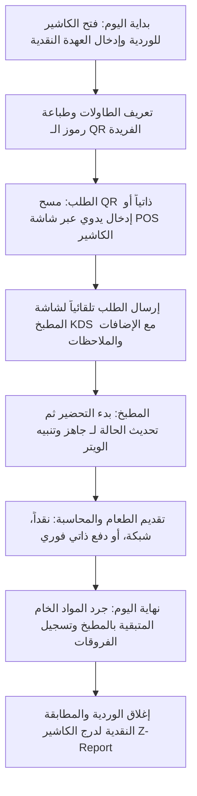

# دليل مديول المطاعم ونقاط البيع (TriPro ERP - Restaurant & POS Module)

مرحباً بك يا صديقي. هذا الدليل مخصص لمساعدتك في شرح مديول المطاعم وعرضه للعملاء المحتملين بشكل احترافي، يوضح الميزات التي يقدمها البرنامج والحلول العملية لمشاكلهم التشغيلية والمالية اليومية من خلال **واجهات النظام، الأزرار التفاعلية، ودورات العمل الواقعية**، تماماً كما هو مطبق على أرض الواقع في نظام **TriPro ERP**، وبصيغة سهلة الفهم وخالية من التعقيد البرمجي.

---

## 1. نظرة عامة والجمهور المستهدف (Overview & Target Audience)

نظام **TriPro ERP - مديول المطاعم** هو حل متكامل يربط مبيعات صالة الطعام (طاولات، سفري، توصيل) بشاشات المطبخ الرقمية، ثم بمستودعات المواد الخام، وانتهاءً بالإدارة المالية والقيود المحاسبية الآلية في شجرة الحسابات. 

### الفئات المستفيدة داخل المطعم:
1. **الكاشير (Cashier):** لفتح وإغلاق الورديات، وتسجيل الطلبات بسرعة، وإدارة عمليات الدفع والطباعة الفورية للفواتير.
2. **النادل / الويتر (Waiter):** لمتابعة حالة الطاولات، وإجراء عمليات النقل والدمج، وتحديث حالة الطلبات بسهولة.
3. **طاقم المطبخ (Kitchen Staff):** لرؤية الطلبات وإضافاتها وملاحظاتها فوراً على شاشات تفاعلية دون بونات ورقية تقليدية.
4. **مسؤول المستودع وجرد المطبخ (Inventory Manager):** لتتبع استهلاك المواد الخام وتصفيات نهاية اليوم وحساب الهدر الميداني.
5. **المدير المالي والمالك (Owner & Financial Manager):** لمراقبة نسب الربحية، تكلفة الوجبات، ومراقبة حركة الصندوق المالي ومنع تسريب الإيرادات.

---

## 2. الدليل التفصيلي للشاشات والأزرار والميزات التشغيلية

يتكون مديول المطاعم من 5 شاشات تفاعلية أساسية تغطي كافة جوانب التشغيل والمحاسبة:

### 🌟 أولاً: شاشة كاشير ونقاط البيع المتكاملة والسريعة (Advanced POS Screen)
* **الفكرة:** شاشة البيع المركزية المجهزة باللمس لإدارة الجلسات والطاولات والمبيعات والعهد النقدية.
* **أهم الأزرار والوظائف التشغيلية:**
  * 🔘 **زر "حجز طاولة" (Reserve Table):** يفتح نافذة لتسجيل اسم العميل ووقت الوصول المتوقع لتعليق الطاولة باللون الأصفر (محجوزة) لمنع حجزها لعميل آخر.
  * 🔘 **زر "تحويل طاولة" (Transfer Table):** يتيح نقل كامل طلبات الجلسة والطلبات المفتوحة من طاولة إلى أخرى بضغطة زر (مثل رغبة الزبون في الانتقال لطاولة بجانب النافذة).
  * 🔘 **زر "دمج الطاولات" (Merge Tables):** يدمج حساب جلستين مفتوحتين في فاتورة واحدة مجمعة (مثل جلوس عائلتين أو أصدقاء معاً على طاولة واحدة عند الحساب).
  * 🔘 **زر "طلب الحساب" (Request Bill / Print Proforma):** يتيح طباعة بون أولي (غير مدفوع) للزبون لمراجعة الأصناف قبل الدفع. كما يستقبل النظام من خلاله تنبيهاً وامضاً باللون الأحمر يظهر على الطاولة بمجرد ضغط الزبون على هاتفه.
  * 🔘 **زر "إتمام الدفع" (Confirm Payment):** يفتح نافذة الدفع لاختيار طريقة السداد (نقدي CASH أو شبكة/بطاقة CARD) مع إمكانية إدخال قيمة الخصومات واستبدال نقاط الولاء للعميل. وبمجرد التأكيد، يقوم النظام تلقائياً بخصم كميات المواد الخام المخزنية، توليد الفاتورة الضريبية، وترحيل القيد المحاسبي آلياً.
  * 🔘 **زر "تأكيد الطلب وإرساله للمطبخ" (Accept & Send to Kitchen):** يرحل الأصناف مباشرة إلى شاشة المطبخ (KDS) ويطبع بون التحضير آلياً في الأقسام المختصة (مطبخ ساخن، بارد، مشروبات).
  * 🔘 **زر "فتح/إغلاق الوردية" (Start/Close Shift):** لتسجيل العهدة الافتتاحية والمطابقة النقدية الختامية بنهاية اليوم، حيث يطلب النظام إدخال النقد الفعلي بالدرج ويحتسب العجز أو الزيادة آلياً.
  * 🔘 **أزرار "سفري" (Takeaway) و "توصيل" (Delivery):** لفتح طلبات سريعة خارج نطاق الطاولات، مع إمكانية ربط الطلب بعنوان العميل والطيار واحتساب رسوم التوصيل المحددة مسبقاً.
  * 🔘 **زر "إضافة خصم" (Add Discount):** لتطبيق خصومات بنسبة مئوية أو قيمة ثابتة على الفاتورة مع التحقق من صلاحية المستخدم الكاشير.
  * 🔘 **زر "استبدال نقاط الولاء" (Redeem Points):** لخصم مبالغ مالية بناءً على رصيد نقاط العميل المسجل في برنامج الولاء المدمج بالنظام.

### 🌟 ثانياً: شاشة قائمة الطعام الذكية والطلب الذاتي عبر QR Code (Public Self-Ordering)
* **الفكرة:** واجهة ويب جذابة تفتح على جوال العميل بمسح رمز QR الفريد المطبوع على طاولته لطلب الطعام والدفع مباشرة دون انتظار الويتر.
* **أهم الأزرار والوظائف التشغيلية:**
  * 🔘 **زر "تخصيص الوجبة" (Customize Item / Modifiers):** يفتح خيارات حجم الوجبة (كبير/وسط/صغير)، نوع الخبز، والإضافات (صوصات، جبن إضافي، نوع اللحم) مع تحديث فوري للسعر الإجمالي المعروض للعميل.
  * 💬 **حقل "ملاحظات خاصة للمطبخ" (Special Instructions):** لإدخال تعليمات خاصة بالطهي أو الحساسية من مكونات معينة تظهر بلون أحمر وامض في المطبخ لضمان سلامة العميل.
  * 🔘 **زر "تأكيد وإرسال الطلب" (Send Order):** يرسل الطلب مباشرة إلى نظام الـ POS ليظهر فوراً كطلب خارجي معلق بانتظار موافقة الكاشير على طاولة العميل.
  * 🔘 **زر "الدفع الإلكتروني" (Pay Now via Mobile):** يتيح الدفع الفوري عبر بوابات الدفع الإلكتروني لتأكيد الطلب وتخفيف العبء عن كاشير المطعم.
  * 🔘 **زر "طلب الحساب/الويتر" (Call Waiter / Bill Request):** يرسل إشارة لاسلكية فورية تظهر كأيقونة وامضة حمراء على طاولة العميل بشاشة الكاشير POS لتنبيه الموظفين.

### 🌟 ثالثاً: شاشة المطبخ الذكية (Kitchen Display System - KDS)
* **الفكرة:** شاشة تواصل رقمية داخل المطبخ تستبدل البونات الورقية وتمنح الطهاة رؤية واضحة للطلبات ومواعيد تحضيرها لتقليل أخطاء التحضير.
* **أهم الأزرار والوظائف التشغيلية:**
  * 🔘 **زر "بدء التحضير" (Chef Hat Icon - Start Preparing):** يحوّل حالة الوجبة من "جديد" (باللون الأزرق) إلى "جاري التحضير" (باللون الأصفر) لحساب زمن التحضير الدقيق لكل صنف.
  * 🔘 **زر "جاهز للتسليم" (Check Mark Icon - Mark as Ready):** يحوّل حالة الوجبة إلى "جاهز" (باللون الأخضر) ويرسل إشعاراً للويتر أو يعرض الرقم على شاشة تسليم الطلبات الخارجية.
  * 🔘 **زر "تم التقديم" (Utensils Icon - Mark as Served):** يُخفي الوجبة أو الطلب بالكامل من شاشة المطبخ بعد تسليمها للزبون.
  * ⏱️ **مؤقت "زمن الانتظار" (ElapsedTime Tracker):** عداد تلقائي يوضح بالدقائق والثواني الوقت المنقضي منذ طلب الوجبة للتنبيه بوجبات الطاولات المتأخرة.
  * 🏷️ **كبسولات "الإضافات والملاحظات" (Modifiers & Notes):** عرض مميز باللون الأزرق الفاتح للإضافات، واللون الأحمر الوامض للملاحظات الطارئة (مثل الحساسية أو درجة الاستواء) لجذب انتباه الطباخ فوراً.

### 🌟 رابعاً: شاشة إدارة الوصفات والمكونات والتكاليف (Recipe & Costing Management)
* **الفكرة:** ربط وجبات المبيعات بالمواد الخام في المستودعات لخصمها تلقائياً وتحديد التكلفة الإجمالية بدقة لضمان التسعير العادل.
* **أهم الأزرار والوظائف التشغيلية:**
  * 🔍 **زر "البحث وإضافة مادة خام" (Add Raw Material Ingredient):** يتيح سحب المواد الأولية من المخزون (مثل: دقيق، لحم، جبن) وربطها بالوجبة.
  * ⚖️ **حقل "الكمية المطلوبة للتحضير" (Required Quantity):** إدخال كمية استهلاك المادة الخام بدقة (بالجرام، الميلي، أو القطعة) لصياغة شجرة المكونات (BOM).
  * 💵 **حقلي "أجور العمالة المباشرة" (Labor Cost) و "المصاريف التشغيلية" (Overhead Cost):** لحساب وتوزيع تكاليف التشغيل والرواتب والكهرباء لكل وجبة (كقيمة ثابتة أو كنسبة مئوية من قيمة المواد الخام).
  * 📊 **مؤشر "صافي تكلفة الوجبة" (Total Recipe Cost):** حاسبة ذكية تجمع تكاليف المواد الخام المستعملة والعمالة والأعباء لتعطي التكلفة المعيارية وتوضح هامش الربح الحقيقي بناءً على سعر البيع.
  * 🔘 **زر "حفظ وتعميم الوصفة" (Save Recipe):** يقوم بتخزين هيكل المكونات وتحديث القيود والتكلفة في بطاقة الصنف على قاعدة البيانات لضمان دقة التقارير.
  * 🔘 **زر "إدارة مجموعات الإضافات" (Modifier Groups):** لإنشاء خيارات مخصصة للوجبة (مثل خيارات "مستوى السبايسي" أو "صوصات إضافية")، مع تحديد ما إذا كانت المجموعة **إجبارية (Required)** أو **اختيار واحد (Single)** أو **متعدد (Multiple)** وتكلفة وسعر بيع كل خيار.

### 🌟 خامساً: شاشة تسوية هدر المستودعات والجرد اليومي للمطبخ (Kitchen End-Day Count & Reconciliations)
* **الفكرة:** معالجة الفروقات بين كميات المواد الخام المتوقعة بالبرنامج والكميات الفعلية المتبقية بالمطبخ في نهاية اليوم وترحيل الهدر مالياً ومخزنياً.
* **أهم الأزرار والوظائف التشغيلية:**
  * 🔘 **زر "اختيار مستودع المطبخ" (Select Kitchen Warehouse):** لتوجيه عملية الجرد والتسوية لمخزن المطبخ الفرعي.
  * 🔘 **زر "بدء الجرد وجلب الكميات المتوقعة" (Start Count & Fetch System Qty):** يجلب تلقائياً كافة المواد الخام وأرصدتها الحالية المسجلة في النظام.
  * 📥 **حقول "إدخال الكمية الفعلية" (Actual Qty Input):** حقل مخصص لمدير المطبخ لإدخال الكميات المتبقية التي تم عدّها يدوياً بنهاية الوردية.
  * 📈 **عمود "الفارق المالي والمخزني" (Variance & Value):** يقوم النظام تلقائياً باحتساب الفرق (الفعلي - المتوقع) وقيمة العجز أو الزيادة بضرب الفرق في تكلفة المادة الخام.
  * 🔘 **زر "ضبط الأرصدة المتطابقة" (Clear Differences):** يصفر الفروقات للأصناف السليمة لتسريع العمل.
  * 🔘 **زر "ترحيل الجرد والتسوية الآلية" (Post & Reconcile):** بضغطة واحدة يقوم النظام بالعمليات التالية:
    1. تحديث كميات مخزون المطبخ تلقائياً لتطابق الجرد الفعلي.
    2. توليد مستند "تسوية مخزنية" (Stock Adjustment) بالفروقات.
    3. إنشاء وترحيل قيد محاسبي فوري في الأستاذ العام:
       * **من حساب:** مصروفات الهدر والتالف (Wastage Expense) - بقيمة العجز.
       * **إلى حساب:** مخزون المواد الخام (Raw Materials Inventory).

---

## 3. دورة العمل التفصيلية (Step-by-Step User Flow)

يوضح المخطط التالي دورة حياة الطلبات داخل المطعم والربط اللحظي بين الأقسام:

```mermaid
graph TD
    A[بداية اليوم: فتح الكاشير للوردية وإدخال العهدة النقدية] --> B[تعريف الطاولات وطباعة رموز الـ QR الفريدة]
    B --> C[الطلب: مسح QR ذاتياً أو إدخال يدوي عبر شاشة POS الكاشير]
    C --> D[إرسال الطلب تلقائياً لشاشة المطبخ KDS مع الإضافات والملاحظات]
    D --> E[المطبخ: بدء التحضير ثم تحديث الحالة لـ جاهز وتنبيه الويتر]
    E --> F[تقديم الطعام والمحاسبة: نقداً، شبكة، أو دفع ذاتي فوري]
    F --> G[نهاية اليوم: جرد المواد الخام المتبقية بالمطبخ وتسجيل الفروقات]
    G --> H[إغلاق الوردية والمطابقة النقدية لدرج الكاشير Z-Report]
```

---

## 4. تقارير الإدارة والمتابعة (Reporting & Analytics)

يوفر النظام لوحات قيادة متقدمة وتقارير دقيقة تمكن الإدارة العليا من اتخاذ القرارات:

1. **تقرير مبيعات المطعم (Restaurant Sales Report):** يحلل المبيعات اليومية والشهرية مقسمة حسب القنوات (صالة، سفري، توصيل) وحسب تصنيفات الوجبات.
2. **المبيعات حسب الموظف (Sales by User Report):** يقيم أداء موظفي الكاشير والويترز ومعرفة الأكثر تحقيقاً للمبيعات والأسرع في خدمة العملاء.
3. **تقرير تحليل الهدر والتالف (Wastage Analysis Report):** يعرض قيمة وكمية الهدر المالي بالجرام للمواد الخام المطبخية، لتحديد مواطن الهدر والمحاسبة عليها.
4. **تقرير أرباح المطعم والوجبات (Restaurant Profit Report):** يقارن تكلفة تحضير الوجبات (الخامات + أجور عمالة + تشغيل) بسعر بيعها الفعلي، لتحديد الوجبات الأكثر ربحية وتلك التي تسبب خسائر للمطعم لتعديل أسعارها أو إلغائها.

---

## 5. جمل تسويقية ذهبية لبيع المديول لأصحاب المطاعم (Sales Hooks)

> [!TIP]
> **السيناريو الأول: التحكم في سرقة وهدر المواد الخام بالمطبخ**
> * **سؤال المندوب:** "هل تشك بأن هناك سرقة في المواد الخام أو هدر مفرط في المطبخ يلتهم أرباحك الصافية دون علمك؟"
> * **الحل بالنظام:** "مع شجرة المكونات (BOM) ونظام *جرد نهاية اليوم (Kitchen End-Day)*، سيعرف النظام بالجرام كمية المواد التي استهلكها المطبخ بناءً على المبيعات الفعلية، وسيقوم بترحيل أي عجز مالي إلى حساب *مصروفات الهدر والتالف* فوراً ليظهر في تقاريرك كخسائر واضحة تحدد المسؤول عنها."

---

> [!IMPORTANT]
> **السيناريو الثاني: حساب التكاليف الحقيقية وهوامش أرباح الوجبات**
> * **سؤال المندوب:** "هل تسعر وجباتك بشكل عشوائي أو تقديري، وتفاجأ بنهاية الشهر بمصاريف العمالة والتشغيل والكهرباء تأكل هامش ربحك؟"
> * **الحل بالنظام:** "شاشة *إدارة الوصفات (Recipe Management)* تتيح لك إدخال تكلفة المواد الخام بالجرام، وتوزيع أجور الطباخين والمصاريف التشغيلية لكل وجبة بدقة، لتعطيك تكلفة إنتاج حقيقية ونسبة ربح واضحة لكل وجبة تساعدك على وضع سياسات تسعير ذكية."

---

> [!NOTE]
> **السيناريو الثالث: تقليل ضغط الكاشير وتسريع خدمة الطاولات بالطلب الذاتي**
> * **سؤال المندوب:** "هل تشتكي من هروب الزبائن بسبب تأخر الويتر في تسجيل الطلبات أو إحضار الحساب، أو أخطاء الكاشير المزدحم؟"
> * **الحل بالنظام:** "عبر ميزة *الطلب الذاتي (Self-Ordering)*، يمسح الزبون الـ QR من طاولته، يطلب إضافاته وملاحظاته، ويدفع من هاتفه، لتذهب الوصفة تلقائياً للمطبخ، دون الحاجة لانتظار الويتر أو الوقوف في طابور الكاشير."

---

> [!CAUTION]
> **السيناريو الرابع: تجنب أخطاء طلبات الزبائن وتأخر المطبخ**
> * **سؤال المندوب:** "كم مرة خرجت وجبة خاطئة للزبون بسبب نسيان الويتر كتابة ملاحظة 'بدون بصل' أو 'حساسية' للوجبة، مما سبب استياء الزبائن وإهدار الوجبات؟"
> * **الحل بالنظام:** "مع شاشة المطبخ الذكية (KDS)، تظهر جميع ملاحظات الزبائن وتعديلاتهم في كبسولات ملونة وملاحظات الحساسية بنص أحمر وامض ومصحوب بتنبيه صوتي، مما يضمن خروج الوجبة تماماً كما طلبها العميل."

---

**TriPro ERP** هو الخيار الأمثل والحل الشامل لإدارة المطاعم، صُمم لينقل منشأتك من العمل الورقي التقليدي والفوضى التشغيلية إلى التحكم المالي والرقابي المطلق. بالتوفيق في تسويق المديول يا صديقي!
